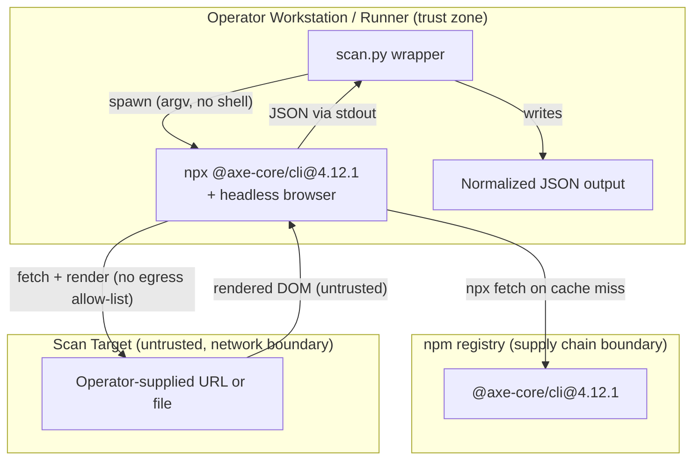

<!-- markdownlint-disable-file -->
# Accessibility Skill Security Model

This document records the STRIDE threat model for the accessibility skill's scanner (`scripts/scan.py`). The model is organized by trust bucket: Scan-target egress (B1), Scanner toolchain supply chain (B2), Untrusted scanner output (B3), and CLI caller process and filesystem (B4). Each bucket enumerates all six STRIDE categories with the in-code mitigations that address them. Assets and adversaries are enumerated first. Acknowledged enterprise readiness gaps are listed at the end.

`scan.py` is a thin Python wrapper that shells out to the Node-based `@axe-core/cli` accessibility scanner against an operator-supplied URL or local file, then normalizes the scanner's JSON into a stable shape. The scanner itself drives a headless browser that fetches and renders the target. The skill holds no credentials and runs no network listener; its security-relevant behavior is the subprocess invocation and the outbound fetch performed by the scanner.

> **See also: repo-wide STRIDE model.** This skill participates in the repository-wide threat model at [`docs/security/security-model.md`](../../../../docs/security/security-model.md) and is registered in its [Skill Security Models](../../../../docs/security/security-model.md#skill-security-models) section.

## Executive Summary

The accessibility skill runs an external Node scanner (`@axe-core/cli`, version-pinned) against an operator-supplied URL or file and normalizes the result. Its highest-risk behavior is the scanner's **unrestricted outbound fetch** of the target — there is no egress allow-list, so a crafted URL can reach internal or cloud-metadata endpoints (SSRF). The wrapper holds no credentials, runs no listener, invokes the scanner with an argument list (no shell), and treats all scanner output as untrusted data. Residual risk concentrates in target egress and the upstream browser/parser surface.

### Security Posture Overview

| Dimension          | Value                                                                            |
|--------------------|----------------------------------------------------------------------------------|
| Runtime surface    | Python wrapper spawning `npx --yes @axe-core/cli@4.12.1` (headless browser)      |
| Trust buckets      | B1 scan-target egress, B2 toolchain supply chain, B3 untrusted output, B4 caller |
| Credentials        | None handled; no listener                                                        |
| Network egress     | Scanner fetches the operator-supplied target (no allow-list); npx package fetch  |
| Open residual gaps | 4 (InfoDisc-Med: SSRF with no egress allow-list)                                 |

## Contents

* [System Description](#system-description)
* [Trust Boundaries](#trust-boundaries)
* [Assets](#assets)
* [Adversaries](#adversaries)
* [Bucket B1: Scan-target egress](#bucket-b1-scan-target-egress)
* [Bucket B2: Scanner toolchain supply chain](#bucket-b2-scanner-toolchain-supply-chain)
* [Bucket B3: Untrusted scanner output](#bucket-b3-untrusted-scanner-output)
* [Bucket B4: CLI caller process and filesystem](#bucket-b4-cli-caller-process-and-filesystem)
* [Enterprise Readiness Gaps](#enterprise-readiness-gaps)
* [References](#references)

## System Description

### Components

1. `scripts/scan.py` — the Python wrapper: builds the argument list, spawns the scanner, normalizes JSON, and writes output.
2. `@axe-core/cli@4.12.1` — the external Node scanner (resolved via `npx`), which drives a headless browser to fetch and render the target.
3. Output path — the operator-chosen `--output` file or stdout.

### Data Flow



## Trust Boundaries

### Boundary Diagram

```text
┌───────────────────────────────────────────────────────────────┐
│ TRUST BOUNDARY: Operator Workstation / Runner                 │
│  ┌──────────────┐   ┌───────────────────────┐   ┌──────────┐  │
│  │ scan.py      │   │ npx @axe-core/cli      │   │ Output   │  │
│  │ wrapper      │   │ + headless browser     │   │ file     │  │
│  └──────────────┘   └───────────────────────┘   └──────────┘  │
└───────────────┬─────────────────────┬─────────────────────────┘
                │ npx fetch            │ fetch + render
   ┌─────────────▼──────────┐  ┌────────▼──────────────────────┐
   │ BOUNDARY: npm registry │  │ BOUNDARY: Scan Target (untrusted) │
   │  @axe-core/cli@4.12.1  │  │  Operator-supplied URL or file    │
   └────────────────────────┘  └───────────────────────────────────┘
```

### Boundary Descriptions

| Boundary                      | Assets Protected               | Controls Enforced                                                         |
|-------------------------------|--------------------------------|---------------------------------------------------------------------------|
| Operator Workstation / Runner | Output integrity, host process | Argument list (no shell); typed errors; default-perm output path          |
| npm registry                  | Scanner toolchain integrity    | Version pin `@axe-core/cli@4.12.1` (no lockfile/integrity hash — G-SUP-1) |
| Scan Target                   | None (target is untrusted)     | No allow-list (G-INF-1); rendering isolated to upstream browser           |

## Assets

| Id | Asset                     | Lifetime         | Notes                                                                                                                                    |
|----|---------------------------|------------------|------------------------------------------------------------------------------------------------------------------------------------------|
| A1 | Scan target (URL or file) | Command lifetime | Operator-supplied argument. When a URL, the scanner's headless browser fetches and renders it, generating outbound network traffic.      |
| A2 | `@axe-core/cli` toolchain | Per-invocation   | Resolved and executed via `npx --yes @axe-core/cli@4.12.1`, which fetches the pinned package version at runtime when not already cached. |
| A3 | Scanner JSON output       | Command lifetime | Untrusted: derived from the rendered target page; normalized and forwarded to the caller / consuming agent.                              |
| A4 | Normalized output file    | Command lifetime | Written to the operator-chosen `--output` path.                                                                                          |

## Adversaries

| Id    | Adversary                                  | In-scope mitigations                                                                                                                                                                                           |
|-------|--------------------------------------------|----------------------------------------------------------------------------------------------------------------------------------------------------------------------------------------------------------------|
| ADV-a | Hostile or malicious scan target           | The target is rendered by `@axe-core/cli`'s headless browser, **not** by the Python wrapper. Browser/engine hardening is upstream; the wrapper only parses JSON.                                               |
| ADV-b | Compromised or substituted scanner package | **Largely defended.** `npx --yes @axe-core/cli@4.12.1` pins the scanner **version**; runtime integrity is still best-effort because npx resolves without a lockfile — see Enterprise Readiness Gaps (G-SUP-1). |
| ADV-c | Hostile or malformed scanner output        | Output is parsed with `json.loads`; non-dict and non-list payloads are coerced to a safe empty-summary shape; field extraction is type-guarded.                                                                |
| ADV-d | Hostile caller process controlling argv    | The subprocess is invoked with an **argument list (no shell)**; the target is passed as a single argv element, so shell metacharacters are not interpreted.                                                    |

## Bucket B1: Scan-target egress

### Spoofing

* Not applicable. The wrapper asserts no identity to the target and presents no credentials; any authentication is whatever the host environment supplies to the scanner.

### Tampering

* Response content from the target is untrusted and is never executed by the wrapper; tampering of rendered content is handled as untrusted output in B3.

### Repudiation

* Not applicable. No durable audit record is produced for target fetches; the scan is a stateless, per-invocation operation.

### Information Disclosure

* When the target is a URL, the underlying scanner fetches it from the host running the skill. There is **no allow-list or egress restriction**, so a URL pointing at an internal or metadata endpoint would be fetched from the operator's network position. This is an acknowledged gap (G-INF-1).
* The wrapper does not add credentials or cookies to the fetch; any authentication is whatever the scanner and host environment supply.

### Denial of Service

* A hostile or oversized target can stress the upstream headless browser. Resource bounding is the scanner/browser's responsibility; the wrapper does not impose its own timeout, so a slow target is operator-observable rather than silently fatal.

### Elevation of Privilege

* Not applicable. The fetch runs at the scanner's privilege; no privilege transition is performed by the wrapper.

### Risk Rating

| Threat                                     | Likelihood | Impact | Residual Risk | Status                                |
|--------------------------------------------|------------|--------|---------------|---------------------------------------|
| SSRF to internal / cloud-metadata endpoint | Med        | High   | Med           | Accepted (G-INF-1)                    |
| Hostile target resource exhaustion         | Low        | Med    | Low           | Partially Mitigated (operator-scoped) |

## Bucket B2: Scanner toolchain supply chain

### Spoofing

* The package identity is pinned to `@axe-core/cli@4.12.1`, so a floating tag cannot silently substitute a different release; a registry-level compromise of that exact version is the residual exposure (G-SUP-1).

### Tampering

* The scanner is launched as `["npx", "--yes", "@axe-core/cli@4.12.1", target]` — an argument list with no shell, so the target cannot inject additional commands.
* `--yes` suppresses the install prompt and resolves the package at runtime. The **version** is pinned, but no integrity hash or lockfile is enforced, so runtime substitution is only partially mitigated (G-SUP-1).

### Repudiation

* Not applicable. Package resolution emits no skill-level audit record beyond npx/npm's own logs.

### Information Disclosure

* Not applicable. No secrets are passed to the scanner subprocess; the argument list carries only the target.

### Denial of Service

* A missing Node toolchain fails closed with a `ScriptError` and a usage exit code rather than silently degrading.

### Elevation of Privilege

* The no-shell argument list prevents the target argument from escalating into arbitrary command execution. The rendering engine inside the scanner is a separate parser surface tracked as G-TAM-1.

### Risk Rating

| Threat                                    | Likelihood | Impact | Residual Risk | Status                        |
|-------------------------------------------|------------|--------|---------------|-------------------------------|
| Compromised / substituted scanner package | Low        | High   | Med           | Partially Mitigated (G-SUP-1) |
| Command injection via target argument     | Low        | High   | Low           | Mitigated (argv, no shell)    |
| Headless-browser parser exploitation      | Low        | High   | Med           | Accepted upstream (G-TAM-1)   |

## Bucket B3: Untrusted scanner output

### Spoofing

* Not applicable. The output is parsed as data; no identity is derived from it.

### Tampering

* `run_scan` requires the scanner to return valid JSON; invalid JSON or an unexpected top-level type raises a typed `ScriptError`.
* `normalize_results` defensively type-checks every field it reads (`violations`, `passes`, `incomplete`, `inapplicable`, per-violation `id`/`impact`/`description`/`nodes`) and emits a bounded, fixed-shape summary.

### Repudiation

* Not applicable. The normalized output is the record; no separate attribution is claimed.

### Information Disclosure

* The normalized summary reproduces attacker-influenced page text (rule `description`/`id`) and forwards it without redaction. Downstream consumers must treat scanner output as untrusted data, not instructions (G-INF-2).

### Denial of Service

* The fixed-shape, bounded summary prevents an oversized or deeply nested payload from propagating unbounded structure to consumers.

### Elevation of Privilege

* Not applicable. Output is data only and is never interpreted as code or instructions by the wrapper.

### Risk Rating

| Threat                                 | Likelihood | Impact | Residual Risk | Status                   |
|----------------------------------------|------------|--------|---------------|--------------------------|
| Malformed / hostile scanner JSON       | Med        | Low    | Low           | Mitigated (type-guarded) |
| Attacker page text echoed to consumers | Med        | Low    | Low           | By design (G-INF-2)      |

## Bucket B4: CLI caller process and filesystem

### Spoofing

* Not applicable. The CLI runs as the invoking OS user and trusts the caller's argv and environment.

### Tampering

* Arguments are parsed by the wrapper; the target is passed as a single argv element and the `--output` path is operator-controlled.

### Repudiation

* The CLI returns deterministic exit codes (success / usage error) so automation can attribute outcomes to the invoking step.

### Information Disclosure

* The skill holds no credentials and performs no first-party authentication, so there is no secret material to leak through output or logs.

### Denial of Service

* Not applicable. The caller controls invocation cadence; the wrapper holds no shared resource.

### Elevation of Privilege

* The output's parent directory is created with default permissions; the wrapper performs no privileged operation and persists nothing else.

### Risk Rating

| Threat                                   | Likelihood | Impact | Residual Risk | Status              |
|------------------------------------------|------------|--------|---------------|---------------------|
| Output path overwrite / unintended write | Low        | Low    | Low           | Operator-controlled |

## Enterprise Readiness Gaps

The following are known limitations recorded so operators can make informed deployment decisions. Severity ratings are the project's own assessment and are not equivalent to a CVSS score.

| Id      | Gap                                                                                                                                                                                                       | Severity        | Status                                                                                                                               |
|---------|-----------------------------------------------------------------------------------------------------------------------------------------------------------------------------------------------------------|-----------------|--------------------------------------------------------------------------------------------------------------------------------------|
| G-SUP-1 | `npx --yes @axe-core/cli@4.12.1` pins the scanner **version**, but npx still resolves it without an integrity hash or lockfile, so runtime substitution is only **partially** mitigated. (audit: A-SUP-1) | SupplyChain-Low | Version pinned to `@axe-core/cli@4.12.1`; review upgrades before bumping. Full integrity/lockfile pinning is tracked as future work. |
| G-INF-1 | The scanner fetches arbitrary target URLs from the host with **no egress allow-list**; a crafted URL could reach internal or cloud-metadata endpoints. (audit: A-SSRF-1)                                  | InfoDisc-Med    | Operators should restrict targets to intended hosts and run scans from a network position without sensitive internal reachability.   |
| G-TAM-1 | The scan target is rendered by a headless browser engine inside `@axe-core/cli`; that engine's parsing/rendering attack surface is outside this skill's control. (audit: A-BRWS-1)                        | Tampering-Med   | Keep the Node toolchain and browser engine patched; prefer scanning trusted targets or run in an isolated container.                 |
| G-INF-2 | Normalized output reproduces attacker-influenced page text (rule descriptions, ids); it is forwarded without redaction. (audit: A-INF-1)                                                                  | InfoDisc-Low    | Consumers must treat scanner output as untrusted data, not instructions.                                                             |

For an active issue tracker entry covering these gaps, see the [hve-core issues list](https://github.com/microsoft/hve-core/issues).

## References

* [STRIDE Threat Model](https://learn.microsoft.com/azure/security/develop/threat-modeling-tool-threats)
* [OWASP Top 10: A10:2021 Server-Side Request Forgery (SSRF)](https://owasp.org/Top10/A10_2021-Server-Side_Request_Forgery_%28SSRF%29/)
* [axe-core CLI](https://github.com/dequelabs/axe-core-npm/tree/develop/packages/cli)
* [Repository security model](../../../../docs/security/security-model.md)

🤖 Crafted with precision by ✨Copilot following brilliant human instruction, then carefully refined by our team of discerning human reviewers.
