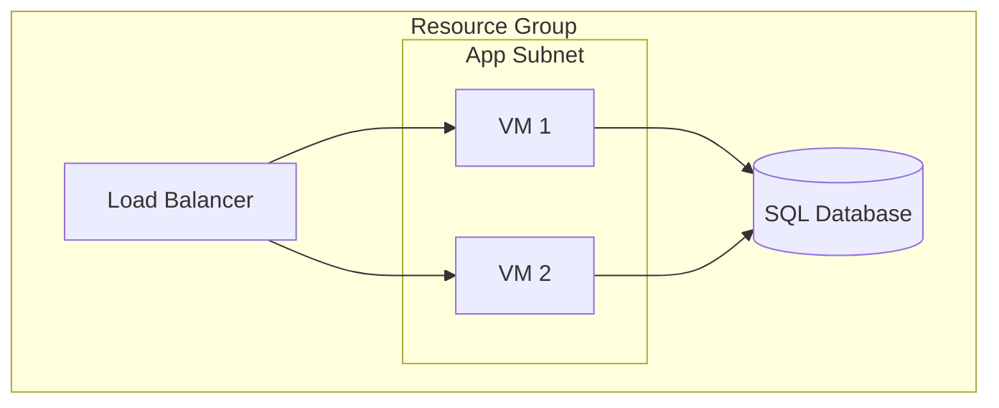
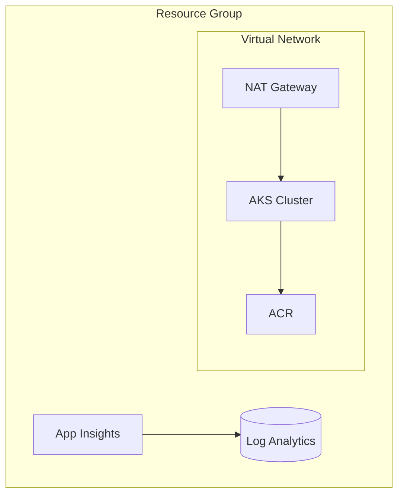

# Architecture Diagrams Skill

## Purpose

Use this skill to turn infrastructure source files into readable architecture diagrams for reviews, ADRs, and design discussions. The skill is optimized for cloud systems and assumes the primary inputs are Terraform, Bicep, ARM templates, shell scripts, Kubernetes manifests, and Docker/Compose files. It focuses on structure, relationships, and boundary clarity rather than rendered graphics.

## Output Format

This skill produces either ASCII block diagrams or Mermaid flowcharts. Neither is the default: the caller or surrounding context chooses the output format for each diagram. When the caller does not state a preference, ask which format they want before generating. Follow the ASCII Conventions or the Mermaid Conventions below depending on the selected format, and keep the structure, boundaries, and relationships identical across formats.

## Preference Contract

Architecture diagram format selection applies beyond ADRs. For standalone usage, consult the root state file at `.copilot-tracking/architecture-diagrams/state.json`. If that file is absent, create it when a format is chosen.

```json
{
  "userPreferences": {
    "diagramFormat": "mermaid"
  },
  "repoVisibility": "private"
}
```

The `userPreferences.diagramFormat` value must be either `ascii` or `mermaid`. The `repoVisibility` field is optional and may be used by surrounding workflows when they need to distinguish public and private repositories. Resolution order is:

1. Explicit request or caller state.
2. Root state file at `.copilot-tracking/architecture-diagrams/state.json`.
3. If no preference is known for a standalone request, ask once and persist the answer to the root state file for later reuse.

## Workflow

Follow this sequence when authoring a diagram:

1. Discovery. Identify the relevant infrastructure files and the architectural scope. When the scope is unclear, ask which folders or services should be included.
2. Parsing. Read the selected sources to extract services, data stores, networking components, ingress points, and deployment units.
3. Relationship mapping. Connect components with the correct direction and annotate important dependencies, network paths, or optional links.
4. Generation. Render the final diagram in the caller's chosen format—ASCII text or a Mermaid flowchart—with clear grouping, boundaries, and a compact legend.

## ASCII Conventions

Use consistent box notation and alignment:

```text
+------------------+      +------------------+
|   Service Name   |----->|   Service Name   |
+------------------+      +------------------+
```

Use the following conventions for readability:

* Keep box labels short and specific.
* Keep arrows aligned and use one relationship per line when possible.
* Prefer clearly named boundaries over dense decoration.
* Use repeated box shapes for similar components.

## Arrow Types

| Arrow   | Meaning                          |
|---------|----------------------------------|
| `---->` | Data flow or dependency          |
| `<--->` | Bidirectional connection         |
| `- - >` | Optional or conditional resource |

## Grouping and Boundaries

Group related components inside a larger boundary when they share a network, account, or deployment domain.

Use a full box for a strong boundary:

```text
+-----------------------------------------------+
|  Resource Group                               |
|                                               |
|  +-------------+        +-------------+       |
|  |   VNet      |------->|   Subnet    |       |
|  +-------------+        +-------------+       |
|                                               |
+-----------------------------------------------+
```

Use labeled boundaries for secondary or nested boundaries:

```text
:--- Virtual Network ---------------------------:
:                                               :
:  +-------------+        +-------------+       :
:  |   Subnet A  |------->|   Subnet B  |       :
:  +-------------+        +-------------+       :
:                                               :
:-----------------------------------------------:
```

## Mermaid Conventions

When the caller chooses Mermaid output, render a `mermaid` fenced code block using a `flowchart` that expresses the same structure, boundaries, and relationships you would draw in ASCII.

* Use `flowchart TB` for top-to-bottom topologies and `flowchart LR` when the main flow reads left to right.
* Declare each component as a node with a short, specific label, for example `lb["Load Balancer"]`, and use `[("...")]` for data stores.
* Group components that share a network, account, or deployment domain inside a `subgraph` block, such as a VNet, subnet, or resource group.
* Use `-->` for data flow or dependency, `<-->` for bidirectional connections, and `-. optional .->` for optional or conditional links.
* Keep node identifiers stable and lowercase, and reserve labels for the human-readable name.



## Layout Guidelines

* Place external or public services at the top.
* Place compute or application tiers in the middle.
* Place data stores at the bottom.
* Group components by network boundary, such as a VNet or subnet.
* Let the main flow run from top to bottom when the direction is clear.

## Resource Identification Heuristics

When reading infrastructure sources, extract:

* Resource type and name
* Network associations, including VNet, subnet, private endpoint, or ingress settings
* Dependencies that are explicit in configuration and those that are implied by references
* Deployment relationships such as container registry, service mesh, or workload placement

## Output Format Contract

Use this structure for every diagram:

```markdown
## <Name> Architecture

[diagram in the selected format]

### Legend
[Arrow meanings from this diagram; reference the arrow types above]

### Key Relationships
[Notable connections and dependencies]
```

The title should use title case and follow the pattern `<Name> Architecture`. The legend should explain any special symbols used, and the key relationships section should focus on the most important dependencies or data flows.

## Worked Example: AKS Platform Architecture

```markdown
## AKS Platform Architecture

+===============================================================+
|  Resource Group                                               |
|  :--- Virtual Network ------------------------------------:   |
|  :  +------------------+        +------------------+      :   |
|  :  |   NAT Gateway    |------->|   AKS Cluster    |      :   |
|  :  +------------------+        +--------+---------+      :   |
|  :                              +--------v---------+      :   |
|  :                              |       ACR        |      :   |
| :                              +------------------+      : |
|:----------------------------------------------------------:|
|      +------------------+        +------------------+      |
|     | Log Analytics    |<-------|  App Insights    |          |
|     +------------------+        +------------------+          |
+===============================================================+

### Legend
See the arrow types above. Additional symbols: `====` primary boundary, `:---:` secondary boundary.

### Key Relationships
* AKS pulls images from ACR through the network boundary.
* NAT Gateway provides egress for AKS workloads.
```

The same architecture in Mermaid form expresses identical structure, boundaries, and relationships:

````markdown
## AKS Platform Architecture



### Legend
See the arrow types above; `subgraph` blocks denote network or resource boundaries.

### Key Relationships
* AKS pulls images from ACR through the network boundary.
* NAT Gateway provides egress for AKS workloads.
````

## Authoring Guidelines

* Ask one or two clarifying questions when the architecture scope is ambiguous.
* Announce the current workflow stage when you move from discovery to parsing or generation.
* Present a draft diagram with a short summary of the resources included before finalizing.
* Note important inference decisions, such as implicit dependencies, when they affect the diagram.
* Treat the diagram as a static representation of infrastructure sources, not a runtime execution view.
* Keep the output focused on a single architecture scope so it remains readable.


