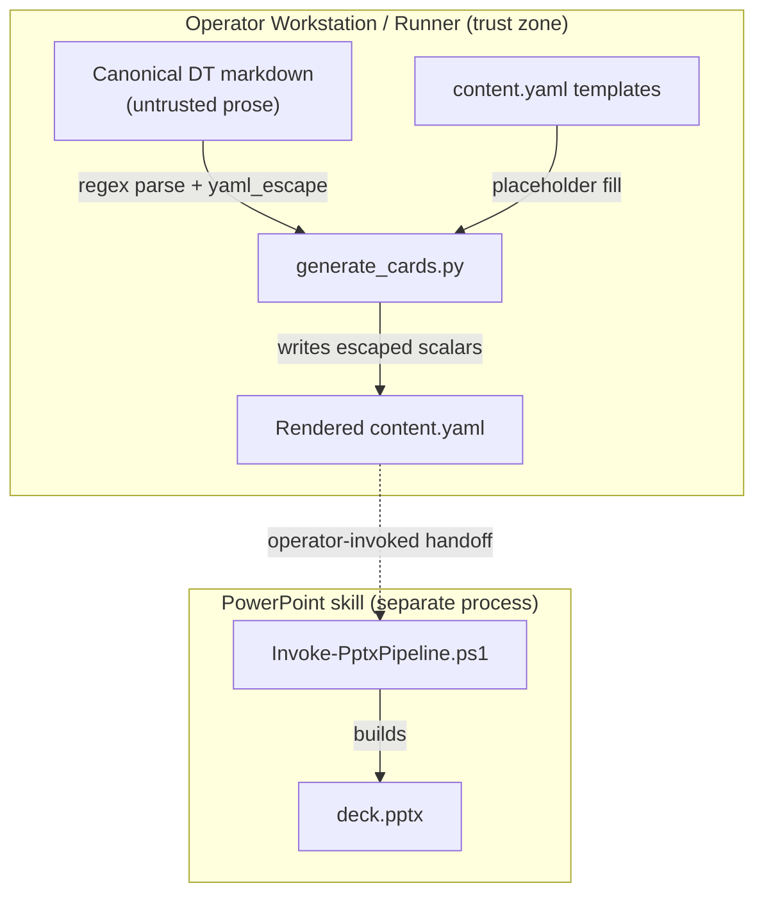

<!-- markdownlint-disable-file -->
# Customer Card Render Skill Security Model

This document records the STRIDE threat model for the customer-card-render skill (`scripts/generate_cards.py`). The model is organized by trust bucket: Untrusted DT markdown parsing (B1), YAML content emission (B2), and CLI caller process and filesystem with the out-of-process PowerPoint handoff (B3). Each bucket enumerates all six STRIDE categories with the in-code mitigations that address them. Assets and adversaries are enumerated first. Acknowledged enterprise readiness gaps are listed at the end.

The skill is a pure local file transform: it reads canonical Design Thinking markdown artifacts, extracts frontmatter and sections with regular expressions, escapes the text, fills template `content.yaml` files, and writes them to an output directory. It handles no credentials, opens no network connection, and spawns no subprocess. The subsequent deck build is a **separate, operator-invoked step** owned by the experimental powerpoint skill (`Invoke-PptxPipeline.ps1`) and governed by that skill's own security model.

> **See also: repo-wide STRIDE model.** This skill participates in the repository-wide threat model at [`docs/security/security-model.md`](../../../../docs/security/security-model.md) and is registered in its [Skill Security Models](../../../../docs/security/security-model.md#skill-security-models) section.

## Executive Summary

The customer-card-render skill converts untrusted Design Thinking markdown into PowerPoint-skill `content.yaml`. Its highest-risk behavior is **emitting attacker-influenced prose into YAML**: adversarial artifact content could otherwise break out of a YAML scalar. Every dynamic value is routed through `yaml_escape`, which escapes backslashes, double-quotes, and newlines, and the templates wrap every placeholder in double quotes, so injected content stays confined to its scalar. Frontmatter is parsed by simple string partitioning (not a YAML loader), so no object construction occurs. The skill performs no network, credential, or subprocess activity; the actual deck build is delegated out-of-process to the powerpoint skill and inherits that skill's residual risk. Residual risk concentrates in confidential DT prose flowing into the emitted content and the supply-chain posture of the downstream build toolchain.

### Security Posture Overview

| Dimension          | Value                                                                                                            |
|--------------------|------------------------------------------------------------------------------------------------------------------|
| Runtime surface    | Local Python CLI; regex parse of untrusted DT markdown; YAML emission; no network, no credentials, no subprocess |
| Trust buckets      | B1 untrusted markdown parsing, B2 YAML content emission, B3 caller/filesystem + PPTX handoff                     |
| Credentials        | None handled or persisted                                                                                        |
| Network egress     | None                                                                                                             |
| Open residual gaps | 2 (SupplyChain-Med: inherited powerpoint build toolchain and uv bootstrap)                                       |

## Contents

* [System Description](#system-description)
* [Trust Boundaries](#trust-boundaries)
* [Assets](#assets)
* [Adversaries](#adversaries)
* [Bucket B1: Untrusted DT markdown parsing](#bucket-b1-untrusted-dt-markdown-parsing)
* [Bucket B2: YAML content emission](#bucket-b2-yaml-content-emission)
* [Bucket B3: CLI caller process and PowerPoint handoff](#bucket-b3-cli-caller-process-and-powerpoint-handoff)
* [Enterprise Readiness Gaps](#enterprise-readiness-gaps)
* [References](#references)

## System Description

### Components

1. `scripts/generate_cards.py` — reads canonical DT markdown, parses frontmatter and sections with regex, escapes text via `yaml_escape`, fills `templates/*.content.yaml`, and writes `slide-NNN/content.yaml` under the output directory.
2. `templates/*.content.yaml` — quoted-placeholder templates the script populates.

### Data Flow



## Trust Boundaries

### Boundary Diagram

```text
┌───────────────────────────────────────────────────────────┐
│ TRUST BOUNDARY: Operator Workstation / Runner             │
│  ┌─────────────┐   ┌──────────────┐   ┌────────────────┐  │
│  │ generate_   │   │ DT markdown  │   │ content.yaml   │  │
│  │ cards.py    │   │ + templates  │   │ output         │  │
│  └─────────────┘   └──────────────┘   └────────────────┘  │
└───────────────────────────┬───────────────────────────────┘
                            │ operator-invoked handoff (separate process)
        ┌────────────────────▼────────────────────┐
        │ TRUST BOUNDARY: PowerPoint skill runtime │
        │  ┌────────────────────────────────────┐  │
        │  │ Invoke-PptxPipeline.ps1 → deck.pptx│  │
        │  └────────────────────────────────────┘  │
        └──────────────────────────────────────────┘
```

### Boundary Descriptions

| Boundary                 | Assets Protected               | Controls Enforced                                                                                            |
|--------------------------|--------------------------------|--------------------------------------------------------------------------------------------------------------|
| Workstation / Runner     | Output integrity, host process | `yaml_escape` of dynamic values; quoted-placeholder templates; string-partition frontmatter (no YAML loader) |
| PowerPoint skill runtime | Deck build integrity           | Delegated to the powerpoint skill's own model (sandboxed execution, hardened document parsing)               |

## Assets

| Id | Asset                         | Lifetime                | Notes                                                                         |
|----|-------------------------------|-------------------------|-------------------------------------------------------------------------------|
| A1 | Canonical DT markdown         | Read-only during render | Untrusted prose; may contain confidential product/customer content            |
| A2 | `content.yaml` templates      | Read-only               | Ship with the skill; every placeholder is double-quoted                       |
| A3 | Rendered `content.yaml`       | Persisted               | Written under the operator-chosen output directory                            |
| A4 | Downstream powerpoint runtime | External                | Out-of-process build; inherits the powerpoint skill's residual risk (G-SUP-1) |

## Adversaries

| Id    | Adversary                                                       | In-scope mitigations                                                                                                                       |
|-------|-----------------------------------------------------------------|--------------------------------------------------------------------------------------------------------------------------------------------|
| ADV-a | Hostile or malformed DT markdown (crafted to break out of YAML) | `yaml_escape` escapes `\`, `"`, and newlines; templates quote every placeholder; frontmatter parsed by string partition, not a YAML loader |
| ADV-b | Caller supplying an adversarial output path                     | Output path is operator-controlled; the script only writes `slide-NNN/content.yaml` beneath it                                             |
| ADV-c | Attacker targeting the downstream deck build                    | Build is delegated out-of-process to the powerpoint skill and governed by its model (G-SUP-1)                                              |

## Bucket B1: Untrusted DT markdown parsing

### Spoofing

* Not applicable. Markdown content carries no identity claim; it is treated as data.

### Tampering

* The skill never modifies the source artifacts. Frontmatter is parsed by line-wise `str.partition(":")` rather than a YAML loader, so no arbitrary object construction occurs; sections are extracted with bounded regular expressions.

### Repudiation

* Not applicable. No attribution is claimed over input content.

### Information Disclosure

* Parsing surfaces only the fields the templates consume; nothing beyond the artifact's own content is read or forwarded.

### Denial of Service

* Section extraction uses anchored, non-catastrophic regular expressions over a single artifact; input size is bounded by the artifact.

### Elevation of Privilege

* No input path leads to code execution: there is no `eval`, no dynamic import, and no subprocess.

### Risk Rating

| Threat                                              | Likelihood | Impact | Residual Risk | Status                                       |
|-----------------------------------------------------|------------|--------|---------------|----------------------------------------------|
| Malicious frontmatter/section triggers unsafe parse | Low        | Low    | Low           | Mitigated (string partition; no YAML loader) |

## Bucket B2: YAML content emission

### Spoofing

* Not applicable.

### Tampering

* **YAML injection is mitigated**: every dynamic value is passed through `yaml_escape` (escaping `\`, `"`, and newlines) before insertion, and every template placeholder is wrapped in double quotes (`text: "{{...}}"`; the sole unquoted field, `slide: {{SLIDE_NUMBER}}`, is an integer). Injected content therefore stays inside its scalar and cannot introduce new keys or structure.

### Repudiation

* Not applicable.

### Information Disclosure

* Confidential prose from the source artifact flows verbatim (escaped) into the emitted `content.yaml` and any downstream deck. There is no data-classification gate (G-INF-1).

### Denial of Service

* Output size is proportional to the input artifact; there is no amplification.

### Elevation of Privilege

* Emission writes text files only; it performs no execution.

### Risk Rating

| Threat                                                 | Likelihood | Impact | Residual Risk | Status                                          |
|--------------------------------------------------------|------------|--------|---------------|-------------------------------------------------|
| YAML breakout via artifact prose                       | Low        | Med    | Low           | Mitigated (`yaml_escape` + quoted placeholders) |
| Confidential prose emitted without classification gate | Med        | Low    | Low           | By design (G-INF-1)                             |

## Bucket B3: CLI caller process and PowerPoint handoff

### Spoofing

* Not applicable. No identity surface.

### Tampering

* The script writes only `slide-NNN/content.yaml` files beneath the operator-supplied output directory.

### Repudiation

* Not applicable. Local tool.

### Information Disclosure

* No credentials or secrets are handled; the skill makes no network connection.

### Denial of Service

* File writes are bounded by the number of rendered cards; there is no unbounded resource use.

### Elevation of Privilege

* The skill runs entirely with the caller's privileges. The deck build is a **separate process** the operator invokes explicitly through the powerpoint skill; this skill neither spawns it nor passes credentials to it. That runtime's risk is covered by the powerpoint skill's own model (G-SUP-1).

### Risk Rating

| Threat                                      | Likelihood | Impact | Residual Risk | Status                                 |
|---------------------------------------------|------------|--------|---------------|----------------------------------------|
| Downstream build executes untrusted content | Low        | Med    | Low           | Deferred to powerpoint model (G-SUP-1) |

## Enterprise Readiness Gaps

The following are known limitations recorded so operators can make informed deployment decisions. Severity ratings are the project's own assessment and are not equivalent to a CVSS score.

| Id      | Gap                                                                                                                                                                                                                                                                                                                     | Severity        | Status                                                                                                                   |
|---------|-------------------------------------------------------------------------------------------------------------------------------------------------------------------------------------------------------------------------------------------------------------------------------------------------------------------------|-----------------|--------------------------------------------------------------------------------------------------------------------------|
| G-SUP-1 | The deck build is delegated out-of-process to the experimental powerpoint skill (`Invoke-PptxPipeline.ps1`) and inherits that skill's residual risk (sandboxed `content-extra.py` execution, LibreOffice/MuPDF document parsing). The documented `uv` toolchain bootstrap uses a `curl \| sh` / `irm \| iex` installer. | SupplyChain-Med | Accepted; see the [powerpoint security model](../powerpoint/SECURITY.md) and pin the `uv` installer to a vetted release. |
| G-INF-1 | Canonical DT artifacts may contain confidential product or customer prose; that content flows verbatim (escaped) into the emitted `content.yaml` and any downstream deck. There is no data-classification gate.                                                                                                         | InfoDisc-Low    | By design; operators must avoid rendering regulated content and control the output directory.                            |

For an active issue tracker entry covering these gaps, see the [hve-core issues list](https://github.com/microsoft/hve-core/issues).

## References

* [STRIDE Threat Model](https://learn.microsoft.com/azure/security/develop/threat-modeling-tool-threats)
* [OWASP Top 10](https://owasp.org/www-project-top-ten/)
* [PowerPoint skill security model](../powerpoint/SECURITY.md)
* [Repository security model](../../../../docs/security/security-model.md)

🤖 Crafted with precision by ✨Copilot following brilliant human instruction, then carefully refined by our team of discerning human reviewers.
