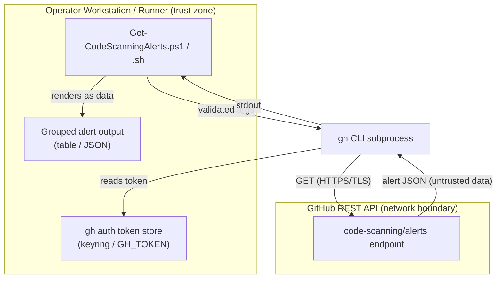

<!-- markdownlint-disable-file -->
# GH Code Scanning Skill Security Model

This document records the STRIDE threat model for the gh-code-scanning skill (`scripts/Get-CodeScanningAlerts.ps1` and `scripts/get-code-scanning-alerts.sh`, the PowerShell and POSIX twins). The model is organized by trust bucket: CLI → gh/GitHub API subprocess (B1), Untrusted alert-data rendering (B2), and CLI caller process and credentials (B3). Each bucket enumerates all six STRIDE categories with the in-code mitigations that address them. Assets and adversaries are enumerated first. Acknowledged enterprise readiness gaps are listed at the end.

The skill reads open GitHub code-scanning alerts for a repository and branch through the `gh` CLI, groups them by rule, and prints a table or JSON. It handles no credential directly (`gh` owns the token), opens no local listener, and writes no files: output goes to stdout only.

> **See also: repo-wide STRIDE model.** This skill participates in the repository-wide threat model at [`docs/security/security-model.md`](../../../../docs/security/security-model.md) and is registered in its [Skill Security Models](../../../../docs/security/security-model.md#skill-security-models) section.

## Executive Summary

The gh-code-scanning skill is a read-only reporting wrapper over `gh api`. Its highest-risk behavior is **rendering untrusted alert data** returned by the GitHub API to the operator's terminal or a JSON consumer. Every caller-supplied argument (`Owner`, `Repo`, `Branch`, output format, severity) is validated against a strict allow-list before it is interpolated into the `gh api` endpoint, closing argument- and query-injection vectors; alert fields are emitted as data (`Format-Table`, `ConvertTo-Json`, `jq`), never executed. Credentials are delegated entirely to `gh` and never touched by the script. Residual risk concentrates in the unpinned `gh`/`jq` PATH dependencies and TLS trust delegated to `gh`.

### Security Posture Overview

| Dimension          | Value                                                                                        |
|--------------------|----------------------------------------------------------------------------------------------|
| Runtime surface    | Local CLI (PowerShell + bash); `gh` CLI subprocess; stdout only; no listener, no writes      |
| Trust buckets      | B1 CLI→gh/GitHub API, B2 untrusted alert-data rendering, B3 caller process/credentials       |
| Credentials        | None handled in-script; `gh` owns the token (keyring or `GH_TOKEN`), `security_events` scope |
| Network egress     | HTTPS to the GitHub REST API via `gh` (read-only GET)                                        |
| Open residual gaps | 3 (SupplyChain-Med: unpinned `gh`/`jq` PATH dependencies)                                    |

## Contents

* [System Description](#system-description)
* [Trust Boundaries](#trust-boundaries)
* [Assets](#assets)
* [Adversaries](#adversaries)
* [Bucket B1: CLI → gh/GitHub API subprocess](#bucket-b1-cli--ghgithub-api-subprocess)
* [Bucket B2: Untrusted alert-data rendering](#bucket-b2-untrusted-alert-data-rendering)
* [Bucket B3: CLI caller process and credentials](#bucket-b3-cli-caller-process-and-credentials)
* [Enterprise Readiness Gaps](#enterprise-readiness-gaps)
* [References](#references)

## System Description

### Components

1. `scripts/Get-CodeScanningAlerts.ps1` — PowerShell twin: validates parameters via `[ValidatePattern]`/`[ValidateSet]`, calls `gh api`, groups alerts by rule, and prints a table or JSON.
2. `scripts/get-code-scanning-alerts.sh` — POSIX/bash twin with the same behavior, validating arguments with regex guards and grouping via `jq`.

### Data Flow



## Trust Boundaries

### Boundary Diagram

```text
┌───────────────────────────────────────────────────────────┐
│ TRUST BOUNDARY: Operator Workstation / Runner             │
│  ┌─────────────┐   ┌──────────────┐   ┌────────────────┐  │
│  │ CodeScanning│   │ gh token     │   │ stdout report  │  │
│  │ CLI twins   │   │ (keyring/env)│   │ (table/JSON)   │  │
│  └─────────────┘   └──────────────┘   └────────────────┘  │
└───────────────────────────┬───────────────────────────────┘
                            │ TLS (via gh)
        ┌────────────────────▼────────────────────┐
        │ TRUST BOUNDARY: GitHub REST API          │
        │  ┌────────────────────────────────────┐  │
        │  │ code-scanning/alerts (read-only)   │  │
        │  └────────────────────────────────────┘  │
        └──────────────────────────────────────────┘
```

### Boundary Descriptions

| Boundary             | Assets Protected           | Controls Enforced                                                                 |
|----------------------|----------------------------|-----------------------------------------------------------------------------------|
| Workstation / Runner | gh token, output integrity | Strict argument allow-lists; no in-script token handling; stdout-only             |
| GitHub REST API      | Request integrity, token   | TLS + auth delegated to `gh`; read-only GET; endpoint built from validated inputs |

## Assets

| Id | Asset                                  | Lifetime                | Notes                                                                                             |
|----|----------------------------------------|-------------------------|---------------------------------------------------------------------------------------------------|
| A1 | GitHub auth token                      | Managed by `gh`         | Never read by the script; `gh` sources it from its keyring or `GH_TOKEN`; `security_events` scope |
| A2 | Owner / Repo / Branch arguments        | Command lifetime        | Caller-supplied; strictly validated before interpolation into the endpoint                        |
| A3 | Alert data (descriptions, paths, URLs) | Command lifetime        | Returned by the GitHub API; rendered as data, never executed                                      |
| A4 | `gh` / `jq` binaries                   | External, PATH-resolved | Unpinned host dependencies (see G-SUP-1)                                                          |

## Adversaries

| Id    | Adversary                                                        | In-scope mitigations                                                                                                                                 |
|-------|------------------------------------------------------------------|------------------------------------------------------------------------------------------------------------------------------------------------------|
| ADV-a | Caller supplying adversarial Owner/Repo/Branch/severity          | Allow-list validation (`^[a-zA-Z0-9._-]+$` / `^[a-zA-Z0-9._/-]+$`, `[ValidateSet]`, severity enum) blocks argument and query injection into `gh api` |
| ADV-b | Malicious content in alert fields (crafted rule text, path, URL) | Alert fields are emitted as data (`Format-Table`, `ConvertTo-Json`, `jq`); never evaluated or executed                                               |
| ADV-c | Network attacker on the CLI ↔ GitHub channel                     | TLS and certificate validation delegated to `gh`; no plaintext fallback                                                                              |

## Bucket B1: CLI → gh/GitHub API subprocess

### Spoofing

* Authentication and endpoint identity are delegated to `gh`, which validates the GitHub API's TLS certificate. The script constructs the endpoint from a fixed template with validated path segments.

### Tampering

* All caller inputs are validated before use: `Owner` and `Repo` against `^[a-zA-Z0-9._-]+$`, `Branch` against `^[a-zA-Z0-9._/-]+$`, `OutputFormat` against a `[ValidateSet]`, and severity against a fixed enum. Because `&`, `?`, and whitespace are excluded, a caller cannot inject additional query parameters or alter the REST path.
* The `Branch` value is confined to the `ref=refs/heads/...` query-string segment; its allow-list still permits `.` and `/` (including `..`), recorded as G-TAM-1.

### Repudiation

* Not applicable. This is a read-only reporting tool with no state change to attribute.

### Information Disclosure

* No secret is handled in-script; the token lives only inside `gh`. `GH_PAGER` is cleared to keep output non-interactive.

### Denial of Service

* The query caps page size (`per_page=100`) and uses `gh --paginate`; runtime is bounded by the number of open alerts. No unbounded local loops.

### Elevation of Privilege

* The subprocess runs with the caller's privileges; access is limited to whatever the `gh` token already grants. The script requests no additional scope.

### Risk Rating

| Threat                                   | Likelihood | Impact | Residual Risk | Status                                      |
|------------------------------------------|------------|--------|---------------|---------------------------------------------|
| Argument/query injection into `gh api`   | Low        | Med    | Low           | Mitigated (allow-list validation)           |
| `Branch` allow-list permits `.`/`..`/`/` | Low        | Low    | Low           | Accepted (confined to query value; G-TAM-1) |

## Bucket B2: Untrusted alert-data rendering

### Spoofing

* Not applicable. Alert content carries no identity claim; it is treated as data.

### Tampering

* The script does not modify alert data; it groups and sorts it for display.

### Repudiation

* Not applicable.

### Information Disclosure

* Alert descriptions, affected paths, and URLs originate from the operator's own repository scanning and are printed to the operator's terminal or a JSON consumer. They are rendered as data; downstream consumers are responsible for their own safe handling.

### Denial of Service

* Grouping is proportional to the number of alerts returned; there is no amplification.

### Elevation of Privilege

* Rendered fields are never interpreted as code or commands, so hostile alert content cannot drive execution.

### Risk Rating

| Threat                                  | Likelihood | Impact | Residual Risk | Status                           |
|-----------------------------------------|------------|--------|---------------|----------------------------------|
| Hostile alert field rendered downstream | Low        | Low    | Low           | Mitigated (emitted as data only) |

## Bucket B3: CLI caller process and credentials

### Spoofing

* Not applicable. No local identity surface.

### Tampering

* The script writes no files; output is stdout only, so there is no on-disk artifact to tamper with.

### Repudiation

* Not applicable. Local read-only tool.

### Information Disclosure

* The token is never read, logged, or echoed by the script; it stays inside `gh`. Only grouped alert data reaches stdout.

### Denial of Service

* No local resource is consumed beyond the bounded `gh` call and in-memory grouping.

### Elevation of Privilege

* Runs entirely with the caller's privileges; no elevation and no setuid behavior.

### Risk Rating

| Threat                            | Likelihood | Impact | Residual Risk | Status                                         |
|-----------------------------------|------------|--------|---------------|------------------------------------------------|
| Token leakage via script handling | Low        | High   | Low           | Mitigated (token owned by `gh`, never touched) |

## Enterprise Readiness Gaps

The following are known limitations recorded so operators can make informed deployment decisions. Severity ratings are the project's own assessment and are not equivalent to a CVSS score.

| Id      | Gap                                                                                                                                                                                              | Severity        | Status                                                       |
|---------|--------------------------------------------------------------------------------------------------------------------------------------------------------------------------------------------------|-----------------|--------------------------------------------------------------|
| G-SUP-1 | `gh` and `jq` are external, unpinned dependencies resolved from `PATH`; the skill inherits their integrity and CVE posture.                                                                      | SupplyChain-Med | Accepted (operator keeps `gh`/`jq` patched)                  |
| G-TLS-1 | No certificate pinning for the GitHub API; TLS validation is delegated to `gh` and the system trust store.                                                                                       | InfoDisc-Low    | Accepted (operator-acceptable for a managed GitHub endpoint) |
| G-TAM-1 | The `Branch` allow-list permits `.`, `..`, and `/`; the value is confined to the `ref=` query segment (so it cannot inject query parameters or traverse the REST path) but is not canonicalized. | Tampering-Low   | Accepted (defence-in-depth)                                  |

For an active issue tracker entry covering these gaps, see the [hve-core issues list](https://github.com/microsoft/hve-core/issues).

## References

* [STRIDE Threat Model](https://learn.microsoft.com/azure/security/develop/threat-modeling-tool-threats)
* [OWASP Top 10](https://owasp.org/www-project-top-ten/)
* [GitHub CLI (`gh`) manual](https://cli.github.com/manual/)
* [GitHub code scanning alerts REST API](https://docs.github.com/rest/code-scanning/code-scanning)
* [Repository security model](../../../../docs/security/security-model.md)

🤖 Crafted with precision by ✨Copilot following brilliant human instruction, then carefully refined by our team of discerning human reviewers.
