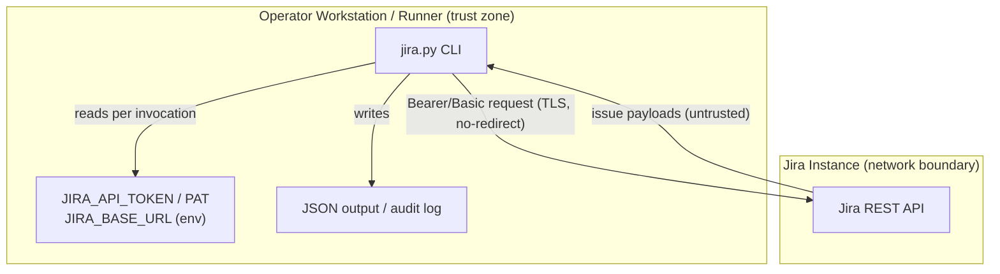

<!-- markdownlint-disable-file -->
# Jira Skill Security Model

This document records the STRIDE threat model for the Jira skill (`scripts/jira.py`). The model is organized by trust bucket: CLI → Jira API (B1), Environment credentials (B2), and CLI caller process (B3). Each bucket enumerates all six STRIDE categories with the in-code mitigations that address them. Assets and adversaries are enumerated first. Acknowledged enterprise readiness gaps are listed at the end.

The skill is a single-file, standard-library-only CLI. It performs no OAuth browser flow, runs no local listener, persists no tokens to disk, and spawns no subprocesses. Credentials are read from the process environment per invocation.

> **See also: repo-wide STRIDE model.** This skill participates in the repository-wide threat model at [`docs/security/security-model.md`](../../../../docs/security/security-model.md) and is registered in its [Skill Security Models](../../../../docs/security/security-model.md#skill-security-models) section.

## Executive Summary

The Jira skill is a single-file, standard-library-only REST CLI. It reads a PAT or Basic credential from the environment per invocation and calls the configured Jira instance over TLS through a hardened, no-redirect opener. Its highest-risk asset is the API token; the skill never persists it, never logs it, and refuses plaintext transport to non-loopback hosts. Write operations require explicit confirmation. Residual risk is upstream (a leaked token can only be revoked at the Jira instance) and at-rest in the operator environment.

### Security Posture Overview

| Dimension          | Value                                                                      |
|--------------------|----------------------------------------------------------------------------|
| Runtime surface    | REST CLI (stdlib only); env credentials; no listener, no subprocess        |
| Trust buckets      | B1 CLI→Jira API, B2 environment credentials, B3 CLI caller process         |
| Credentials        | PAT (Bearer) or Basic (`email:token`) from env; never persisted to disk    |
| Network egress     | HTTPS to `JIRA_BASE_URL` (no-redirect opener; HTTPS required off-loopback) |
| Open residual gaps | 5 (EoP-Med: skill cannot revoke a leaked token)                            |

## Contents

* [System Description](#system-description)
* [Trust Boundaries](#trust-boundaries)
* [Assets](#assets)
* [Adversaries](#adversaries)
* [Bucket B1: CLI → Jira API](#bucket-b1-cli--jira-api)
* [Bucket B2: Environment credentials](#bucket-b2-environment-credentials)
* [Bucket B3: CLI caller process](#bucket-b3-cli-caller-process)
* [Enterprise Readiness Gaps](#enterprise-readiness-gaps)
* [References](#references)

## System Description

### Components

1. `scripts/jira.py` — a single-file CLI: parses arguments, resolves credentials from the environment, issues REST calls through a hardened opener, and prints JSON.
2. Hardened opener (`_OPENER` / `_NoRedirect`) — enforces TLS, refuses 30x redirects, and caps response bodies.

### Data Flow



## Trust Boundaries

### Boundary Diagram

```text
┌───────────────────────────────────────────────┐
│ TRUST BOUNDARY: Operator Workstation / Runner             │
│  ┌─────────┐   ┌─────────────┐   ┌───────────┐  │
│  │ jira CLI │   │ Env creds   │   │ JSON/audit │  │
│  │         │   │ (PAT/Basic) │   │ output     │  │
│  └─────────┘   └─────────────┘   └───────────┘  │
└────────────────────────┬─────────────────────┘
                          │ HTTPS (TLS, no-redirect)
            ┌──────────────▼─────────────────────────┐
            │ BOUNDARY: Jira Instance                │
            │  Jira REST API                         │
            └────────────────────────────────────────┘
```

### Boundary Descriptions

| Boundary                      | Assets Protected                         | Controls Enforced                                                                 |
|-------------------------------|------------------------------------------|-----------------------------------------------------------------------------------|
| Operator Workstation / Runner | API token, output                        | Per-invocation env resolution (no persistence); redaction; write-confirm gate     |
| Jira Instance                 | Request/response integrity, bearer token | TLS (system trust store); `_NoRedirect`; origin-only base URL; capped JSON parser |

## Assets

| Id | Asset                                   | Lifetime         | Notes                                                                                                                                          |
|----|-----------------------------------------|------------------|------------------------------------------------------------------------------------------------------------------------------------------------|
| A1 | Jira API token / PAT                    | Operator-managed | Read from `JIRA_API_TOKEN` / PAT env at invocation. Sent as Bearer (Server/DC) or HTTP Basic (`email:token` base64, Cloud) in `Authorization`. |
| A2 | `JIRA_BASE_URL`                         | Operator-managed | Origin of the Jira instance. Used to construct every request URL.                                                                              |
| A3 | Request/response bodies, issue payloads | Command lifetime | Server responses may include issue text, comments, and field data authored by other users; downstream automation must treat as untrusted.      |
| A4 | Diagnostic / audit output               | Command lifetime | stderr diagnostics and the optional audit log; must never contain unredacted secrets.                                                          |

## Adversaries

| Id    | Adversary                                             | In-scope mitigations                                                                                                                                                 |
|-------|-------------------------------------------------------|----------------------------------------------------------------------------------------------------------------------------------------------------------------------|
| ADV-a | Same-uid malware on the operator workstation          | **Not defended.** A process running as the operator can read the environment directly. Workstation hygiene is the controlling defense.                               |
| ADV-b | Network attacker on the CLI ↔ Jira channel            | TLS with stdlib certificate validation; HTTP redirects refused (`_NoRedirect`); HTTPS required for non-loopback hosts; capped, content-type-checked response parser. |
| ADV-c | Hostile or malformed Jira server / response           | No-redirect opener; response size cap (`MAX_BODY_BYTES`); JSON content-type fail-closed; error bodies parsed-then-redacted before display.                           |
| ADV-d | Hostile caller process controlling argv / stdin / env | Inputs validated and URL-encoded; `JIRA_BASE_URL` canonicalized to origin-only; Basic-auth components ASCII-validated; stdin/JSON size-capped before parse.          |

## Bucket B1: CLI → Jira API

All REST calls target the configured `JIRA_BASE_URL` over `urllib.request` through a hardened opener.

### Spoofing

* TLS certificate validation is enforced by the stdlib default `SSLContext` (system trust store).
* `JIRA_BASE_URL` is validated and normalized to an origin-only URL, rejecting embedded userinfo so a crafted value cannot impersonate a host with inline credentials (`_validate_base_url` / base-URL normalization).

### Tampering

* TLS protects request and response bodies in transit.
* The shared opener `_OPENER` is built with `_NoRedirect`, which raises on any 30x so a redirect cannot silently retarget the request to another host.
* Interpolated path segments (project key, issue type id) are URL-encoded via `urllib.parse.quote(safe="")`; `max_results` is clamped; the issue key is matched against `ISSUE_KEY_PATTERN`.

### Repudiation

* Commands emit deterministic exit codes (`EXIT_SUCCESS`/`EXIT_FAILURE`/`EXIT_USAGE`) so automation can attribute outcomes.
* An optional best-effort audit record (auth/request context) is emitted when the audit sink is configured; see Enterprise Readiness Gaps for its limitations.

### Information Disclosure

* The Bearer/Basic token is sent only in the `Authorization` header over TLS and is never logged.
* The token-bearing opener blocks 30x, preventing a hostile redirect from forwarding the `Authorization` header to a non-Jira origin (`_NoRedirect`).
* The response parser requires a JSON content type when JSON is expected and reads through a capped reader (`_read_response_body`, `_get_response_content_type`); a missing or non-JSON content type fails closed rather than being parsed as a token/payload.
* Remote error bodies are JSON-parsed first and only redacted for presentation (`_extract_error_message` → `_redact_sensitive_text`), so structured extraction is preserved and secrets in error text are masked. `_redact_sensitive_text` covers `Bearer`/`Basic`, `Authorization`/`Proxy-Authorization`/`X-API-Key`/`PRIVATE-TOKEN`/`Cookie`/`Set-Cookie`, and query-string secrets (`token`, `api_key`, `access_token`, `private_token`).

### Denial of Service

* Response bodies are read through `_read_response_body` with a `MAX_BODY_BYTES` cap so a runaway upstream cannot exhaust memory.
* The request uses `REQUEST_TIMEOUT_SECONDS` so a stalled server cannot hang the CLI indefinitely.

### Elevation of Privilege

* The skill issues only the operations exposed by its explicit subcommands; there is no dynamic endpoint construction beyond validated, encoded path segments.

### TLS posture

The skill performs every Jira call through the stdlib opener with no custom `SSLContext`, CA-bundle flag, or certificate pinning. Operators inherit Python's default HTTPS behavior: validation uses the system trust store; custom internal CAs require `SSL_CERT_FILE`/`SSL_CERT_DIR`; there is no pinning or mTLS (recorded as G-TLS-1). HTTPS is required for non-loopback hosts; plaintext `http://` is refused even when `JIRA_ALLOW_INSECURE=1` is set. The bypass is limited to loopback hosts only. Write operations such as `create`, `update`, `transition`, and `comment` now require explicit confirmation via `--confirm`/`--yes` or `JIRA_CONFIRM_WRITES=1` before dispatch.

### Risk Rating

| Threat                                  | Likelihood | Impact | Residual Risk | Status                          |
|-----------------------------------------|------------|--------|---------------|---------------------------------|
| TLS MITM / hostile redirect retargeting | Low        | High   | Low           | Mitigated (TLS + `_NoRedirect`) |
| Plaintext HTTP to a non-loopback host   | Low        | High   | Low           | Mitigated (refused)             |
| Unconfirmed write operation             | Low        | Med    | Low           | Mitigated (confirm gate)        |
| Oversized-response memory exhaustion    | Low        | Low    | Low           | Mitigated (body cap + timeout)  |

## Bucket B2: Environment credentials

Credentials and the instance origin are read from the process environment per invocation (`JiraClient.from_environment`). Nothing is persisted to disk.

### Spoofing

* The base URL is parsed with `urllib.parse.urlsplit` and must use `http`/`https`; HTTPS is enforced for non-loopback hosts.

### Tampering

* `JIRA_BASE_URL` is rejected when it contains control characters, embedded userinfo, a query, a fragment, or a non-root path — it is reduced to an origin-only URL before any request is built.
* The HTTP Basic credential is constructed from validated components and the resulting header is ASCII-only, preventing header injection via newline- or control-bearing email/token values.

### Repudiation

* Missing or malformed credentials fail fast with a `ScriptError` and a usage exit code, so a misconfigured environment is attributable.

### Information Disclosure

* Tokens are never written to disk and never logged. The Basic-auth base64 value is used only to build the `Authorization` header.

### Denial of Service

* Not applicable; credential resolution is a bounded, in-process step.

### Elevation of Privilege

* The token's effective permissions are governed entirely by Jira; the skill adds no privilege and cannot broaden scope.

### Risk Rating

| Threat                                          | Likelihood | Impact | Residual Risk | Status                       |
|-------------------------------------------------|------------|--------|---------------|------------------------------|
| Header injection via credential components      | Low        | Med    | Low           | Mitigated (ASCII validation) |
| Base-URL host impersonation (embedded userinfo) | Low        | Med    | Low           | Mitigated (origin-only)      |

## Bucket B3: CLI caller process

The caller controls argv, environment, stdin, stdout, and stderr; the CLI treats that process as operator-controlled.

### Spoofing

* The CLI has no network listener or attach surface; it runs as the invoking OS user.

### Tampering

* Arguments are parsed with `argparse`; handlers validate identifiers and encode interpolated segments before issuing requests.
* JSON arguments are parsed through the JSON-argument helper, which enforces a size cap before `json.loads` so an oversized payload cannot be materialized in memory.

### Repudiation

* Validation, authentication, and runtime failures map to distinct exit codes so a calling step can attribute the failure class.

### Information Disclosure

* Command output is JSON-encoded Jira payloads; tokens never appear in normal output.
* Diagnostics and any error body emitted to stderr pass through `_redact_sensitive_text` first.
* Jira-authored text returned in output must be treated as untrusted by downstream automation; the CLI never interpolates it into model instructions.

### Denial of Service

* stdin and JSON payloads are size-capped before parsing; `max_results` pagination is clamped to a bounded value.

### Elevation of Privilege

* There is no command path that bypasses input validation or constructs an unencoded request URL from caller input.

### Risk Rating

| Threat                                  | Likelihood | Impact | Residual Risk | Status                              |
|-----------------------------------------|------------|--------|---------------|-------------------------------------|
| Oversized stdin / JSON payload          | Low        | Low    | Low           | Mitigated (size caps)               |
| Untrusted Jira text consumed downstream | Med        | Med    | Med           | By design (consumer responsibility) |
| Leaked token not revocable by the skill | Low        | High   | Med           | Accepted upstream (G-EOP-1)         |

## Enterprise Readiness Gaps

The following are known limitations recorded so operators can make informed deployment decisions. Severity ratings are the project's own assessment and are not equivalent to a CVSS score.

| Id      | Gap                                                                                                                                                                                        | Severity        | Status                                                                                                   |
|---------|--------------------------------------------------------------------------------------------------------------------------------------------------------------------------------------------|-----------------|----------------------------------------------------------------------------------------------------------|
| G-REP-1 | The optional audit record is best-effort and is written after the request; it writes to an operator-supplied path and is not a signed or append-only sink.                                 | Repudiation-Med | By design; integrate with host telemetry for tamper-evident logging.                                     |
| G-INF-1 | Redaction is regex-based and intentionally broad; it may over-redact benign diagnostic text. It is a defense-in-depth backstop, not a license to log secrets.                              | InfoDisc-Low    | Accepted; operators should still avoid logging credential-bearing values.                                |
| G-EOP-1 | The skill cannot revoke a leaked Jira token; revocation is performed at the Jira instance. A leaked PAT remains valid until revoked there.                                                 | EoP-Med         | Upstream control; rotate/revoke at the Jira instance on suspicion of compromise.                         |
| G-SUP-1 | The skill's Python dependencies are declared in `pyproject.toml` but transitive hashes are not pinned and no SBOM is published for the skill; transport/URL/auth fuzz coverage is partial. | SupplyChain-Med | Tracked at the repository level.                                                                         |
| G-TLS-1 | No certificate pinning for the Jira origin; TLS validation depends entirely on the system trust store.                                                                                     | InfoDisc-Low    | Operator-acceptable for a managed Jira endpoint; documented for customers whose policy mandates pinning. |

For an active issue tracker entry covering these gaps, see [microsoft/hve-core#2225](https://github.com/microsoft/hve-core/issues/2225).

## References

* [STRIDE Threat Model](https://learn.microsoft.com/azure/security/develop/threat-modeling-tool-threats)
* [OWASP Top 10 for Web Applications](https://owasp.org/www-project-top-ten/)
* [Jira REST API](https://developer.atlassian.com/cloud/jira/platform/rest/v3/)
* [Repository security model](../../../../docs/security/security-model.md)

🤖 Crafted with precision by ✨Copilot following brilliant human instruction, then carefully refined by our team of discerning human reviewers.
