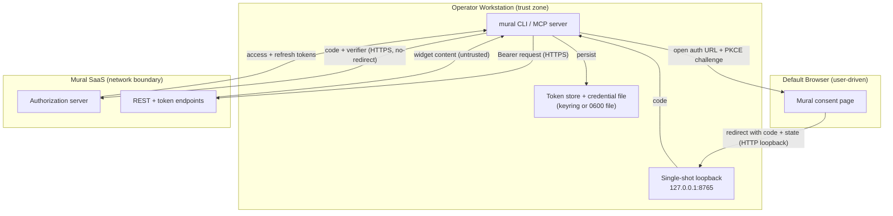

<!-- markdownlint-disable-file -->
# Mural Skill Security Model

This document records the STRIDE threat model for the Mural skill (the `mural` package under `scripts/mural/`). The model is organized by trust bucket: Browser to Loopback (B1), CLI to Mural endpoints (B2), On-disk cache (B3), and CLI caller process (B4). Each bucket enumerates all six STRIDE categories with the in-code mitigations that address them. Assets and adversaries are enumerated first because credential-storage docs ([`docs/agents/mural/credentials.md`](../../../../docs/agents/mural/credentials.md)) reference them by id. Acknowledged enterprise readiness gaps are listed at the end of the document.

> **See also: repo-wide STRIDE model.** This skill participates in the repository-wide threat model at [`docs/security/security-model.md`](../../../../docs/security/security-model.md). The Authorization Code + PKCE login flow implemented by `_run_login` is enumerated there as threats **OA-1 through OA-17** in [§ OAuth Authentication Threats](../../../../docs/security/security-model.md#oauth-authentication-threats). Each OA row cites Mural's published OAuth documentation at <https://developers.mural.co/public/docs/oauth> (verified 2026-05-10) and pins residual-risk expectations against published RFC behavior. Gap **G-EOP-2** below (refresh-token non-rotation) is **verified correct** against that source.

## Executive Summary

The Mural skill is a local Python CLI with an embedded stdio MCP server. It authenticates to Mural with OAuth 2.0 Authorization Code + PKCE, caches access and refresh tokens in the OS keyring (or a `0600` file fallback), and makes authenticated HTTPS calls to the Mural REST API. Its highest-risk behaviors are at-rest credential storage on the operator workstation and the browser-mediated OAuth login flow; both are mitigated in code, with residual gaps tracked in the gap register. The skill runs no public listener (the loopback receiver is single-shot and bound to `127.0.0.1`) and treats all Mural-authored content returned through the CLI as untrusted.

### Security Posture Overview

| Dimension          | Value                                                                                |
|--------------------|--------------------------------------------------------------------------------------|
| Runtime surface    | REST CLI + embedded stdio MCP server; OAuth Auth Code + PKCE; single-shot loopback   |
| Trust buckets      | B1 Browser→Loopback, B2 CLI→Mural, B3 On-disk cache, B4 CLI caller process           |
| Credentials        | OAuth access/refresh tokens + `client_id`/`client_secret`; OS keyring or `0600` file |
| Network egress     | HTTPS to `https://app.mural.co` (system trust store; no-redirect token opener)       |
| Open residual gaps | 10 (EoP-High: no client-side token revocation / refresh-token non-rotation)          |

## Contents

* [System Description](#system-description)
* [Trust Boundaries](#trust-boundaries)
* [Assets](#assets)
* [Adversaries](#adversaries)
* [Bucket B1: Browser → Loopback](#bucket-b1-browser--loopback)
* [Bucket B2: CLI → Mural endpoints](#bucket-b2-cli--mural-endpoints)
* [Bucket B3: On-disk cache](#bucket-b3-on-disk-cache)
* [Bucket B4: CLI Caller Process](#bucket-b4-cli-caller-process)
* [Enterprise Readiness Gaps](#enterprise-readiness-gaps)
* [References](#references)

## System Description

### Components

1. `scripts/mural/` Python package — the CLI entry point, command handlers, and the embedded stdio MCP server.
2. OAuth login flow (`_run_login`) — opens the browser to Mural's authorization URL and runs a single-shot loopback receiver at `http://127.0.0.1:8765/callback`.
3. Token store and credential file — per-user cache (`mural-token.json`, mode `0600`) and `mural.{profile}.env`, or the OS keyring backend.
4. REST client — `urllib.request` calls to `https://app.mural.co` through a no-redirect opener with a capped JSON parser.

### Data Flow



## Trust Boundaries

### Boundary Diagram

```text
┌───────────────────────────────────────────────────────────────┐
│ TRUST BOUNDARY: Operator Workstation                          │
│  ┌─────────────┐  ┌────────────────┐  ┌────────────────────┐  │
│  │ mural CLI / │  │ Loopback recv  │  │ Token store +      │  │
│  │ MCP server │  │ 127.0.0.1:8765 │  │ credential file    │  │
│  └─────────────┘  └────────────────┘  └────────────────────┘  │
└───────────────┬───────────────────────────────┬───────────────┘
                │ open browser                  │ HTTPS (TLS)
    ┌────────────▼───────────┐      ┌────────────▼───────────────┐
    │ BOUNDARY: Browser      │      │ BOUNDARY: Mural SaaS       │
    │  Mural consent page    │      │  Auth server + REST API    │
    └────────────────────────┘      └────────────────────────────┘
```

### Boundary Descriptions

| Boundary             | Assets Protected                         | Controls Enforced                                                                                   |
|----------------------|------------------------------------------|-----------------------------------------------------------------------------------------------------|
| Operator Workstation | Tokens, client secret, code verifier     | OS keyring / `0600` files, single-shot loopback bound to `127.0.0.1`, PKCE verifier held in-process |
| Browser              | Authorization code, `state`              | Random `state` compared with `secrets.compare_digest`; user verifies consent URL                    |
| Mural SaaS           | Request/response integrity, bearer token | TLS via system trust store; no-redirect token opener; capped JSON response parser                   |

## Assets

| Id | Asset                                       | Lifetime         | Notes                                                                                                                                                                                                   |
|----|---------------------------------------------|------------------|---------------------------------------------------------------------------------------------------------------------------------------------------------------------------------------------------------|
| A1 | Mural OAuth access tokens                   | ~1 hour          | Bearer in `Authorization` header to `https://app.mural.co`. Cached in token store (B3).                                                                                                                 |
| A2 | Mural OAuth refresh tokens                  | Long-lived       | Mural does **not** rotate refresh tokens at refresh time, so a leaked refresh token remains valid until revoked at the portal. See Enterprise Readiness Gaps.                                           |
| A3 | Mural OAuth `client_id` and `client_secret` | Long-lived       | Provisioned at <https://app.mural.co/account/api>. Stored in the credential file (B3) or environment.                                                                                                   |
| A4 | Cached widget content from Mural            | Command lifetime | CLI output may include sticky-note text, attachments, or comments authored by other Mural users. May contain PII or confidential workshop content; downstream automation must treat as untrusted input. |

## Adversaries

| Id    | Adversary                                                             | In-scope mitigations                                                                                                                                                                                                                         |
|-------|-----------------------------------------------------------------------|----------------------------------------------------------------------------------------------------------------------------------------------------------------------------------------------------------------------------------------------|
| ADV-a | Same-uid malware on the operator workstation                          | **Not defended.** A process running as the operator can read the token store, the credential file, the keyring, and process environment directly. Workstation hygiene is the controlling defense.                                            |
| ADV-b | Network attacker (in-path or off-path) on the CLI ↔ Mural channel     | TLS to `https://app.mural.co` with stdlib certificate validation; token-endpoint redirects refused; capped JSON response parser.                                                                                                             |
| ADV-c | Backup, sync, or snapshot exfiltration of the operator home directory | Keyring backend moves A2/A3 out of `$XDG_CONFIG_HOME/hve-core/` so they are not captured by home-dir backups, cloud sync, or editor "open recent" indexes. File backend remains at-risk; mitigated only by `0600` permissions.               |
| ADV-d | Stolen or compromised device at rest                                  | Partially mitigated by keyring backends that require explicit unlock (macOS Keychain, Windows DPAPI tied to user logon, locked SecretService). Keyrings auto-unlocked at login provide no additional defense over `0600` filesystem storage. |
| ADV-e | Hostile browser tab or referrer during the OAuth login flow           | PKCE binds the authorization code to the per-flow `code_verifier`; `state` is compared with `secrets.compare_digest`; loopback is single-shot, GET-only, validates the inbound `Host` header, and the token-endpoint opener refuses 30x.     |
| ADV-f | Hostile or untrusted caller process invoking the CLI                  | CLI inputs are parsed locally and destructive commands require granted OAuth scope before execution. Mural-authored text in command output is treated as untrusted by downstream automation.                                                 |

## Bucket B1: Browser → Loopback

The Authorization Code + PKCE flow opens the user's default browser at Mural's authorization URL and runs a single-shot loopback HTTP listener at `http://127.0.0.1:8765/callback` (overrideable via `MURAL_REDIRECT_URI`) to receive the authorization code.

### Spoofing

A hostile page in the browser could attempt to deliver a forged authorization response.

* The login flow generates a random `state` parameter and rejects callbacks whose `state` does not match (see [`scripts/mural/`](scripts/mural/) `_run_login`).
* The loopback handler verifies the inbound `Host` header matches the bound loopback address before processing the request (see [`scripts/mural/`](scripts/mural/) `_LoopbackHandler`).

### Tampering

The loopback channel is plaintext HTTP because TLS to `127.0.0.1` is not available without a custom CA.

* The listener is bound to `127.0.0.1` only (never `0.0.0.0` or `::`), so on-host code is the only writer (see [`scripts/mural/`](scripts/mural/) `_start_loopback_server`).
* The redirect URI is validated to require an IPv4 loopback literal; `localhost` and `[::1]` are rejected (see [`scripts/mural/`](scripts/mural/) `_validate_redirect_uri`).

### Repudiation

Not applicable. The loopback exchange is a synchronous, in-process step; no persistent action is taken until the token endpoint exchange in B2 succeeds.

### Information Disclosure

A hostile referrer or shoulder surfer could attempt to capture the authorization code.

* PKCE binds the authorization code to a per-flow `code_verifier`, so a captured code cannot be redeemed without the verifier held only by this process (see [`scripts/mural/`](scripts/mural/) `_generate_pkce_pair`, `_verify_pkce`).
* The loopback responds with a minimal HTML success page that contains no token material.

### Denial of Service

The listener is a process-local socket and an attractive target for local resource exhaustion.

* The loopback server is single-shot: it accepts one request, completes the handshake, and shuts down (see [`scripts/mural/`](scripts/mural/) `_start_loopback_server`).
* The login wait has a bounded timeout and the bound port is fixed so collisions surface immediately as `MuralError("port 8765 already in use; set MURAL_REDIRECT_URI")` rather than silently rebinding (see [`scripts/mural/`](scripts/mural/) `_run_login`).

### Elevation of Privilege

A request to an unexpected path or method could attempt to drive the handler into unintended code paths.

* The handler accepts only `GET /callback` and rejects every other method or path with HTTP 404 (see [`scripts/mural/`](scripts/mural/) `_LoopbackHandler`).

### Risk Rating

| Threat                                         | Likelihood | Impact | Residual Risk | Status           |
|------------------------------------------------|------------|--------|---------------|------------------|
| Forged authorization response (state mismatch) | Low        | Med    | Low           | Mitigated        |
| Authorization-code capture by hostile referrer | Low        | Med    | Low           | Mitigated (PKCE) |
| Local DoS / loopback port collision            | Low        | Low    | Low           | Mitigated        |

## Bucket B2: CLI → Mural endpoints

All REST and OAuth token-endpoint calls target `https://app.mural.co/...` over TLS using the Python standard library (`urllib.request`).

### Spoofing

* TLS certificate validation is enforced by the stdlib default `SSLContext`, which uses the system trust store.

### Tampering

* TLS protects request and response bodies in transit.
* Token-endpoint calls go through a dedicated opener that refuses HTTP redirects, so a 30x cannot be used to silently retarget the request (see [`scripts/mural/`](scripts/mural/) `_NoRedirect`).

### Repudiation

* Token responses are persisted with `obtained_at` timestamps so `auth status` can show when each profile was last refreshed (see [`scripts/mural/`](scripts/mural/) `_apply_refresh`).

### Information Disclosure

* Bearer tokens are sent only in the `Authorization` header to `https://app.mural.co` and never logged.
* The token-endpoint opener blocks 30x responses, preventing a hostile redirect from leaking refresh tokens to a non-Mural origin (see [`scripts/mural/`](scripts/mural/) `_NoRedirect`).
* The token response parser requires `Content-Type: application/json` and reads through a capped-size reader; a non-JSON response (HTML error page, captive portal, etc.) raises a typed error rather than being parsed as a token (see [`scripts/mural/`](scripts/mural/) `_parse_token_response`).

### Denial of Service

* Mural API rate limits surface as `MuralAPIError` codes; the CLI honors `Retry-After` for transient failures and exits `EX_TEMPFAIL` (75) so callers can back off.
* Response bodies are read through a capped reader so a runaway upstream cannot exhaust memory.

### Elevation of Privilege

* The default scopes are read-only. Write scopes are granted only when `auth login --write` is invoked, and the granted scope set is recorded in the token store and re-checked at dispatch time before any destructive call.
* `MURAL_SCOPES` allows callers to drop scopes per session for least-privilege automation.

### TLS posture

The skill performs every Mural API and OAuth token-endpoint call through `urllib.request.urlopen`. There is no `ssl.SSLContext`, custom `HTTPSHandler`, `cafile`/`capath` argument, or certificate-pinning callback anywhere in the skill source. Operators inherit Python's default HTTPS behavior end to end, with the implications below.

* **Trust store.** Validation uses the default `ssl.create_default_context()` (created implicitly by `urllib`), which loads the system trust store. On Linux this is OpenSSL's default cert paths; on macOS Python links against the system Security framework when built with the official installer; on Windows Python loads the SChannel certificate store.
* **Custom CA roots.** The skill does **not** expose a CLI flag for a CA bundle. Operators behind a TLS-inspecting proxy or with an internal CA must export the standard Python/OpenSSL environment variables (`SSL_CERT_FILE`, `SSL_CERT_DIR`) before invoking `python -m mural`. The skill does not depend on `requests`, so `REQUESTS_CA_BUNDLE` has no effect.
* **Certificate pinning.** None. Validation relies entirely on the system trust store. This is acceptable for a public SaaS endpoint (`app.mural.co`) but is recorded as G-TLS-1 below for customers whose policy requires explicit pinning.
* **mTLS.** Not supported by the skill. Mural's API does not require client certificates, so this is not currently a gap.
* **TLS version and ciphers.** Inherited from the host Python build's OpenSSL. The skill makes no calls to `set_ciphers`, `minimum_version`, or `set_alpn_protocols`. Hosts requiring TLS 1.2 floors or specific cipher suites must enforce them through the Python build or system OpenSSL configuration.
* **FIPS posture.** Inherited from the host Python build. The skill does not attempt to detect or enforce FIPS mode; operators on FIPS-validated systems should confirm their Python and OpenSSL builds before relying on the skill in regulated environments.

### Risk Rating

| Threat                                         | Likelihood | Impact | Residual Risk | Status                         |
|------------------------------------------------|------------|--------|---------------|--------------------------------|
| TLS MITM / hostile redirect retargeting        | Low        | High   | Low           | Mitigated (no-redirect opener) |
| Refresh-token leak via 30x to non-Mural origin | Low        | High   | Low           | Mitigated                      |
| Upstream rate-limit / oversized-body DoS       | Med        | Low    | Low           | Mitigated (capped reader)      |
| Compromised local CA (no cert pinning)         | Low        | High   | Low           | Accepted (G-TLS-1)             |

## Bucket B3: On-disk cache

Refresh and access tokens are persisted to a per-user cache file (`mural-token.json`) with a sibling lockfile (`<path>.lock`). The cache is schema version 2 and supports multiple named profiles.

This bucket also covers the per-user credential file (`mural.{profile}.env`) created by `mural auth bootstrap` at `$XDG_CONFIG_HOME/hve-core/` (POSIX) or `%APPDATA%\hve-core\` (Windows), which holds the Mural OAuth `client_id` and `client_secret`. It is loaded at runtime via `_autoload_credentials` only when the matching environment variables are unset.

### Storage backend variants

`MURAL_CREDENTIAL_BACKEND` selects how A2 (refresh tokens) and A3 (client secrets) are persisted at rest. The four modes share the same wire-level behavior but have distinct at-rest threat surfaces:

* **`auto` (default).** Prefers the OS keychain when the `keyring` package and a usable backend are present; falls back to the file backend otherwise. The chosen backend is reported by `mural auth status`.
* **`keyring`.** OS keychain only (macOS Keychain, Windows Credential Manager via DPAPI, freedesktop SecretService). Defends ADV-c (backup/sync exfiltration) and partially defends ADV-d (stolen device) when the keychain requires explicit unlock. Does **not** defend ADV-a.
* **`file`.** Plaintext-at-rest under `0600` permissions, with the protections described below. Defends only ADV-d on encrypted-at-rest disks. Does not defend ADV-a or ADV-c.
* **`env-only`.** Reads credentials only from process environment; never persists. Suitable for ephemeral CI runners. Removes ADV-c entirely; introduces a Repudiation gap (no `obtained_at` history is recorded).

`mural auth migrate` round-trips credentials between backends and verifies the destination read before deleting the source (when `--cleanup --force` is passed).

Devcontainer, Codespaces, and WSL2 contexts inherit the host operator's trust; the keyring backend may be unavailable inside the container, in which case `auto` falls through to the file backend or env-only and the resulting backend is logged at startup.

### Spoofing

* Each profile entry is bound to its registered `client_id`. A token loaded under a profile whose `client_id` does not match the current `MURAL_CLIENT_ID` is rejected at load time so a token issued for a different OAuth app cannot be silently reused (see [`scripts/mural/`](scripts/mural/) `_select_profile`).

### Tampering

* All writes go through `os.open(O_WRONLY | O_CREAT | O_EXCL, 0o600)` followed by `os.replace` so partial writes are never observed.
* Concurrent CLI writers serialize through an advisory lock on the sibling `<path>.lock` file (`fcntl.flock` on POSIX, `msvcrt.locking` on Windows), preventing interleaved writes from corrupting the v2 envelope (see [`scripts/mural/`](scripts/mural/) `_acquire_cache_lock`).
* The credential-file parser performs no shell expansion and no `$VAR` interpolation; values are stored verbatim and matching surrounding quotes are stripped without further processing (see [`scripts/mural/`](scripts/mural/) `FileBackend._read_all`). A tampered file therefore cannot escalate to subprocess execution via parsed values.

### Repudiation

* Each profile entry records `obtained_at` and the granted scope set so the source and freshness of any cached credential is auditable from the cache file alone.
* `mural auth status` reports `credential_file` (resolved path) and `credential_file_exists` (boolean) so operators have a stable, scriptable view of which credential source the runtime would load (see [`scripts/mural/`](scripts/mural/) `_cmd_auth_status`).

### Information Disclosure

* The cache file is created with mode `0600` on POSIX. On Windows the file lives under `%LOCALAPPDATA%\hve-core\` whose default ACL grants access only to the owning user.
* The lockfile is created with mode `0600` and contains no token material; it exists only as the target of the platform's advisory-lock primitive.
* The credential file is created with mode `0600` and `_check_credential_file_perms` refuses to load it on POSIX when the mode includes any group or world bits. The check can only be bypassed by setting `MURAL_ENV_FILE_RELAXED=1`, which is intended for ephemeral CI containers and should never be set on a workstation. `MURAL_ENV_FILE` overrides the resolved path so callers can point the loader at a managed secrets-mount location instead of the default XDG path.
* Env-only mode (`MURAL_CREDENTIAL_BACKEND=env-only`) does not write to disk and therefore inherits whatever protection the host process environment provides; operators are responsible for not leaking the environment into job logs or child-process dumps.

### Denial of Service

* The lockfile is intentionally never deleted to avoid the unlink/recreate race that would let a concurrent writer hold a lock on a stale inode. A stale lock is harmless: the next acquirer simply takes the advisory lock on the same file.
* Cache reads are bounded by file size and parsed through `json.loads` with no recursion limits relaxed.

### Elevation of Privilege

* The schema-version check refuses to load a v1 cache as v2 without running the explicit `_migrate_v1_to_v2` path, which preserves the `client_id` binding contract (see [`scripts/mural/`](scripts/mural/) `_migrate_v1_to_v2`).
* `MURAL_KEYRING_BACKEND` accepts a `module.path.ClassName` string and instantiates it via `importlib.import_module` + `getattr`. This is intentional for tests and unusual desktop environments, but it permits arbitrary class instantiation from any importable module. An attacker who can already set environment variables for the CLI process can already do worse, so this is rated EoP-Low; treat the env var as part of the operator-controlled trust surface.

> **Secret rotation:** The `client_secret` outlives any access token. To rotate, revoke the old credential at <https://app.mural.co/account/api> first, then re-run `mural auth bootstrap` to write fresh values. Deleting the credential file alone does not revoke the secret server-side.

**Known limitation: plaintext at-rest.** Both the token store and the credential file are mode-0600 plaintext on disk. Stdlib symmetric encryption with a passphrase prompt was rejected because it would prompt on every CLI invocation (defeating the UX goal) and storing the passphrase next to the ciphertext provides no real defense over POSIX permissions. The credential file shares the same threat model as the token store; users who require stronger at-rest protection wrap invocations with an out-of-band secrets manager (`dotenvx`, `sops exec-env`, `pass`) as documented in [SKILL.md](SKILL.md).

### Risk Rating

| Threat                                     | Likelihood | Impact | Residual Risk | Status                                |
|--------------------------------------------|------------|--------|---------------|---------------------------------------|
| At-rest token/secret theft (file backend)  | Med        | High   | Med           | Partially Mitigated (keyring backend) |
| Backup/sync exfiltration of home directory | Med        | High   | Med           | Partially Mitigated (keyring backend) |
| Cache tampering / partial write            | Low        | Med    | Low           | Mitigated (atomic write + lock)       |
| Refresh-token non-rotation reuse           | Med        | High   | Med           | Accepted upstream (G-EOP-2)           |

## Bucket B4: CLI Caller Process

The skill exposes Mural operations through local CLI commands. The caller process controls argv, environment variables, stdin, stdout, and stderr, and the CLI treats that process as operator-controlled.

### Spoofing

* The CLI has no network listener or attach surface. It runs as the invoking OS user and trusts the caller's argv and environment.
* The executable identity comes from the installed package or `python -m mural`; operators should invoke the intended environment explicitly when multiple checkouts or virtual environments exist.

### Tampering

* Command arguments are parsed by `argparse`; command handlers validate identifiers, URLs, JSON bodies, profile names, area layouts, tags, hyperlinks, and pagination cursors before issuing HTTP requests.
* JSON arguments are parsed through `_parse_json_arg`, which requires object-shaped payloads where a command expects a request body and raises a typed validation error before any API call.
* Environment-driven paths and profiles are normalized through dedicated helpers so null bytes, unsupported profile names, and unsafe credential-file permissions fail before credential loading.

### Repudiation

* Commands emit deterministic exit codes for validation failures, authentication failures, temporary upstream failures, and unexpected errors so automation can attribute failures to the invoking step.
* The in-process idempotency cache (`_IDEMPOTENCY_CACHE`, bounded LRU of 128 entries) returns the original result for duplicate command/idempotency-key pairs within a process lifetime, so repeated create calls cannot be silently double-attributed. The cache is process-local and not persisted across restarts.

### Information Disclosure

* Command output is JSON-encoded Mural payloads; tokens never appear in normal command output.
* All log output is filtered through `_redact`, which masks the access token, refresh token, code verifier, code challenge, `client_secret`, and the form-style `code` parameter in any logged JSON or form payload (see [`scripts/mural/`](scripts/mural/) `_redact`). Bearer headers and Azure Blob SAS query strings are also redacted.
* Unexpected errors emitted to stderr are passed through `_redact(repr(exc))` before logging.
* Mural-authored text (sticky notes, textboxes, descriptions, attachments, etc.) returned through CLI output must be treated as untrusted by downstream automation. Mural-sourced text is JSON-encoded output data and is never interpolated into model instructions by the CLI.

### Denial of Service

* HTTP response bodies from Mural are read through `_read_capped` with `MURAL_MAX_BODY_BYTES` (default 16 MiB) so an upstream that streams an unbounded body cannot exhaust the process.
* Pagination uses explicit page-size limits and bounded cursor parsing so malformed cursors or oversized page requests fail locally.
* Bulk update commands support `--atomic` and bounded retry behavior for tag merge conflicts so partial upstream failures produce structured summaries instead of unbounded loops.

### Elevation of Privilege

* Write commands dispatch through `_require_scope`; there is no CLI path that skips the granted-scope check before calling a write endpoint.
* Guarded destructive commands honor the AI-authored tag contract and require explicit override flags before mutating human-authored widgets.
* Dry-run capable commands return structured previews without invoking the underlying Mural API call.

### Risk Rating

| Threat                                      | Likelihood | Impact | Residual Risk | Status                          |
|---------------------------------------------|------------|--------|---------------|---------------------------------|
| Hostile argv / JSON body injection          | Low        | Med    | Low           | Mitigated (validated, no shell) |
| Secret leakage into logs                    | Low        | High   | Low           | Mitigated (`_redact`)           |
| Untrusted Mural content consumed downstream | Med        | Med    | Med           | By design (G-INF-4)             |
| Duplicate-write double-attribution          | Low        | Low    | Low           | Mitigated (idempotency cache)   |

## Enterprise Readiness Gaps

The following gaps are known limitations of the current implementation. They are recorded here so operators can make informed deployment decisions and so contributors have a clear backlog of hardening work. Severity ratings are the project's own assessment and are not equivalent to a CVSS score.

| Id      | Gap                                                                                                                                                                                                                                                                                                                                                                                                                                                                                                     | Severity        | Status                                                                                                                                                                                                                                                                                                                                                                                                                                                                                   |
|---------|---------------------------------------------------------------------------------------------------------------------------------------------------------------------------------------------------------------------------------------------------------------------------------------------------------------------------------------------------------------------------------------------------------------------------------------------------------------------------------------------------------|-----------------|------------------------------------------------------------------------------------------------------------------------------------------------------------------------------------------------------------------------------------------------------------------------------------------------------------------------------------------------------------------------------------------------------------------------------------------------------------------------------------------|
| G-EOP-1 | `mural auth logout` removes local credentials but does **not** call the Mural OAuth token revocation endpoint. A leaked refresh token therefore remains valid until manually revoked at <https://app.mural.co/account/api>.                                                                                                                                                                                                                                                                             | EoP-High        | Tracked separately, fix in flight.                                                                                                                                                                                                                                                                                                                                                                                                                                                       |
| G-EOP-2 | Mural does not rotate refresh tokens at refresh time, verified against <https://developers.mural.co/public/docs/oauth> (refresh response schema returns only `access_token` + `expires_in`; reference text states "You can reuse your refresh_token"). A leaked refresh token remains valid until manual revocation; rotation cannot be enforced from the client side. See also OA-17 in [`docs/security/security-model.md`](../../../../docs/security/security-model.md#oauth-authentication-threats). | EoP-High        | Upstream behavior; mitigate via short-lived sessions and prompt revocation on suspicion of compromise.                                                                                                                                                                                                                                                                                                                                                                                   |
| G-INF-1 | `client_secret` was historically absent from `_REDACT_KEYS`, leaving any future code path or third-party library that logged a JSON or form payload containing `client_secret` exposed in clear. The token-endpoint exchange itself does not log request bodies, so no shipped code path leaked the secret, but defense-in-depth coverage was missing.                                                                                                                                                  | InfoDisc-Med    | Fixed: `client_secret` is now in `_REDACT_KEYS`. Defense-in-depth expanded to also mask `id_token` (OIDC), `assertion` and `client_assertion` (RFC 7521 / RFC 7523 JWT-bearer), `device_code` (RFC 8628), and `password` (RFC 6749 §4.3 ROPC) so any third-party library or future code path that logs an OAuth/OIDC payload using these standard field names will be scrubbed even though the Mural skill itself does not currently exercise those flows. Row retained for audit trail. |
| G-INF-2 | Both the token store and the credential file are mode-`0600` plaintext on disk for the file backend. This is documented under B3 "Known limitation"; keyring backend mitigates.                                                                                                                                                                                                                                                                                                                         | InfoDisc-Med    | Operator-selectable: use `MURAL_CREDENTIAL_BACKEND=keyring`.                                                                                                                                                                                                                                                                                                                                                                                                                             |
| G-INF-3 | `MURAL_ENV_FILE_RELAXED=1` bypasses the `0o077` permission gate with a single warning log. There is no enterprise-side opt-out that prevents an operator from setting the variable on a workstation.                                                                                                                                                                                                                                                                                                    | InfoDisc-Med    | Mitigate via host policy or org-level environment lockdown.                                                                                                                                                                                                                                                                                                                                                                                                                              |
| G-REP-1 | No structured or tamper-evident audit log is emitted. CLI diagnostics go to stderr only; there is no signed or append-only sink.                                                                                                                                                                                                                                                                                                                                                                        | Repudiation-Med | Out of scope for the skill; integrate with host telemetry if required.                                                                                                                                                                                                                                                                                                                                                                                                                   |
| G-REP-2 | Env-only mode emits no `obtained_at` history because nothing is persisted; `mural auth status` cannot show a refresh history.                                                                                                                                                                                                                                                                                                                                                                           | Repudiation-Low | Inherent to the mode; operators relying on history should use `keyring` or `file`.                                                                                                                                                                                                                                                                                                                                                                                                       |
| G-SUP-1 | The skill's Python dependencies are listed in `pyproject.toml` but the project does not yet publish an SBOM, sign release artifacts, or pin transitive dependency hashes for the skill.                                                                                                                                                                                                                                                                                                                 | SupplyChain-Med | Tracked at the repository level.                                                                                                                                                                                                                                                                                                                                                                                                                                                         |
| G-INF-4 | Mural payloads returned through CLI output may include PII or confidential workshop content (A4). The skill does not classify or redact this content; downstream handling is the caller's responsibility.                                                                                                                                                                                                                                                                                               | InfoDisc-Med    | By design; documented in B4 Information Disclosure.                                                                                                                                                                                                                                                                                                                                                                                                                                      |
| G-TLS-1 | The skill performs no certificate pinning for `app.mural.co`; TLS validation depends entirely on the system trust store. A compromised local CA, an operator-installed inspection root, or a vulnerability in the underlying OpenSSL/SChannel/Security framework therefore extends to the skill. See the **TLS posture** subsection under B2 for the full inventory.                                                                                                                                    | InfoDisc-Low    | Operator-acceptable for a public SaaS endpoint; documented for customers whose policy mandates pinning.                                                                                                                                                                                                                                                                                                                                                                                  |

For an active issue tracker entry covering these gaps, see the [hve-core issues list](https://github.com/microsoft/hve-core/issues).

## References

* [STRIDE Threat Model](https://learn.microsoft.com/azure/security/develop/threat-modeling-tool-threats)
* [OWASP Top 10 for LLM Applications](https://owasp.org/www-project-top-10-for-large-language-model-applications/)
* [Mural OAuth documentation](https://developers.mural.co/public/docs/oauth) (verified 2026-05-10)
* [RFC 6749 — OAuth 2.0](https://datatracker.ietf.org/doc/html/rfc6749), [RFC 7636 — PKCE](https://datatracker.ietf.org/doc/html/rfc7636), [RFC 6819 — OAuth Threat Model](https://datatracker.ietf.org/doc/html/rfc6819)
* [Repository security model](../../../../docs/security/security-model.md)

🤖 Crafted with precision by ✨Copilot following brilliant human instruction, then carefully refined by our team of discerning human reviewers.
