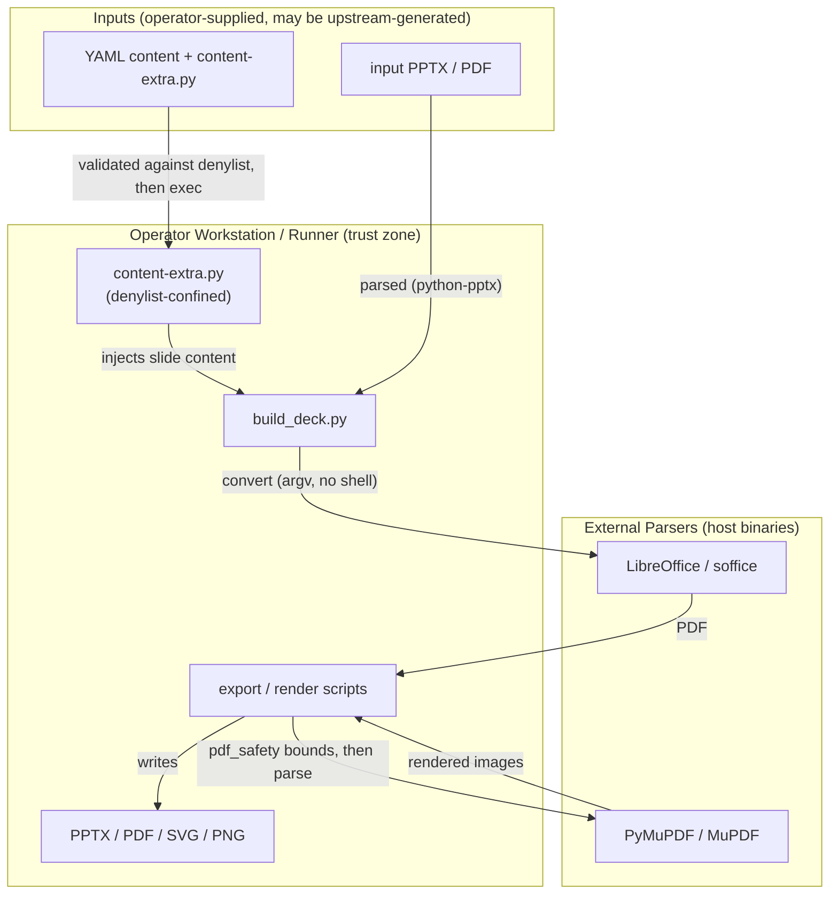

<!-- markdownlint-disable-file -->
# PowerPoint Skill Security Model

This document records the STRIDE threat model for the powerpoint skill (`scripts/build_deck.py`, `scripts/export_slides.py`, `scripts/export_svg.py`, `scripts/render_pdf_images.py`, and the `scripts/pdf_safety.py` helper). The model is organized by trust bucket: Sandboxed `content-extra.py` execution (B1), External converter subprocess (B2), Untrusted document parsing (B3), and CLI caller process and filesystem (B4). Each bucket enumerates all six STRIDE categories with the in-code mitigations that address them. Assets and adversaries are enumerated first. Acknowledged enterprise readiness gaps are listed at the end.

The skill builds and validates PPTX decks from YAML content, optionally executes author-supplied `content-extra.py` helper scripts to add advanced slide content, and exports decks to PDF/SVG/PNG using LibreOffice and PyMuPDF. The highest-risk behavior is **executing author-supplied Python**, which is constrained by an import/builtin denylist; the second is invoking external document converters on potentially untrusted documents.

> **See also: repo-wide STRIDE model.** This skill participates in the repository-wide threat model at [`docs/security/security-model.md`](../../../../docs/security/security-model.md) and is registered in its [Skill Security Models](../../../../docs/security/security-model.md#skill-security-models) section.

## Executive Summary

The powerpoint skill builds decks from YAML, optionally **executes author-supplied `content-extra.py`** under an import/builtin denylist, and exports via external parsers (LibreOffice, PyMuPDF). Its highest-risk behaviors are in-process execution of author Python (denylist confinement, not an OS sandbox) and invoking large external document parsers on potentially untrusted documents. The skill holds no credentials and performs no first-party network egress; subprocess invocations use argument lists (no shell) and PDF inputs are bounded by `pdf_safety` before MuPDF parses them. Residual risk concentrates in sandbox-escape and external-parser CVE exposure.

### Security Posture Overview

| Dimension          | Value                                                                          |
|--------------------|--------------------------------------------------------------------------------|
| Runtime surface    | Author-Python execution (denylist); LibreOffice + PyMuPDF subprocess/parsing   |
| Trust buckets      | B1 content-extra exec, B2 converter subprocess, B3 document parsing, B4 caller |
| Credentials        | None handled; no network listener; no first-party egress                       |
| Network egress     | None (first-party); LibreOffice/MuPDF operate on local files                   |
| Open residual gaps | 4 (EoP-Med: denylist confinement is not an OS-level sandbox)                   |

## Contents

* [System Description](#system-description)
* [Trust Boundaries](#trust-boundaries)
* [Assets](#assets)
* [Adversaries](#adversaries)
* [Bucket B1: Sandboxed content-extra.py execution](#bucket-b1-sandboxed-content-extrapy-execution)
* [Bucket B2: External converter subprocess](#bucket-b2-external-converter-subprocess)
* [Bucket B3: Untrusted document parsing](#bucket-b3-untrusted-document-parsing)
* [Bucket B4: CLI caller process and filesystem](#bucket-b4-cli-caller-process-and-filesystem)
* [Enterprise Readiness Gaps](#enterprise-readiness-gaps)
* [References](#references)

## System Description

### Components

1. `scripts/build_deck.py` — builds and validates the PPTX from YAML; optionally executes `content-extra.py` under a denylist.
2. `scripts/export_slides.py`, `scripts/export_svg.py`, `scripts/render_pdf_images.py` — export the deck via LibreOffice and render images via PyMuPDF.
3. `scripts/pdf_safety.py` — bounds PDF inputs (size, magic bytes, page count) before MuPDF parsing.

### Data Flow



## Trust Boundaries

### Boundary Diagram

```text
┌───────────────────────────────────────────────────────────────┐
│ TRUST BOUNDARY: Operator Workstation / Runner                 │
│  ┌──────────────┐  ┌────────────────────┐  ┌───────────────┐  │
│  │ build_deck   │  │ content-extra.py   │  │ export/render │  │
│  │              │  │ (denylist-confined)│  │ + outputs     │  │
│  └──────────────┘  └────────────────────┘  └───────────────┘  │
└───────────────┬─────────────────────────┬─────────────────────┘
                │ argv (no shell)          │ parse (bounded)
   ┌─────────────▼──────────────┐  ┌────────▼─────────────────────┐
   │ BOUNDARY: External parsers │  │ BOUNDARY: Inputs (untrusted) │
   │  LibreOffice / PyMuPDF     │  │  YAML + content-extra + PPTX │
   └────────────────────────────┘  └──────────────────────────────┘
```

### Boundary Descriptions

| Boundary                      | Assets Protected       | Controls Enforced                                                                  |
|-------------------------------|------------------------|------------------------------------------------------------------------------------|
| Operator Workstation / Runner | Host process, outputs  | Denylist-confined author exec; argv (no shell); tempfile outputs                   |
| External parsers              | Host process integrity | `pdf_safety` bounds before MuPDF; python-pptx entity resolution disabled; no shell |
| Inputs                        | Build integrity        | Denylist validation of `content-extra.py`; type-checked YAML; bounded PDF          |

## Assets

| Id | Asset                            | Lifetime         | Notes                                                                                                                      |
|----|----------------------------------|------------------|----------------------------------------------------------------------------------------------------------------------------|
| A1 | `content-extra.py` author script | Command lifetime | Author-supplied Python executed by the deck builder to inject advanced content. Constrained by an import/builtin denylist. |
| A2 | Input PPTX / YAML content        | Command lifetime | Parsed by python-pptx (lxml) and PyYAML; may originate from an upstream pipeline fed by untrusted material.                |
| A3 | Intermediate / input PDF         | Command lifetime | Parsed by PyMuPDF (MuPDF C library) during export and image rendering. MuPDF has a non-trivial CVE history.                |
| A4 | LibreOffice / soffice binary     | Per-invocation   | Located via `shutil.which` and platform default paths; spawned headless to convert PPTX to PDF.                            |
| A5 | Output files (PDF/SVG/PNG/PPTX)  | Command lifetime | Written to operator-chosen output paths.                                                                                   |

## Adversaries

| Id    | Adversary                                 | In-scope mitigations                                                                                                                                                                                                                                                                                                                           |
|-------|-------------------------------------------|------------------------------------------------------------------------------------------------------------------------------------------------------------------------------------------------------------------------------------------------------------------------------------------------------------------------------------------------|
| ADV-a | Hostile `content-extra.py` author content | **Partially defended.** A denylist blocks dangerous stdlib modules (`os`, `subprocess`, `socket`, `urllib`, `ctypes`, `pickle`, `multiprocessing`, and more), dangerous builtins (`eval`, `exec`, `compile`, `__import__`, `breakpoint`), and indirect-bypass builtins (`getattr`/`setattr`/`globals`/`locals`/`vars`/`delattr`). See G-EOP-1. |
| ADV-b | Hostile or malformed input PDF            | `pdf_safety.validate_pdf_path` enforces a regular-file check, a 100 MB size ceiling, the `%PDF-` magic-byte prefix, and a 1000-page ceiling before any MuPDF parsing; C-level failures are wrapped in typed `PdfSafetyError` subclasses.                                                                                                       |
| ADV-c | Hostile or malformed input PPTX           | Parsed through python-pptx, which disables external-entity resolution in its OOXML parser. Inline timing/transition XML is built from hardcoded templates.                                                                                                                                                                                     |
| ADV-d | Hostile or substituted LibreOffice binary | Located via `shutil.which` and known platform paths; invoked with an argument list (no shell). Trust in the installed binary is an operator responsibility.                                                                                                                                                                                    |
| ADV-e | Hostile caller process controlling argv   | All converter subprocesses use argument lists (no shell); output paths are operator-controlled.                                                                                                                                                                                                                                                |

## Bucket B1: Sandboxed `content-extra.py` execution

### Spoofing

* Not applicable. The author script asserts no identity; it is trusted-by-policy input whose provenance is the operator's responsibility.

### Tampering

* Not applicable to the wrapper's own state. The author script's integrity is an operator concern; the skill validates it against the denylist before execution but does not attest its source.

### Repudiation

* Denylist violations raise `ContentExtraError` and abort the build with a clear reason, so a rejected script is attributable rather than silently skipped.

### Information Disclosure

* The denylist blocks network and filesystem modules (`socket`, `urllib`, `os`, and more), constraining an author script's ability to exfiltrate host data, though denylist confinement is not airtight (G-EOP-1).

### Denial of Service

* A long-running or resource-heavy author script is not separately bounded; `content-extra.py` is treated as trusted, reviewed input and execution time is the operator's responsibility.

### Elevation of Privilege

* Before execution, `content-extra.py` is validated against `_BLOCKED_STDLIB_MODULES` (filesystem, process, network, serialization, and introspection modules), `_DANGEROUS_BUILTINS` (`eval`, `exec`, `compile`, `__import__`, `breakpoint`), and `_INDIRECT_BYPASS_BUILTINS` (`getattr`, `setattr`, `delattr`, `globals`, `locals`, `vars`) that could otherwise defeat the import allow-list.
* **Residual risk:** denylist-based confinement of in-process Python is difficult to make airtight. This control raises the bar but is not an OS-level sandbox (G-EOP-1).

### Risk Rating

| Threat                                    | Likelihood | Impact | Residual Risk | Status                         |
|-------------------------------------------|------------|--------|---------------|--------------------------------|
| Sandbox escape via author Python          | Med        | High   | Med           | Partially Mitigated (G-EOP-1)  |
| Host data exfiltration from author script | Low        | High   | Med           | Partially Mitigated (denylist) |

## Bucket B2: External converter subprocess

### Spoofing

* The converter is located via `shutil.which` and known platform paths. Trust in the resolved binary's identity is an operator responsibility (G-TAM-1 covers the unisolated-parser surface).

### Tampering

* `convert_pptx_to_pdf` invokes `soffice --headless --convert-to pdf --outdir <dir> <pptx>` as an argument list with `check=True`; failures are surfaced, not silently ignored. SVG and PNG export paths likewise spawn the converter with argument lists and no shell interpolation.

### Repudiation

* Subprocess failures propagate as non-zero exits with surfaced errors so automation can attribute a failed conversion.

### Information Disclosure

* Not applicable. The converter operates on local files; the skill passes no secrets and performs no first-party network egress.

### Denial of Service

* A large or pathological document can stress the external converter; resource bounding is the converter's responsibility, and failures are surfaced rather than hanging silently under `check=True`.

### Elevation of Privilege

* The converter is a large external parser executed on the document with no container/seccomp isolation provided by the skill; isolation from the host is an operator responsibility (G-TAM-1).

### Risk Rating

| Threat                                          | Likelihood | Impact | Residual Risk | Status              |
|-------------------------------------------------|------------|--------|---------------|---------------------|
| Converter parser exploitation on untrusted deck | Low        | High   | Med           | Accepted (G-TAM-1)  |
| Substituted / hostile soffice binary            | Low        | High   | Low           | Operator-controlled |

## Bucket B3: Untrusted document parsing

### Spoofing

* Not applicable. Documents are parsed as data; no identity is derived from them.

### Tampering

* `pdf_safety` enforces three cheap bounds (size ceiling, magic-byte prefix, page-count ceiling) before MuPDF parses a PDF, rejecting obvious non-PDF inputs. PPTX/OOXML is parsed via python-pptx with external-entity resolution disabled upstream, mitigating XXE.

### Repudiation

* Per-page render failures are surfaced as `PdfRenderError` rather than silently dropped.

### Information Disclosure

* Not applicable. Parsing produces images/structure locally; no secret material is read or forwarded.

### Denial of Service

* The cheap pre-parse bounds (size, magic, page count) constrain parser memory pressure before MuPDF touches the input.

### Elevation of Privilege

* PyMuPDF wraps the MuPDF C library, which has a non-trivial memory-safety CVE history. `pdf_safety` bounds the input but cannot eliminate native parser exposure (G-TAM-2).

### Risk Rating

| Threat                           | Likelihood | Impact | Residual Risk | Status                                 |
|----------------------------------|------------|--------|---------------|----------------------------------------|
| MuPDF memory-safety exploitation | Low        | High   | Med           | Partially Mitigated (G-TAM-2)          |
| XXE via PPTX                     | Low        | Med    | Low           | Mitigated (entity resolution disabled) |

## Bucket B4: CLI caller process and filesystem

The caller controls argv, stdout, and stderr; the CLI treats that process as operator-controlled.

### Spoofing

* Not applicable. The CLI runs as the invoking OS user.

### Tampering

* Output paths are operator-controlled; temporary files use `tempfile`. Converters run in headless mode without a UI.

### Repudiation

* Conversion and render failures surface as non-zero exits so automation can attribute outcomes.

### Information Disclosure

* The skill holds no credentials and performs no first-party network egress, so there is no secret material to leak.

### Denial of Service

* Not applicable at the wrapper layer; the caller controls invocation cadence.

### Elevation of Privilege

* Output directories are created with default permissions; the skill performs no privileged operation and persists nothing beyond requested outputs.

### Risk Rating

| Threat                                   | Likelihood | Impact | Residual Risk | Status              |
|------------------------------------------|------------|--------|---------------|---------------------|
| Output path overwrite / unintended write | Low        | Low    | Low           | Operator-controlled |

## Enterprise Readiness Gaps

The following are known limitations recorded so operators can make informed deployment decisions. Severity ratings are the project's own assessment and are not equivalent to a CVSS score.

| Id      | Gap                                                                                                                                                                                                    | Severity        | Status                                                                                                                                    |
|---------|--------------------------------------------------------------------------------------------------------------------------------------------------------------------------------------------------------|-----------------|-------------------------------------------------------------------------------------------------------------------------------------------|
| G-EOP-1 | `content-extra.py` execution is confined by an import/builtin **denylist**, not an OS-level sandbox. Denylist confinement of in-process Python is hard to make airtight. (audit: A-EXEC-1)             | EoP-Med         | Treat `content-extra.py` as trusted, reviewed input; for untrusted authors, run the build in an isolated container or restricted account. |
| G-TAM-1 | LibreOffice/soffice is a large external document parser executed on the input deck with no container/seccomp isolation provided by the skill. (audit: A-CONV-1)                                        | Tampering-Med   | Keep LibreOffice patched; run conversions in an isolated environment when inputs are not fully trusted.                                   |
| G-TAM-2 | PyMuPDF wraps the MuPDF C library, which has a non-trivial memory-safety CVE history. `pdf_safety` bounds the input but cannot eliminate parser exposure. (audit: A-PDF-1)                             | Tampering-Med   | Keep PyMuPDF pinned to a vetted range and monitor MuPDF CVE feeds; avoid parsing untrusted PDFs in long-lived processes.                  |
| G-SUP-1 | Runtime dependencies (python-pptx, lxml, PyMuPDF) are declared in `pyproject.toml` and hash-pinned via `uv.lock`; the external LibreOffice binary is operator-installed and unpinned. (audit: A-SUP-1) | SupplyChain-Med | Pin Python dependencies to vetted ranges; manage the LibreOffice version through the host's package controls.                             |

For an active issue tracker entry covering these gaps, see the [hve-core issues list](https://github.com/microsoft/hve-core/issues).

## References

* [STRIDE Threat Model](https://learn.microsoft.com/azure/security/develop/threat-modeling-tool-threats)
* [OWASP Top 10 for Web Applications](https://owasp.org/www-project-top-ten/)
* [python-pptx](https://python-pptx.readthedocs.io/), [PyMuPDF](https://pymupdf.readthedocs.io/), [LibreOffice](https://www.libreoffice.org/)
* [Repository security model](../../../../docs/security/security-model.md)

🤖 Crafted with precision by ✨Copilot following brilliant human instruction, then carefully refined by our team of discerning human reviewers.
