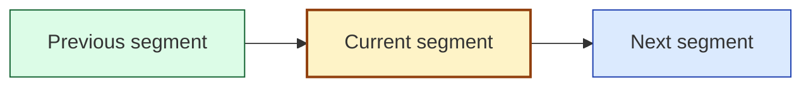

# RPI Walkthrough Protocol

This reference expands the `rpi-walkthrough` SKILL with the operational detail for a guided, conversational walkthrough. Use [../templates/walkthrough.md](../templates/walkthrough.md) as the structure for the session artifact at `.copilot-tracking/walkthroughs/{{YYYY-MM-DD}}/{{task_slug}}-walkthrough.md`.

Follow the shared conventions in `copilot-tracking.instructions.md`. References inside `.copilot-tracking` artifacts use plain workspace-relative paths; references shown to the user in the conversation use markdown links with line numbers.

## Target resolution

Resolve the walkthrough target before any review or explanation:

* Prefer an explicit `target=...`, then attached or open files, then the most recent relevant `.copilot-tracking` artifact, then conversation context.
* Classify the target so the right review path and segment ordering apply:
  * Code or feature: source files, a feature flow, or a library or API surface.
  * UI or UX: components, routes, state wiring, styles, and the user-facing flow that connects them.
  * Prompt-engineering artifact: a prompt, instructions, agent, or skill file under `.github/`.
  * Artifact or document: a `.copilot-tracking` research, plan, details, changes, review, or log document, or another project document such as an architecture or planning record.
* Set `detail` to `brief`, `normal`, or `deep` (default `normal`). The user can change it at any segment boundary.
* When no target can be formed, stop and ask. When several unrelated targets match, ask the user to choose one before proceeding.

## Deep review before explaining

Always understand the target through subagents before narrating it, and capture what you learn so the explanation stays accurate and grounded.

* Create the walkthrough artifact from [../templates/walkthrough.md](../templates/walkthrough.md) at the dated path before recording anything, so the session can resume if interrupted.
* Dispatch a generic exploration subagent (`Explore`, or `runSubagent` with no named agent) to trace how the code, UI, UX, feature, or artifact actually works: entry points, call paths, data flow, connected files, and the decisions or evidence recorded inside `.copilot-tracking` artifacts.
* Dispatch `Researcher Subagent` when the explanation depends on an external library, framework, standard, or anything that benefits from web or repository research with citations.
* Scale the review to `detail`: a focused single pass for `brief`, a normal pass for `normal`, and a thorough multi-pass review with cross-references for `deep`.
* Record the results in the walkthrough artifact as the evidence map and system of record: for each planned segment capture the target reference (file and line range or artifact section), what it does, why it is this way, and the supporting evidence paths and lines. Keep any lightweight working or scratch notes in that same artifact so it stays the single system of record and the walkthrough can resume after an interruption.
* When dispatch tooling is unavailable, perform the equivalent review inline and record the fallback and its reason in the walkthrough artifact.

## Segment planning

Turn the reviewed target into an ordered list of segments that each cover one coherent idea:

* Code or feature: order from entry point through the main flow to the key blocks and lines, grouping tightly-coupled lines into one segment.
* UI or UX: order along the user-facing flow, connecting each view or component to the state, events, and styles that drive it.
* Artifact: follow the document's own section order, pairing each decision with its rationale and evidence.

Record the segment list in the walkthrough artifact before starting segment one so the session can resume if interrupted. Do not over-condense the walkthrough. When the target is large or nuanced, use more segments rather than forcing a compact summary, and 25 or more segments is acceptable when that is the clearest way to explain the material.

## Conversation markdown format

Use well-formatted markdown in every walkthrough turn.

* Start each segment with a segment header such as `### Segment 1: ...` before any narrative explanation.
* Before the first segment explanation, render an overview mermaid diagram that shows the overall flow or structure of the target and the planned segment sequence. Color-code its nodes with the same state classes as the zoom diagram below (done in green, current in gold, upcoming in blue), marking the first segment current and the rest upcoming. Render the overview once as a map; the per-segment zoom diagram is what tracks progress as the walkthrough advances.
* For each segment, render a compact zoomed mermaid diagram that shows only the previous segment, the current segment, and the next segment, and color the nodes by the same states so the current one stands out.
* Use a mermaid pattern like this for each zoom diagram, styling the previous node as done, the current node as current, and the next node as upcoming:

* For the first segment omit the previous node, and for the last segment omit the next node, keeping the current node styled as current in both cases.
* Keep the prose scannable. Each sentence or paragraph that discusses a file, line range, block, or artifact must include a nearby markdown link to that reference, rather than relying only on the reference table.
* Keep the reference table requirement. Render it near the bottom of each segment turn, immediately before the questions.

## Segment explanation loop

Run this loop once per segment, and never advance more than one segment per turn:

1. Explain the segment in the conversation. Start with the segment header, then move from what it does to how it connects to the rest of the target and why it is this way, without labeling those parts. Match the depth to `detail`. Keep the writing scannable: short paragraphs, a tight bullet list when it helps, and bold only for the few terms that carry the idea, and follow the "Writing the explanation for human eyes" section in this reference. Do not paste large code blocks; describe the code and point to it.
2. Render the overview diagram before the first segment explanation, and then render a compact zoomed mermaid diagram for every segment. Each zoomed diagram shows only the previous segment, the current segment, and the next segment, color-coded by state so the current one stands out.
3. Add inline markdown links beside the explanatory prose for any file, block, or artifact being discussed. Do not rely only on the reference table for navigation.
4. Render the reference table for the segment (see Reference table format) so the user can navigate to every place being discussed.
5. Call `vscode_askQuestions` with one or two clear questions written in the same plain voice, with no praise or filler. The first offers more detail or a why on the current segment; the second continues to the next segment.

Write the full segment turn as visible chat text before this call: the segment header, diagrams, inline links, and reference table must already be in the response, and the questions come last in that same turn. Do not go straight from internal reasoning to the question tool with nothing rendered for the user; the failure mode is a bare `vscode_askQuestions` prompt that arrives before the explanation that sets it up. This gate holds before every `vscode_askQuestions` call and before any hand back of control, including mid-segment pauses.

## Writing the explanation for human eyes

Walkthrough prose is for a human reader. It should read like a thoughtful engineer explaining their own work, not like generated filler. Treat the lists below as patterns to recognize, not a literal find-and-replace blocklist; generalize from the examples so the prose stays natural rather than only dodging the exact words. Quoting or naming the target's actual identifiers, strings, or wording is always fine, even when they contain words this section would otherwise avoid.

### Avoid these AI tells

* Formulaic openers and recap wrappers such as "In today's world", "In conclusion", or "In summary", plus forced first-second-third scaffolding and transitions such as "Moreover" or "Additionally".
* Filler and empty restating such as "It's worth noting", "It's important to note", and "It should be mentioned", along with abstract intensifiers that do not earn their place.
* Promotional slogans and inflated language such as "game-changer", "paradigm shift", "cutting-edge", "unlock", "elevate", "empower", "supercharge", "leverage", and spike words such as "delve", "tapestry", "testament to", "realm", "landscape", "underscore", "showcase", "robust", "seamless", "intricate", "dive into", and "plays a crucial role".
* Sentence frames that feel packaged rather than thought-through, such as "It's not just X, it's Y", "not only X but also Y", rule-of-three triads, and "on one hand... on the other hand..." when they add no real analysis.
* Typography crutches: avoid em dashes, a common tell, and use commas, parentheses, or separate sentences instead; also avoid emoji in headings or bullets, bold-label-colon list items, Title Case headings, and excessive bolding.
* Conversational filler and sycophancy such as "Certainly!", "Great question!", and "I hope this helps", and over-agreeable phrasing, plus self-referential asides such as "let me be clear" or "to be clear".

### Write it like this instead

* Start with the real point, not a generic frame.
* Make every sentence do work and cut to the next useful sentence.
* Prefer concrete nouns and verbs over abstract labels.
* Use the shortest sentence that still says the thing clearly.
* Give one specific example tied to the actual code or artifact.
* Support claims with evidence rather than slogans, and keep the why behind each line or block in view.
* Let the prose carry the idea without announcing the structure.
* Make the last line of prose the implication, consequence, or next step, before the reference table and questions.
* Vary sentence and paragraph length so the rhythm reads human.
* When something is genuinely uncertain, say so plainly and separate what is known from what is likely, but do not manufacture hedging when the answer is clear.
* Use bold, lists, tables, and diagrams only when they help the reader.

### Shape of a segment message

Keep each turn easy to scan and small enough not to overwhelm:

* Open with the real point of this segment, and vary how you open across segments so the walkthrough does not fall into a repeated template.
* Explain how it works and why it is this way at a depth that matches `detail`: about one short paragraph for `brief`, two short paragraphs or a short list plus one concrete example for `normal`, and up to three short paragraphs plus one evidence-backed point for `deep`.
* Keep any single turn to roughly 200 words of prose or less, and move extra depth into a follow-up turn rather than one long message.
* Place the reference table near the bottom, just before the questions, so the reader can jump to the exact lines.
* Close with the one or two `vscode_askQuestions` prompts and nothing after them.

### A model segment message

This shows the intended rhythm: open with the point, explain how and why in a few plain lines, then the reference table, then the questions. The paths and code here are illustrative.

The `withRetry` wrapper exists so one flaky network call does not fail the whole import. It runs the callback, and when the callback throws it waits a short, growing delay and tries again, up to three attempts, before giving up. The delay grows on purpose: instant retries against a rate-limited API tend to make an outage worse, so each attempt backs off a little further.

| Reference                                    | What to look at                            |
|----------------------------------------------|--------------------------------------------|
| [src/net/retry.ts](src/net/retry.ts#L12-L28) | The retry loop and the backoff calculation |
| [src/net/client.ts](src/net/client.ts#L40)   | Where the import call is wrapped           |

Then ask, through `vscode_askQuestions`, whether to go deeper on how the backoff delay is calculated or move on to how a final failure is handled.

## Reference table format

Present references as a compact markdown table near the bottom of the message, before the questions. Use workspace-relative markdown links with line numbers, never inline code for file names, and never combine non-contiguous lines into one link.

| Reference                                    | What to look at                    |
|----------------------------------------------|------------------------------------|
| [path/to/file.ext](path/to/file.ext#L10-L24) | One-line description of this block |
| [path/to/other.ext](path/to/other.ext#L5)    | One-line description of this line  |

For a `.copilot-tracking` artifact walkthrough, link the artifact section being explained and any codebase files it references so the user can move between the decision and the code.

## Handling feedback

Interpret the user's `vscode_askQuestions` answer and respond in kind:

* More detail or why: repeat the deep review with subagents and tools as needed, extend the evidence map, then re-explain the same segment at greater depth before offering to continue.
* Less detail or a depth change: adjust `detail` and continue.
* Continue: advance to the next segment and run the loop again.
* A change request: capture it (see Capturing requested changes) and continue, unless the user asks for the change immediately.
* A new or refined target: re-resolve the target, re-review, and re-plan the segments.

## Capturing requested changes

The walkthrough is read-only by default. When the user requests a change while explaining:

* Append it to the Requested Changes section of the walkthrough artifact with the file and line reference, the requested change, the reason the user gave, and the relevant evidence path.
* Do not modify source files, and do not stage edits to the codebase.
* The only exception is an explicit request to make the change immediately: confirm scope, apply the change, then record what was applied in the artifact and resume the walkthrough.

## Closing the walkthrough

When every planned segment is covered, or when the user declines another segment, asks for a summary, or ends the session:

* Mark the walkthrough artifact complete or partial, and record any uncovered segments so the session can resume later.
* Review the captured Requested Changes with the user in the conversation.
* Recommend `/rpi-quick` for a one-shot pass, or the full `/rpi-research`, `/rpi-plan`, `/rpi-implement`, and `/rpi-review` sequence for larger work, seeded with the walkthrough artifact. Keep these as recommendations unless the user asks to proceed.

## Final response contract

Close with a concise summary that contains:

* The walkthrough artifact path.
* The segments covered and the detail level used.
* The count of captured change requests.
* A markdown table linking the walkthrough artifact and its Requested Changes section alongside the recommended next command.

| Artifact                                                                                                                                                 | Requested Changes                                                                                                 | Next step                                                         |
|----------------------------------------------------------------------------------------------------------------------------------------------------------|-------------------------------------------------------------------------------------------------------------------|-------------------------------------------------------------------|
| [.copilot-tracking/walkthroughs/{{YYYY-MM-DD}}/{{task_slug}}-walkthrough.md](.copilot-tracking/walkthroughs/{{YYYY-MM-DD}}/{{task_slug}}-walkthrough.md) | [Requested Changes](.copilot-tracking/walkthroughs/{{YYYY-MM-DD}}/{{task_slug}}-walkthrough.md#requested-changes) | Run `/rpi-quick` with this artifact, or run the full RPI sequence |

## Re-entry

When the user returns to an existing walkthrough, read the walkthrough artifact, resume at the next uncovered segment, and re-review only the segments whose depth or target the user changed.

> Brought to you by microsoft/hve-core
