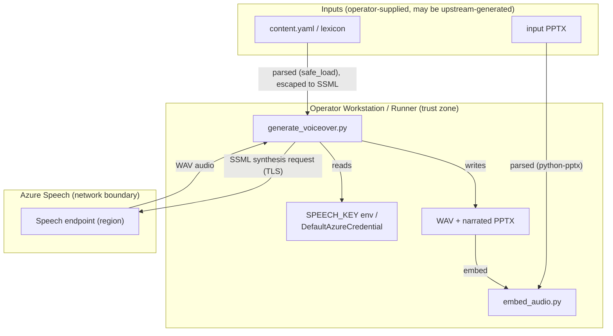

<!-- markdownlint-disable-file -->
# TTS Voice-Over Skill Security Model

This document records the STRIDE threat model for the tts-voiceover skill (`scripts/generate_voiceover.py` and `scripts/embed_audio.py`). The model is organized by trust bucket: CLI → Azure Speech API (B1), Environment and Entra credentials (B2), Untrusted content inputs (B3), and CLI caller process and filesystem (B4). Each bucket enumerates all six STRIDE categories with the in-code mitigations that address them. Assets and adversaries are enumerated first. Acknowledged enterprise readiness gaps are listed at the end.

The skill reads `content.yaml` speaker notes, escapes them into SSML, synthesizes one WAV per slide through the Azure Cognitive Services Speech SDK over TLS, and optionally embeds the WAV files into a PowerPoint deck. It runs no local listener and persists no credentials to disk; credentials are read from the process environment (or resolved through `DefaultAzureCredential`) per invocation.

> **See also: repo-wide STRIDE model.** This skill participates in the repository-wide threat model at [`docs/security/security-model.md`](../../../../docs/security/security-model.md) and is registered in its [Skill Security Models](../../../../docs/security/security-model.md#skill-security-models) section.

## Executive Summary

The tts-voiceover skill synthesizes narration by sending speaker-notes text to the Azure Speech endpoint over TLS and embeds the resulting audio into a deck. Its highest-risk behavior is **content egress**: speaker-notes content leaves the trust boundary to the configured Azure region for synthesis, with no data-classification gate. Credentials are read per invocation and never persisted; SSML and document inputs are escaped or parsed with hardening (XML-escaping, `yaml.safe_load`, python-pptx OOXML parsing with entity resolution disabled). One raw `lxml` parse of a hardcoded timing-template constant in `embed_audio.py` uses lxml's default parser; it is not an exploitable XXE (trusted literal input) but is being hardened as defence-in-depth per issue #1056 (PR #1695). Residual risk concentrates in content egress and the breadth of the `DefaultAzureCredential` chain.

### Security Posture Overview

| Dimension          | Value                                                                             |
|--------------------|-----------------------------------------------------------------------------------|
| Runtime surface    | Python CLI; Azure Speech SDK (TLS); SSML + PPTX parsing; no local listener        |
| Trust buckets      | B1 CLI→Azure Speech, B2 env/Entra credentials, B3 untrusted inputs, B4 caller     |
| Credentials        | `SPEECH_KEY` or Entra token via `DefaultAzureCredential`; never persisted to disk |
| Network egress     | HTTPS to the configured Azure Speech region endpoint                              |
| Open residual gaps | 5 (InfoDisc-Med: speaker-notes content egress to the Azure region)                |

## Contents

* [System Description](#system-description)
* [Trust Boundaries](#trust-boundaries)
* [Assets](#assets)
* [Adversaries](#adversaries)
* [Bucket B1: CLI → Azure Speech API](#bucket-b1-cli--azure-speech-api)
* [Bucket B2: Environment and Entra credentials](#bucket-b2-environment-and-entra-credentials)
* [Bucket B3: Untrusted content inputs](#bucket-b3-untrusted-content-inputs)
* [Bucket B4: CLI caller process and filesystem](#bucket-b4-cli-caller-process-and-filesystem)
* [Enterprise Readiness Gaps](#enterprise-readiness-gaps)
* [References](#references)

## System Description

### Components

1. `scripts/generate_voiceover.py` — reads `content.yaml`, escapes speaker notes into SSML, and synthesizes one WAV per slide via the Azure Speech SDK.
2. `scripts/embed_audio.py` — embeds the synthesized WAV files into a PowerPoint deck via python-pptx.
3. Credential resolution — `SPEECH_KEY` from the environment, or an Entra token minted by `DefaultAzureCredential`.

### Data Flow



## Trust Boundaries

### Boundary Diagram

```text
┌───────────────────────────────────────────────────────────────┐
│ TRUST BOUNDARY: Operator Workstation / Runner                 │
│  ┌────────────────────┐  ┌──────────────┐  ┌───────────────┐  │
│  │ generate_voiceover │  │ Credentials  │  │ WAV / narrated│  │
│  │ + embed_audio      │  │ (env/Entra)  │  │ PPTX outputs  │  │
│  └────────────────────┘  └──────────────┘  └───────────────┘  │
└───────────────┬─────────────────────────┬─────────────────────┘
                │ TLS                      │ parse (no egress)
   ┌─────────────▼──────────────┐  ┌────────▼─────────────────────┐
   │ BOUNDARY: Azure Speech     │  │ BOUNDARY: Inputs (untrusted) │
   │  Speech endpoint (region)  │  │  content.yaml / input PPTX   │
   └────────────────────────────┘  └──────────────────────────────┘
```

### Boundary Descriptions

| Boundary                      | Assets Protected                          | Controls Enforced                                                                                                                                                      |
|-------------------------------|-------------------------------------------|------------------------------------------------------------------------------------------------------------------------------------------------------------------------|
| Operator Workstation / Runner | Credentials, output files                 | Per-invocation credential resolution (no disk persistence); output path forced to differ from input                                                                    |
| Azure Speech                  | Synthesis request integrity, bearer token | TLS via SDK (system trust store); credentials sent only to the SDK                                                                                                     |
| Inputs                        | Host process integrity                    | `yaml.safe_load`; SSML XML-escaping/`quoteattr`; python-pptx OOXML external-entity resolution disabled; raw lxml timing-template parse hardening tracked (#1056/#1695) |

## Assets

| Id | Asset                            | Lifetime         | Notes                                                                                                                                                     |
|----|----------------------------------|------------------|-----------------------------------------------------------------------------------------------------------------------------------------------------------|
| A1 | `SPEECH_KEY` subscription key    | Operator-managed | Read from `SPEECH_KEY` env at invocation. Passed to the Speech SDK and sent to the Azure region endpoint over TLS.                                        |
| A2 | Entra ID access token            | Command lifetime | Minted by `DefaultAzureCredential` for `https://cognitiveservices.azure.com/.default`; embedded as `aad#{resource_id}#{token}` and refreshed near expiry. |
| A3 | Speaker-notes content            | Command lifetime | Read from `content.yaml`; **leaves the trust boundary** to the Azure Speech endpoint for synthesis. May contain confidential narration.                   |
| A4 | Input PPTX / lexicon YAML        | Command lifetime | Operator-supplied but potentially produced by an upstream pipeline from untrusted material; parsed by python-pptx (lxml) and PyYAML.                      |
| A5 | Output WAV / narrated PPTX files | Command lifetime | Written to the operator-chosen output directory.                                                                                                          |

## Adversaries

| Id    | Adversary                                          | In-scope mitigations                                                                                                                                                                                                                                                                                                                                                                                                     |
|-------|----------------------------------------------------|--------------------------------------------------------------------------------------------------------------------------------------------------------------------------------------------------------------------------------------------------------------------------------------------------------------------------------------------------------------------------------------------------------------------------|
| ADV-a | Same-uid malware on the operator workstation       | **Not defended.** A process running as the operator can read `SPEECH_KEY` from the environment or invoke the same credential chain. Workstation hygiene is the controlling defense.                                                                                                                                                                                                                                      |
| ADV-b | Network attacker on the CLI ↔ Azure Speech channel | TLS provided by the Azure Speech SDK with system-trust-store certificate validation. The skill performs no plaintext fallback.                                                                                                                                                                                                                                                                                           |
| ADV-c | Hostile or malformed `content.yaml` / lexicon      | `yaml.safe_load` (no arbitrary object construction); speaker notes XML-escaped via `xml.sax.saxutils.escape`; voice/rate/acronym aliases via `quoteattr`; XML-special acronym keys warned and skipped.                                                                                                                                                                                                                   |
| ADV-d | Hostile or malformed input PPTX                    | Parsed through python-pptx, which disables external entity resolution in its OOXML parser. The inline timing XML is a hardcoded constant parsed via a raw `etree.fromstring`; because that input is a trusted literal it is not an exploitable XXE, but the call uses lxml's default parser and is being hardened as defence-in-depth (`XMLParser(resolve_entities=False, no_network=True)`) per issue #1056 / PR #1695. |
| ADV-e | Hostile caller process controlling argv / env      | Argument paths constrained to declared options; output path forced to differ from input to prevent in-place overwrite; partial WAV files removed on synthesis failure.                                                                                                                                                                                                                                                   |

## Bucket B1: CLI → Azure Speech API

### Spoofing

* Transport security is delegated to the Azure Speech SDK, which validates the endpoint certificate against the system trust store. The skill constructs no raw HTTP requests and performs no redirect handling of its own.

### Tampering

* TLS protects the SSML request and the synthesized audio response in transit; the skill performs no plaintext fallback.

### Repudiation

* The CLI returns deterministic exit codes (`EXIT_SUCCESS` / `EXIT_FAILURE` / `EXIT_ERROR`) and logs per-slide synthesis outcomes so automation can attribute failures.

### Information Disclosure

* `SPEECH_KEY` and the Entra token are passed only to the SDK and are never written to logs. Synthesis failures log only `cancellation.reason` and `error_details`, not the credential.
* Speaker-notes content (A3) leaves the trust boundary to the Azure region for synthesis. There is no data-classification gate (G-INF-1).

### Denial of Service

* Token-refresh failures are caught and logged; the previous token is retained rather than crashing mid-deck, so a transient credential-service hiccup does not abort a long run.

### Elevation of Privilege

* Not applicable. The skill requests only synthesis; it performs no privilege transition and the endpoint scope is limited to Cognitive Services.

### Risk Rating

| Threat                                       | Likelihood | Impact | Residual Risk | Status              |
|----------------------------------------------|------------|--------|---------------|---------------------|
| Speaker-notes content egress to Azure region | Med        | Med    | Med           | By design (G-INF-1) |
| Credential leakage into logs                 | Low        | High   | Low           | Mitigated           |

## Bucket B2: Environment and Entra credentials

Credentials are resolved per invocation. `SPEECH_KEY` is read from the environment; otherwise `SPEECH_RESOURCE_ID` triggers `DefaultAzureCredential`, which mints a short-lived token refreshed roughly five minutes before expiry. Nothing is persisted to disk.

### Spoofing

* When both `SPEECH_KEY` and `SPEECH_RESOURCE_ID` are set, the skill warns and prefers key auth deterministically rather than silently choosing, so the active credential is unambiguous.

### Tampering

* Not applicable. Credentials are read into memory per invocation and never written back, so there is no at-rest credential state to tamper with.

### Repudiation

* Not applicable. Credential acquisition emits no skill-level audit record beyond the Azure SDK's own diagnostics.

### Information Disclosure

* Short-lived Entra tokens are preferred over long-lived keys where the resource supports a custom domain and role assignment. Nothing is persisted to disk; credentials inherit whatever protection the process environment provides.

### Denial of Service

* Token-refresh failures are caught and logged; the previously acquired token is retained rather than aborting the run.

### Elevation of Privilege

* `DefaultAzureCredential` walks a broad credential chain (env, managed identity, Azure CLI, and more). In CI it may bind an unintended identity (G-EOP-1).

### Risk Rating

| Threat                                           | Likelihood | Impact | Residual Risk | Status                        |
|--------------------------------------------------|------------|--------|---------------|-------------------------------|
| Broad credential chain binds unintended identity | Low        | Med    | Low           | Partially Mitigated (G-EOP-1) |

## Bucket B3: Untrusted content inputs

### Spoofing

* Not applicable. Input content is parsed as data; no identity is derived from it.

### Tampering

* **SSML injection is mitigated**: all dynamic values inserted into the SSML document — speaker notes, voice name, prosody rate, and acronym alias/replacement text — are XML-escaped or attribute-quoted before assembly. A single-pass regex prevents acronym substitution from corrupting previously inserted markup.
* In `embed_audio.py`, the input PPTX is opened through python-pptx (external entity resolution disabled upstream) and WAV duration is read from the file header only via `wave.open`.
* The narration timing element is built by parsing a hardcoded `_TIMING_TEMPLATE` constant with a raw `etree.fromstring` call (lxml's default parser). The input is a trusted literal, so this is not an exploitable XXE; per the repo's parse-site audit standard (issue #1056) it is being hardened to the `XMLParser(resolve_entities=False, no_network=True)` idiom used by the sibling powerpoint skill (PR #1695).

### Repudiation

* Not applicable. No attribution is claimed over input content.

### Information Disclosure

* Not applicable. The skill does not extract or forward secrets from input content; speaker-notes egress is covered under B1.

### Denial of Service

* YAML inputs are parsed with `yaml.safe_load`; malformed slides are skipped with a warning rather than aborting the whole deck.

### Elevation of Privilege

* python-pptx disables external-entity resolution (mitigating XXE) when opening the input PPTX, and the inline timing/transition XML is a hardcoded constant rather than derived from input, so hostile input cannot drive code execution. The raw `etree.fromstring(_TIMING_TEMPLATE)` parse still uses lxml's default parser; hardening it to the shared `XMLParser(resolve_entities=False, no_network=True)` idiom is a tracked defence-in-depth item (G-TAM-1, #1056/#1695).

### Risk Rating

| Threat                                                         | Likelihood | Impact | Residual Risk | Status                                 |
|----------------------------------------------------------------|------------|--------|---------------|----------------------------------------|
| SSML injection via speaker notes / aliases                     | Low        | Med    | Low           | Mitigated (escape / quoteattr)         |
| Hostile PPTX / XXE                                             | Low        | Med    | Low           | Mitigated (entity resolution disabled) |
| Raw lxml parse of hardcoded timing template (defence-in-depth) | Low        | Low    | Low           | Tracked (G-TAM-1, #1056/#1695)         |

## Bucket B4: CLI caller process and filesystem

The caller controls argv, environment, stdin, stdout, and stderr; the CLI treats that process as operator-controlled.

### Spoofing

* Not applicable. The CLI runs as the invoking OS user and trusts the caller's argv and environment.

### Tampering

* Argument paths are constrained to declared options; the embed step refuses to write when the resolved output path equals the input path, preventing in-place overwrite.

### Repudiation

* The CLI returns deterministic exit codes so automation can attribute outcomes to the invoking step.

### Information Disclosure

* Nothing is persisted to disk beyond the requested outputs; no credentials are written.

### Denial of Service

* Partial WAV files left by a failed synthesis are removed, so a corrupt zero-duration file is never embedded into the deck.

### Elevation of Privilege

* Output directories are created with default permissions; the skill performs no privileged operation.

### Risk Rating

| Threat                           | Likelihood | Impact | Residual Risk | Status                         |
|----------------------------------|------------|--------|---------------|--------------------------------|
| In-place overwrite of input deck | Low        | Low    | Low           | Mitigated (output ≠ input)     |
| Corrupt partial WAV embedded     | Low        | Low    | Low           | Mitigated (cleanup on failure) |

## Enterprise Readiness Gaps

The following are known limitations recorded so operators can make informed deployment decisions. Severity ratings are the project's own assessment and are not equivalent to a CVSS score.

| Id      | Gap                                                                                                                                                                                                                                                                                                                               | Severity        | Status                                                                                                   |
|---------|-----------------------------------------------------------------------------------------------------------------------------------------------------------------------------------------------------------------------------------------------------------------------------------------------------------------------------------|-----------------|----------------------------------------------------------------------------------------------------------|
| G-INF-1 | Speaker-notes content is transmitted to the configured Azure Speech region for synthesis. There is no data-classification gate; confidential narration leaves the boundary (data-dependent severity). (audit: T-INF-1)                                                                                                            | InfoDisc-Med    | By design; operators must pin `SPEECH_REGION` to an approved region and avoid sending regulated content. |
| G-EOP-1 | `DefaultAzureCredential` walks a broad credential chain (env, managed identity, Azure CLI, and more). In CI it may bind an unintended identity. (audit: T-IAM-1)                                                                                                                                                                  | EoP-Low         | Prefer a scoped `SPEECH_KEY` or an explicit credential on shared runners.                                |
| G-TLS-1 | No certificate pinning for the Azure Speech endpoint; TLS validation depends on the SDK and the system trust store. (audit: T-TLS-1)                                                                                                                                                                                              | InfoDisc-Low    | Operator-acceptable for a managed Azure endpoint.                                                        |
| G-SUP-1 | Runtime dependencies (Azure Speech SDK, python-pptx, lxml, PyYAML) are floor-pinned in `pyproject.toml` and hash-pinned via `uv.lock`, but untrusted PPTX parsing relies on upstream python-pptx/lxml hardening. (audit: T-SUP-1)                                                                                                 | SupplyChain-Med | Keep dependencies pinned to vetted ranges and monitor CVE feeds for lxml and python-pptx.                |
| G-TAM-1 | `_add_narration_timing` in `embed_audio.py` parses a hardcoded `_TIMING_TEMPLATE` constant via a raw `etree.fromstring` using lxml's default parser. Input is a trusted literal (not an exploitable XXE), but the site does not yet match the repo's `XMLParser(resolve_entities=False, no_network=True)` idiom. (audit: T-TAM-1) | Tampering-Low   | Defence-in-depth; hardening tracked in issue #1056 / PR #1695 (matches powerpoint `extract_content.py`). |

For an active issue tracker entry covering these gaps, see the [hve-core issues list](https://github.com/microsoft/hve-core/issues).

## References

* [STRIDE Threat Model](https://learn.microsoft.com/azure/security/develop/threat-modeling-tool-threats)
* [OWASP Top 10 for LLM Applications](https://owasp.org/www-project-top-10-for-large-language-model-applications/)
* [Azure AI Speech security](https://learn.microsoft.com/azure/ai-services/speech-service/)
* [DefaultAzureCredential](https://learn.microsoft.com/azure/developer/python/sdk/authentication/credential-chains)
* [Repository security model](../../../../docs/security/security-model.md)

🤖 Crafted with precision by ✨Copilot following brilliant human instruction, then carefully refined by our team of discerning human reviewers.
