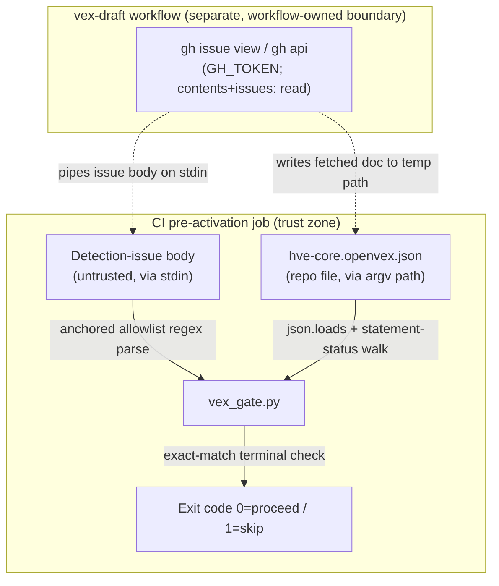

<!-- markdownlint-disable-file -->
# VEX Skill Security Model

This document records the STRIDE threat model for the vex skill's executable runtime, `scripts/vex_gate.py`. The model is organized by trust bucket: untrusted detection-issue body parsing (B1), OpenVEX document parsing (B2), and the gate decision with its adjacent workflow-owned fetch (B3). Each bucket enumerates all six STRIDE categories with the in-code mitigations that address them. Assets and adversaries are enumerated first. Acknowledged enterprise readiness gaps are listed at the end.

The skill is otherwise a markdown knowledge pack (`SKILL.md` plus `references/` and `assets/`); only `scripts/vex_gate.py` is executable. That script is a deterministic gate: it reads a detection-issue body from **stdin**, reads an OpenVEX JSON document from a **local path** passed as its first argument, decides whether the `vex-draft` agentic workflow should proceed, and returns an exit code (`0` proceed, `1` skip). It handles no credentials, opens no network connection, spawns no subprocess, writes no files, and parses JSON with `json.loads` (never `pickle` or a YAML object loader). The upstream fetch of the issue body, the OpenVEX document, and this gate script itself — and the `GH_TOKEN` those calls use — is a **separate, workflow-owned step** in `.github/workflows/vex-draft.md` (`gh issue view` and `gh api`), governed by that workflow's `contents: read` / `issues: read` permissions. In production the `vex-draft` workflow fetches `scripts/vex_gate.py` from the default branch through that same contents API and executes it directly, so the deployed gate is exactly the code this model's test suite covers — there is no separately maintained inline reimplementation that could drift.

> **See also: repo-wide STRIDE model.** This skill participates in the repository-wide threat model at [`docs/security/security-model.md`](../../../../docs/security/security-model.md) and is registered in its [Skill Security Models](../../../../docs/security/security-model.md#skill-security-models) section.

## Executive Summary

The vex skill's highest-risk behavior is **parsing an externally authorable GitHub issue body** (the VEX detection issue) to decide whether an AI drafting workflow spends credits. Finding IDs are extracted only from the first cell of each markdown table row and only when they match an anchored vulnerability-ID allowlist (`^(?:CVE|GHSA|PYSEC|OSV|RUSTSEC|GO|GMS|GLSA|DSA|USN|ALSA|ELSA|RHSA)-[0-9A-Za-z._-]+$`), so header rows, separator rows, and injected free-text cannot register as findings. The regex has no nested quantifiers, so it is not vulnerable to catastrophic backtracking. The OpenVEX document is read with `json.loads` and walked for statement `status` values only; a corrupt or unreadable document is caught and treated as absent, which makes the gate **proceed** (favouring triage over a silent skip). The script performs no network, credential, subprocess, or file-write activity; the fetch that supplies its inputs is delegated to the `vex-draft` workflow and inherits that workflow's permissions and credit-budget guardrails. Residual risk concentrates in gate-decision tampering by a party with issue-edit access (bounded by the bot-owned, `automated`-labelled detection issue) and AI-credit consumption from a forced proceed (bounded by the workflow's credit budgets and `skip-if-match`).

### Security Posture Overview

| Dimension          | Value                                                                                                                       |
|--------------------|-----------------------------------------------------------------------------------------------------------------------------|
| Runtime surface    | Local Python CLI; anchored-regex parse of untrusted issue body (stdin); `json.loads` of a local OpenVEX doc; exit code only |
| Trust buckets      | B1 detection-issue body parsing, B2 OpenVEX document parsing, B3 gate decision + adjacent workflow fetch                    |
| Credentials        | None handled or persisted (upstream `GH_TOKEN` is workflow-owned)                                                           |
| Network egress     | None (upstream `gh api` / `gh issue view` fetch is workflow-owned)                                                          |
| Open residual gaps | 2 (Tamper-Low gate-suppression; DoS-Low forced-proceed AI-credit consumption)                                               |

## Contents

* [System Description](#system-description)
* [Trust Boundaries](#trust-boundaries)
* [Assets](#assets)
* [Adversaries](#adversaries)
* [Bucket B1: Untrusted detection-issue body parsing](#bucket-b1-untrusted-detection-issue-body-parsing)
* [Bucket B2: OpenVEX document parsing](#bucket-b2-openvex-document-parsing)
* [Bucket B3: Gate decision and adjacent workflow fetch](#bucket-b3-gate-decision-and-adjacent-workflow-fetch)
* [Enterprise Readiness Gaps](#enterprise-readiness-gaps)
* [References](#references)

## System Description

### Components

1. `scripts/vex_gate.py` — reads the detection-issue body from stdin, extracts finding IDs with an anchored allowlist regex (`parse_finding_ids`), reads the OpenVEX document from `argv[1]` with `json.loads`, walks its `statements` for terminal statuses (`_iter_statement_ids` / `all_terminal`), and returns `0` (proceed) or `1` (skip). No network, credentials, subprocess, or file writes.
2. `SKILL.md`, `references/*.md`, `assets/pr-body-scaffold.yml` — non-executable knowledge and templates; no runtime surface.

### Data Flow



## Trust Boundaries

### Boundary Diagram

```text
┌───────────────────────────────────────────────────────────┐
│ TRUST BOUNDARY: vex-draft workflow (pre-activation)       │
│  ┌──────────────────────────────────────────────────────┐ │
│  │ gh issue view / gh api  (GH_TOKEN; read-only scopes)  │ │
│  └──────────────────────────────────────────────────────┘ │
└───────────────────────────┬───────────────────────────────┘
                            │ issue body on stdin + fetched doc at temp path
        ┌────────────────────▼────────────────────────────┐
        │ TRUST BOUNDARY: CI pre-activation job            │
        │  ┌────────────┐  ┌─────────────┐  ┌───────────┐  │
        │  │ vex_gate.py│  │ issue body +│  │ exit code │  │
        │  │            │  │ OpenVEX doc │  │ 0 / 1     │  │
        │  └────────────┘  └─────────────┘  └───────────┘  │
        └──────────────────────────────────────────────────┘
```

### Boundary Descriptions

| Boundary              | Assets Protected                      | Controls Enforced                                                                                                            |
|-----------------------|---------------------------------------|------------------------------------------------------------------------------------------------------------------------------|
| vex-draft workflow    | Fetch integrity, `GH_TOKEN`           | Read-only `contents` / `issues` scopes; deterministic detection issue (bot-owned, `automated`-labelled); credit budgets      |
| CI pre-activation job | Gate-decision integrity, host process | Anchored allowlist regex (no ReDoS); `json.loads` only (no gadget); caught decode errors fail toward proceed; exit code only |

## Assets

| Id | Asset                     | Lifetime                | Notes                                                                              |
|----|---------------------------|-------------------------|------------------------------------------------------------------------------------|
| A1 | Detection-issue body      | Read-only via stdin     | Untrusted; a GitHub issue body that external parties may be able to edit           |
| A2 | OpenVEX document          | Read-only via argv path | `security/vex/hve-core.openvex.json`; repo-controlled; parsed with `json.loads`    |
| A3 | Gate decision (exit code) | Ephemeral               | Governs whether the AI drafting workflow spends credits                            |
| A4 | vex-draft workflow fetch  | External                | Owns the `gh api` / `gh issue view` call and `GH_TOKEN`; governed by its own model |

## Adversaries

| Id    | Adversary                                                      | In-scope mitigations                                                                                                                                |
|-------|----------------------------------------------------------------|-----------------------------------------------------------------------------------------------------------------------------------------------------|
| ADV-a | Party with issue-edit access crafting the detection-issue body | Anchored allowlist regex reads only first-cell IDs; injected non-ID rows cannot add findings; detection issue is bot-owned and `automated`-labelled |
| ADV-b | Corrupt or malformed OpenVEX document                          | `json.loads` (no `pickle`/YAML gadget); `JSONDecodeError` / `OSError` caught and treated as absent (gate proceeds toward triage)                    |
| ADV-c | Attacker targeting the upstream fetch or `GH_TOKEN`            | Fetch is delegated to the vex-draft workflow and bounded by its read-only permissions and credit budgets (adjacent boundary)                        |

## Bucket B1: Untrusted detection-issue body parsing

### Spoofing

* Not applicable. The issue body carries no identity claim; it is treated as opaque data.

### Tampering

* The body is externally authorable, but `parse_finding_ids` inspects only the first cell of each `|`-delimited row and accepts a token only when it matches the anchored vulnerability-ID allowlist. Header and separator rows never match, and free-text injected into other cells is ignored. A tamperer can at most malform every ID row (yielding an empty finding set, which forces a **skip**) or inject a well-formed ID row (forcing a **proceed**); both outcomes are bounded (see G-TAM-1 and G-DOS-1) and neither writes state.

### Repudiation

* Not applicable. The parser claims no attribution over input content.

### Information Disclosure

* Only first-cell tokens are read; nothing beyond the piped body is accessed, and the script's output is an exit code plus a generic proceed/skip message that echoes no body content.

### Denial of Service

* The allowlist regex is anchored with no nested quantifiers, so it is not subject to catastrophic backtracking; parsing is a single linear pass over lines, and body size is bounded by GitHub's issue-length limits.

### Elevation of Privilege

* No input path leads to execution: there is no `eval`, no dynamic import, and no subprocess; text is only matched and compared.

### Risk Rating

| Threat                                           | Likelihood | Impact | Residual Risk | Status                                                     |
|--------------------------------------------------|------------|--------|---------------|------------------------------------------------------------|
| Crafted issue body forces skip (suppress draft)  | Low        | Low    | Low           | Bounded (bot-owned issue; manual triage remains) (G-TAM-1) |
| Crafted issue body forces proceed (burn credits) | Low        | Med    | Low           | Bounded (workflow credit budgets) (G-DOS-1)                |

## Bucket B2: OpenVEX document parsing

### Spoofing

* Not applicable. The document asserts no identity to the gate.

### Tampering

* The document is read read-only with `json.loads` — never `pickle` or a YAML object loader — so no arbitrary object construction occurs. `_iter_statement_ids` reads only `status`, `vulnerability` name/`@id`, and `aliases`; unexpected shapes are skipped by `isinstance` guards.

### Repudiation

* Not applicable. No attribution is claimed over the document.

### Information Disclosure

* Only statement statuses and vulnerability identifiers are read; the document content is never forwarded off-process and never appears in the script's output.

### Denial of Service

* `_iter_statement_ids` iterates the `statements` array once; the document is a small, repo-controlled file. A corrupt or unreadable document raises `JSONDecodeError` / `OSError`, which is caught and treated as absent rather than crashing.

### Elevation of Privilege

* Parsing performs no execution and no file writes; a missing document simply yields a proceed decision.

### Risk Rating

| Threat                                        | Likelihood | Impact | Residual Risk | Status                                            |
|-----------------------------------------------|------------|--------|---------------|---------------------------------------------------|
| Malformed JSON crashes or subverts the gate   | Low        | Low    | Low           | Mitigated (`json.loads`; decode errors → proceed) |
| Corrupt document silently suppresses drafting | Low        | Low    | Low           | By design (fail-open toward triage)               |

## Bucket B3: Gate decision and adjacent workflow fetch

### Spoofing

* Not applicable to the script. The upstream fetch authenticates with the workflow `GH_TOKEN`, which is owned and scoped by the vex-draft workflow, not this skill.

### Tampering

* The exit-code contract (`0` proceed / `1` skip) governs whether the AI drafting workflow runs. Forcing a proceed can consume AI credits; this is bounded by the workflow's daily/max credit budgets and the `skip-if-match: is:pr` guard that pauses drafting while a draft PR is open (G-DOS-1).

### Repudiation

* The gate prints its proceed/skip decision and reason to the job's stdout, and the run is attributable through GitHub Actions logs.

### Information Disclosure

* The script emits only an exit code and a generic message; it persists nothing. The fetched issue body, OpenVEX document, and gate script, and the `GH_TOKEN` used to obtain them, are handled by the vex-draft workflow under its read-only `contents` / `issues` permissions (adjacent boundary).

### Denial of Service

* The gate itself is `O(findings)`; input-driven DoS is addressed in B1 and B2. The pre-activation job is short-lived and non-privileged.

### Elevation of Privilege

* The script cannot escalate beyond its non-privileged pre-activation job: no subprocess, no credential access, and no write to the repository or workflow state.

### Risk Rating

| Threat                             | Likelihood | Impact | Residual Risk | Status                                              |
|------------------------------------|------------|--------|---------------|-----------------------------------------------------|
| Forced proceed consumes AI credits | Low        | Med    | Low           | Bounded (credit budgets; `skip-if-match`) (G-DOS-1) |
| Gate decision unattributable       | Low        | Low    | Low           | Mitigated (stdout reason + Actions logs)            |

## Enterprise Readiness Gaps

The following are known limitations recorded so operators can make informed deployment decisions. Severity ratings are the project's own assessment and are not equivalent to a CVSS score.

| Id      | Gap                                                                                                                      | Severity   | Status                                                                                                                               |
|---------|--------------------------------------------------------------------------------------------------------------------------|------------|--------------------------------------------------------------------------------------------------------------------------------------|
| G-TAM-1 | A party with edit access to the detection issue can malform its finding rows to suppress auto-drafting (forced skip).    | Tamper-Low | Bounded: the detection issue is created by the deterministic `vex-detect` bot and `automated`-labelled; manual triage still applies. |
| G-DOS-1 | A well-formed injected finding row (with no terminal OpenVEX statement) forces a proceed, consuming AI drafting credits. | DoS-Low    | Bounded: the vex-draft workflow enforces daily/max AI-credit budgets and `skip-if-match: is:pr` to pause drafting.                   |

For an active issue tracker entry covering these gaps, see the [hve-core issues list](https://github.com/microsoft/hve-core/issues).

## References

* [Repository-wide security model](../../../../docs/security/security-model.md)
* [Skill security model conventions](../../../../.github/instructions/skill-security-model.instructions.md)
* [OpenVEX v0.2.0 specification](https://github.com/openvex/spec/blob/main/OPENVEX-SPEC.md)
* [STRIDE Threat Model](https://learn.microsoft.com/azure/security/develop/threat-modeling-tool-threats)

🤖 Crafted with precision by ✨Copilot following brilliant human instruction, then carefully refined by our team of discerning human reviewers.
