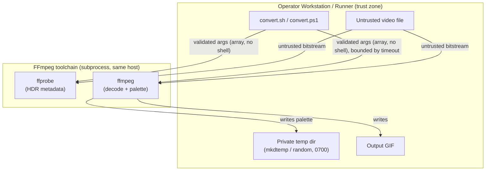

<!-- markdownlint-disable-file -->
# Video-to-GIF Skill Security Model

This document records the STRIDE threat model for the video-to-gif skill (`scripts/convert.sh` and `scripts/convert.ps1`, the POSIX and PowerShell twins). The model is organized by trust bucket: CLI → FFmpeg/ffprobe subprocess (B1), Untrusted media input parsing (B2), and CLI caller process and filesystem (B3). Each bucket enumerates all six STRIDE categories with the in-code mitigations that address them. Assets and adversaries are enumerated first. Acknowledged enterprise readiness gaps are listed at the end.

The skill is a local media converter. It resolves a video filename, invokes `ffprobe` to detect HDR metadata, and runs one (single-pass) or two (palette + paletteuse) `ffmpeg` invocations to produce an optimized GIF. It handles no credentials, opens no local listener, and performs no network egress; both twins run entirely with the caller's privileges against local files.

> **See also: repo-wide STRIDE model.** This skill participates in the repository-wide threat model at [`docs/security/security-model.md`](../../../../docs/security/security-model.md) and is registered in its [Skill Security Models](../../../../docs/security/security-model.md#skill-security-models) section.

## Executive Summary

The video-to-gif skill converts an untrusted local video into a GIF by shelling out to FFmpeg. Its highest-risk behavior is **parsing untrusted media**: the input file's container and codec bitstreams are decoded by FFmpeg, which inherits FFmpeg's decoder CVE exposure. The skill constructs every FFmpeg argument as an array element (no shell string interpolation), validates all numeric parameters before they enter the FFmpeg `-vf` filtergraph (closing a filtergraph-injection vector), allow-lists the dither and tonemap algorithms, isolates the intermediate palette in a private unpredictable temp directory, and bounds every FFmpeg/ffprobe invocation with a wall-clock timeout. Residual risk concentrates in FFmpeg's own memory safety when decoding hostile media, which the skill cannot fix and bounds only for denial of service.

### Security Posture Overview

| Dimension          | Value                                                                                   |
|--------------------|-----------------------------------------------------------------------------------------|
| Runtime surface    | Local CLI (bash + PowerShell twins); FFmpeg/ffprobe subprocess; no network, no listener |
| Trust buckets      | B1 CLI→FFmpeg subprocess, B2 untrusted media parsing, B3 caller process/filesystem      |
| Credentials        | None handled or persisted                                                               |
| Network egress     | None (operates on local files only)                                                     |
| Open residual gaps | 2 (SupplyChain-Med: inherited FFmpeg decoder CVE exposure on untrusted media)           |

## Contents

* [System Description](#system-description)
* [Trust Boundaries](#trust-boundaries)
* [Assets](#assets)
* [Adversaries](#adversaries)
* [Bucket B1: CLI → FFmpeg/ffprobe subprocess](#bucket-b1-cli--ffmpegffprobe-subprocess)
* [Bucket B2: Untrusted media input parsing](#bucket-b2-untrusted-media-input-parsing)
* [Bucket B3: CLI caller process and filesystem](#bucket-b3-cli-caller-process-and-filesystem)
* [Enterprise Readiness Gaps](#enterprise-readiness-gaps)
* [References](#references)

## System Description

### Components

1. `scripts/convert.sh` — POSIX/bash twin: resolves the input file, detects HDR via `ffprobe`, validates parameters, and runs bounded single-pass or two-pass `ffmpeg` conversions.
2. `scripts/convert.ps1` — PowerShell twin with the same behavior, using typed `[ValidateRange]`/`[ValidateSet]` parameters and a `.NET` process wrapper for bounded execution.
3. `tests/convert.Tests.ps1` — Pester unit tests that mock the FFmpeg execution seam.

### Data Flow



## Trust Boundaries

### Boundary Diagram

```text
┌───────────────────────────────────────────────────────────┐
│ TRUST BOUNDARY: Operator Workstation / Runner             │
│  ┌─────────────┐   ┌──────────────┐   ┌────────────────┐  │
│  │ convert.sh  │   │ Private temp │   │ Output GIF     │  │
│  │ convert.ps1 │   │ dir (0700)   │   │                │  │
│  └─────────────┘   └──────────────┘   └────────────────┘  │
└───────────────────────────┬───────────────────────────────┘
                            │ process boundary (array args, no shell)
        ┌────────────────────▼────────────────────┐
        │ TRUST BOUNDARY: FFmpeg subprocess        │
        │  ┌────────────────────────────────────┐  │
        │  │ ffprobe / ffmpeg decode untrusted  │  │
        │  │ container + codec bitstreams       │  │
        │  └────────────────────────────────────┘  │
        └──────────────────────────────────────────┘
```

### Boundary Descriptions

| Boundary             | Assets Protected                           | Controls Enforced                                                                              |
|----------------------|--------------------------------------------|------------------------------------------------------------------------------------------------|
| Workstation / Runner | Filesystem, temp palette, output integrity | Numeric validation, allow-listed algorithms, private temp dir, cleanup handlers                |
| FFmpeg subprocess    | Argument integrity, availability           | Array/`ArgumentList` argument passing (no shell), wall-clock timeout, `UseShellExecute=$false` |

## Assets

| Id | Asset                   | Lifetime                    | Notes                                                           |
|----|-------------------------|-----------------------------|-----------------------------------------------------------------|
| A1 | Input video file        | Read-only during conversion | Untrusted data parsed by FFmpeg; never modified                 |
| A2 | Intermediate palette    | Transient (two-pass only)   | Written to a private 0700 temp dir; removed on exit/failure     |
| A3 | Output GIF              | Persisted                   | Written to caller-chosen or derived path; overwritten with `-y` |
| A4 | FFmpeg/ffprobe binaries | External, PATH-resolved     | Unpinned host dependency (see G-SUP-1)                          |

## Adversaries

| Id    | Adversary                                                            | In-scope mitigations                                                                                                |
|-------|----------------------------------------------------------------------|---------------------------------------------------------------------------------------------------------------------|
| ADV-a | Malicious media author (crafts a hostile video to exploit a decoder) | Wall-clock timeout bounds runaway decode; memory-safety inherited from FFmpeg (G-SUP-1)                             |
| ADV-b | Caller supplying adversarial CLI parameters                          | Numeric range validation, dither/tonemap allow-lists, array argument passing prevent filtergraph/argument injection |
| ADV-c | Local attacker racing the temp palette path                          | Private unpredictable temp directory (mkdtemp/random, 0700) with guaranteed cleanup                                 |

## Bucket B1: CLI → FFmpeg/ffprobe subprocess

### Spoofing

* `ffmpeg` and `ffprobe` are resolved by name from `PATH`; the skill trusts the operator's environment for binary identity. A compromised `PATH` is an inherited environment concern, not one the skill can resolve; operators are expected to maintain PATH hygiene.

### Tampering

* All FFmpeg arguments are passed as discrete array elements (bash `"${args[@]}"`, PowerShell `ProcessStartInfo.ArgumentList`), never as a shell string, so no argument can inject shell metacharacters.
* Numeric parameters (`fps`, `width`, `loop`, `start`, `duration`) are validated to integer/decimal ranges before they are interpolated into the FFmpeg `-vf` filtergraph, closing a filtergraph-injection vector (V-INJ-1, mitigated). The PowerShell twin enforces the same ranges through typed `[ValidateRange]` parameters.
* Dither and tonemap algorithms are restricted to fixed allow-lists (bash `case`, PowerShell `[ValidateSet]`).

### Repudiation

* Not applicable. This is a local developer conversion tool with no audit or non-repudiation requirement. FFmpeg progress is written to stderr for the interactive caller.

### Information Disclosure

* No secrets or credentials are handled and no network egress occurs. FFmpeg output is limited to progress and diagnostics on the caller's terminal.

### Denial of Service

* Every `ffprobe` and `ffmpeg` invocation is bounded by a wall-clock timeout (bash `timeout`/`gtimeout`, PowerShell `Process.WaitForExit` + `Kill`), default 600 seconds and overridable via `VIDEO_TO_GIF_TIMEOUT` / `-TimeoutSeconds` (V-DOS-1, mitigated). A pathological input can still consume CPU and disk within the bound.

### Elevation of Privilege

* The subprocess runs with the caller's privileges and no shell (`UseShellExecute=$false`; array argument passing). There is no privilege transition.

### Risk Rating

| Threat                                            | Likelihood | Impact | Residual Risk | Status                          |
|---------------------------------------------------|------------|--------|---------------|---------------------------------|
| Filtergraph/argument injection via CLI parameters | Low        | High   | Low           | Mitigated (V-INJ-1)             |
| Unbounded FFmpeg run exhausts resources           | Low        | Med    | Low           | Mitigated (V-DOS-1)             |
| PATH-resolved FFmpeg binary substitution          | Low        | High   | Low           | Accepted (operator environment) |

## Bucket B2: Untrusted media input parsing

### Spoofing

* Not applicable. The input file is treated as untrusted data, never as an authenticated identity.

### Tampering

* The skill never modifies the input file; FFmpeg opens it read-only. The untrusted container and codec bitstreams are parsed by FFmpeg's demuxers and decoders.

### Repudiation

* Not applicable. No audit requirement for a local conversion.

### Information Disclosure

* `ffprobe` reads only `color_primaries` and `color_transfer` for HDR detection; no other metadata from the untrusted file is surfaced beyond an HDR yes/no decision.

### Denial of Service

* A malformed or oversized input could stall decoding; both the HDR probe and each conversion pass are bounded by the wall-clock timeout (V-DOS-1).

### Elevation of Privilege

* Memory-safety defects in FFmpeg's decoders, triggered by hostile media, could theoretically execute code within the FFmpeg process. The skill cannot fix FFmpeg internals; the timeout bounds availability impact but not memory-safety exploitation. This is recorded as G-SUP-1, mitigated at the operator level by keeping FFmpeg patched.

### Risk Rating

| Threat                                    | Likelihood | Impact | Residual Risk | Status                        |
|-------------------------------------------|------------|--------|---------------|-------------------------------|
| Hostile media triggers FFmpeg decoder CVE | Low        | High   | Med           | Partially Mitigated (G-SUP-1) |
| Malformed input stalls decoding           | Low        | Med    | Low           | Mitigated (V-DOS-1)           |

## Bucket B3: CLI caller process and filesystem

### Spoofing

* Not applicable. No authentication or identity surface.

### Tampering

* The intermediate palette is written inside a private, unpredictable temporary directory (bash `mktemp -d ... 0700`, PowerShell random directory under the system temp path) rather than a predictable `/tmp/palette_$$.png` or `%TEMP%\palette_$PID.png`, closing a symlink/pre-creation race on a shared temp location (V-TMP-1, mitigated). Cleanup runs on process exit (a bash `EXIT` handler; PowerShell `finally`) so the directory is removed even on failure or timeout.

### Repudiation

* Not applicable. Local tool with no non-repudiation requirement.

### Information Disclosure

* The convenience file search resolves a bare filename across the current directory, the workspace root, and `~/Movies`/`~/Videos`, `~/Downloads`, and `~/Desktop`. A bare name could resolve to an unintended file in a lower-priority location (G-INF-1). The output path is derived from the input, and existing destinations are overwritten with `-y`.

### Denial of Service

* Temp and output writes are bounded by the conversion timeout; disk usage is proportional to the input size.

### Elevation of Privilege

* The skill runs entirely with the caller's privileges; there is no setuid behavior and no elevation.

### Risk Rating

| Threat                                        | Likelihood | Impact | Residual Risk | Status                         |
|-----------------------------------------------|------------|--------|---------------|--------------------------------|
| Predictable temp palette symlink/race         | Low        | Med    | Low           | Mitigated (V-TMP-1)            |
| Bare-filename search resolves unintended file | Low        | Low    | Low           | Accepted (G-INF-1)             |
| Destination overwrite via `-y`                | Low        | Low    | Low           | Accepted (documented behavior) |

## Enterprise Readiness Gaps

The following are known limitations recorded so operators can make informed deployment decisions. Severity ratings are the project's own assessment and are not equivalent to a CVSS score.

| Id      | Gap                                                                                                                                                                                                                                             | Severity        | Status                                   |
|---------|-------------------------------------------------------------------------------------------------------------------------------------------------------------------------------------------------------------------------------------------------|-----------------|------------------------------------------|
| G-SUP-1 | `ffmpeg`/`ffprobe` are external, unpinned dependencies resolved from `PATH`; the skill inherits FFmpeg's decoder CVE exposure when parsing untrusted media. The wall-clock timeout bounds denial of service but not memory-safety exploitation. | SupplyChain-Med | Accepted (operator keeps FFmpeg patched) |
| G-INF-1 | The convenience file search spans the working directory, workspace root, and several home-directory locations, so a bare filename could resolve to an unintended file in a lower-priority location.                                             | InfoDisc-Low    | Accepted                                 |

For an active issue tracker entry covering these gaps, see the [hve-core issues list](https://github.com/microsoft/hve-core/issues).

## References

* [STRIDE Threat Model](https://learn.microsoft.com/azure/security/develop/threat-modeling-tool-threats)
* [OWASP Top 10](https://owasp.org/www-project-top-ten/)
* [FFmpeg Security](https://ffmpeg.org/security.html)
* [Repository security model](../../../../docs/security/security-model.md)

🤖 Crafted with precision by ✨Copilot following brilliant human instruction, then carefully refined by our team of discerning human reviewers.
