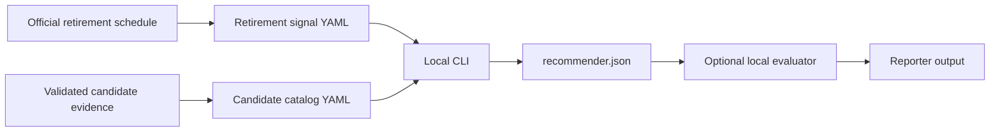

<!-- markdownlint-disable-file -->
# Task Research: GPT-4.1 Retirement Alternatives

Research for the question: "GPT-4.1 is retiring, how can I use this repository to find the alternative?"

## Task Implementation Requests

* Identify the implemented retirement detection and candidate recommendation workflow.
* Provide concrete local and GitHub Actions commands.
* Map configuration, outputs, limitations, and validation checks.

## Scope and Success Criteria

* Scope: Existing repository behavior as verified on 2026-07-17, plus the current Microsoft Foundry retirement schedule.
* Assumptions: The deployment is GPT-4.1 version `2025-04-14`, the workload is `general_qa`, and Sweden Central remains the target region unless the watch-list entry is changed.
* Success criteria:
  * A user can create a deterministic local shortlist today.
  * The documented workflow distinguishes fixture-backed recommendations from live Foundry evidence.
  * The configuration and result paths are exact.

## Outline

1. Use the local CLI with a retirement-signal fixture and a curated candidate catalog for a quick answer.
2. Inspect the staged rank or run the local evaluator and reporter for a comparison report.
3. Use the scheduled GitHub workflow only for orchestration scaffolding until it calls the pipeline.

## Research Executed

### File Analysis

* `config/models.yaml`
  * Defines the non-empty model watch list, including model ID, version, region, workload, and optional per-model horizon.
* `config/evaluation.yaml`
  * Sets the default retirement horizon to 90 days and candidate count to 3.
* `config/recommender.yaml`
  * Sets the deterministic score weights: quality 0.5, safety 0.3, and cost 0.2.
* `src/orchestrator/cli.py:19-81`
  * Accepts the repository root, retirement fixture, candidate catalog, and run ID.
* `src/orchestrator/pipeline.py:97-169`
  * Matches signals to the watch list, applies the horizon, filters candidates, scores them, and writes artifacts.
* `src/detector/retirement_source.py:23-57`
  * Implements a fixture-only retirement source rather than a live Microsoft Foundry schedule parser.
* `src/recommender/catalog.py:22-55`
  * Reads candidates only from a local YAML catalog.
* `src/evaluator/service.py:20-107`
  * Produces local evaluation artifacts without an Azure deployment; ACA dispatch is deferred.
* `src/reporter/service.py:33-147`
  * Produces the final Markdown report and decision JSON from recommendation and evaluation artifacts.
* `.github/workflows/detect-and-eval.yml:1-27`
  * Schedules a weekly `Detect and Evaluate` workflow and exposes manual-dispatch inputs.
* `.github/workflows/detect-and-eval.yml:251-286`
  * Contains a placeholder summary rather than detector, recommender, evaluator, and reporter invocation.
* `config/azure.env.example:4-30`
  * Documents Azure and Foundry variables used by the workflow.

### External Research

* Microsoft Learn: [Model retirement schedule](https://learn.microsoft.com/en-us/azure/foundry/openai/concepts/model-retirement-schedule)
  * As retrieved on 2026-07-17, GPT-4.1 `2025-04-14` retires on 2026-10-14, 89 days away and inside the default 90-day horizon. The row does not prescribe a replacement.
* Microsoft Learn: [Foundry Models sold directly by Azure](https://learn.microsoft.com/en-us/azure/foundry/foundry-models/concepts/models-sold-directly-by-azure)
  * Use the current capabilities and regional-availability information to validate any model added to a candidate catalog.

### Project Conventions

* Standards referenced: `.copilot-tracking/research/` is the durable location for research, and runtime `artifacts/` and `results/` are gitignored.
* Instructions followed: `.github/instructions/copilot-tracking.instructions.md`, `.github/instructions/markdown.instructions.md`, and `.github/instructions/writing-style.instructions.md`.

## Key Discoveries

### Project Structure

The implemented code path is a local, deterministic pipeline:

```text
retirement-signals YAML + candidate-catalog YAML
    -> src.orchestrator.cli
    -> detector match and horizon filter
    -> candidate eligibility filters and weighted rank
    -> artifacts/<run-id>/recommender.json
    -> optional local evaluator
    -> reporter Markdown report and decision JSON
```

The GitHub workflow creates run-context and placeholder finalization artifacts, but does not call this pipeline.

### Implementation Patterns

The CLI cannot discover the GPT-4.1 retirement date or identify a model replacement autonomously. A user must supply:

* A retirement signal based on the Microsoft schedule.
* Candidate entries already validated for region, quota, deployment type, API compatibility, lifecycle, and the target workload.
* Fixture scores that represent the user's quality, safety, and cost judgment.

### Complete Examples

Create a GPT-4.1 retirement signal and two validated candidates. Names, versions, availability, and scores below are placeholders and must be replaced by verified values.

```powershell
@'
retiring_models:
  - model_id: gpt-4.1
    current_version: "2025-04-14"
    retirement_date: "2026-10-14"
    replacement_family: gpt-4.1-successor
    source: microsoft-foundry-retirement-schedule-2026-07-09
'@ | Set-Content .\retirement-signals-gpt41.yaml

@'
candidates:
  - model_id: candidate-a
    version: "validated-version-a"
    region: swedencentral
    deployment_types: [DataZoneStandard]
    workloads: [general_qa]
    replacement_families: [gpt-4.1-successor]
    quality_score: 0.90
    safety_score: 0.96
    cost_score: 0.70
  - model_id: candidate-b
    version: "validated-version-b"
    region: swedencentral
    deployment_types: [DataZoneStandard]
    workloads: [general_qa]
    replacement_families: [gpt-4.1-successor]
    quality_score: 0.86
    safety_score: 0.94
    cost_score: 0.84
'@ | Set-Content .\candidate-catalog-gpt41.yaml

$runId = "gpt41-20260717"
New-Item -ItemType Directory -Force "artifacts/$runId" | Out-Null
python -m src.orchestrator.cli `
  --repo-root . `
  --fixture .\retirement-signals-gpt41.yaml `
  --catalog .\candidate-catalog-gpt41.yaml `
  --run-id $runId |
  Tee-Object "artifacts/$runId/cli-output.json"
```

### Configuration Examples

Use these configuration surfaces for the indicated controls.

| Control | File or variable | Behavior |
| --- | --- | --- |
| Models to watch | `config/models.yaml` | Watch-list entry with model identity, version, region, workload, and optional model-specific horizon |
| Default horizon | `config/evaluation.yaml` | Default 90-day detection horizon and candidate limit |
| Workflow horizon override | `RETIREMENT_HORIZON_DAYS` | Overrides the workflow run context |
| Candidate filters and weights | `config/recommender.yaml` | Region/deployment constraints and deterministic quality, safety, and cost weights |
| Azure and Foundry workflow values | `config/azure.env.example` and GitHub variables | Required only for non-dry-run workflow scaffolding |

## Technical Scenarios

### Quick Local Alternative Shortlist

Run the local pipeline with verified, curated YAML fixtures. This is the only implemented path that returns ranked alternatives today.

**Requirements:**

* Python 3.12 or later, as specified in `pyproject.toml:1-15`.
* `config/models.yaml` includes the GPT-4.1 deployment being retired.
* The retirement fixture uses the exact watched model ID and version.
* The candidate catalog contains only technically and commercially validated candidates.

**Preferred Approach:**

* Supply a narrowly curated candidate catalog and use `src.orchestrator.cli` to rank it, because the shipped detector and catalog adapters are fixture-only.

```text
artifacts/<run-id>/detector.json
artifacts/<run-id>/recommender.json
artifacts/<run-id>/provisioner.json
artifacts/<run-id>/history_preview.json
artifacts/<run-id>/dry_run_output.json
```



**Implementation Details:**

Install the local project dependencies, run the CLI, then validate the staged detector and ranked-candidate outputs.

```powershell
python -m pip install -e ".[test]"
Get-Content "artifacts/$runId/detector.json"
Get-Content "artifacts/$runId/recommender.json"
python -m pytest -q tests/unit/test_detector_service.py tests/unit/test_recommender_service.py tests/unit/test_orchestrator_cli.py
```

For a local decision report, run the evaluator and reporter using the same run ID.

```powershell
python -m src.evaluator.service `
  --repo-root . `
  --artifact-root "artifacts/$runId" `
  --dataset tests/fixtures/evaluator/dataset.sample.jsonl

python -m src.reporter.service `
  --repo-root . `
  --artifact-root "artifacts/$runId" `
  --output-root "artifacts/$runId/reporter-output"
```

The readable result is `artifacts/<run-id>/reporter-output/<target>-report.md`; the selected candidate is in `artifacts/<run-id>/reporter-output/<target>-decision.json`. Per-candidate local results are under `results/<run-id>/<candidate-slug>/`.

#### Considered Alternatives

* Use the checked-in `tests/fixtures/retirement_signals.yaml` and `tests/fixtures/candidate_catalog.yaml`: rejected for GPT-4.1 migration decisions because they model a GPT-4.1-mini test scenario and fixture scores.
* Run the GitHub Actions workflow to generate a recommendation: rejected today because the workflow is a scaffold and does not invoke the local pipeline.
* Treat the first catalog result as a production migration decision: rejected because the score is fixture input, not live availability, quota, benchmark, or cost evidence.

### Scheduled Workflow Scaffolding

Use `.github/workflows/detect-and-eval.yml` for scheduled or manual orchestration evidence only. The workflow runs weekly on Monday at 04:00 UTC and can be manually dispatched with `dry_run`, `candidate_limit`, and `enable_auto_pr` inputs.

**Requirements:**

* For a workflow dry run, use Actions > `Detect and Evaluate` > `Run workflow` > `dry_run=true`.
* For a non-dry-run scaffold check, configure `AZURE_CLIENT_ID`, `AZURE_TENANT_ID`, `AZURE_SUBSCRIPTION_ID`, `RESOURCE_GROUP`, `FOUNDRY_ACCOUNT_NAME`, `FOUNDRY_PROJECT_NAME`, `ACA_ENVIRONMENT_NAME`, `ACA_JOB_NAME`, `STORAGE_ACCOUNT_NAME`, and `KEY_VAULT_NAME` as described by `config/azure.env.example`.

**Preferred Approach:**

* Use the workflow after the local fixture run only to verify OIDC/context plumbing and preserve its artifacts. Do not expect a recommended model until the workflow executes detector, recommender, evaluator, and reporter code.

**Implementation Details:**

Current workflow artifacts are:

```text
run-context-<run-id>/.artifacts/run-context.env
run-context-<run-id>/run-context.json
detect-and-eval-<run-id>/orchestrator-summary.json
detect-and-eval-<run-id>/teardown-plan.json
finalize-<run-id>/finalize-summary.md
finalize-<run-id>/cleanup-recovery.json
finalize-<run-id>/workflow-report.md
finalize-<run-id>/workflow-report.json
```

## Selected Approach and Rationale

Use the local fixture-driven CLI for the immediate GPT-4.1 alternative shortlist. It is the only existing code path that produces ranked candidates. Treat its result as a decision-support shortlist, validate the inputs against current Foundry documentation and your subscription's region/quota, then use the optional evaluator and reporter to record a recommendation.

The production GitHub Actions path is not yet an alternative-finding workflow. It is suitable for verifying workflow configuration and artifact lifecycle, but must be wired to the local pipeline and live Foundry sources before it can produce autonomous recommendations.

## Potential Next Research

* Implement live retirement schedule parsing, Foundry catalog/region/quota discovery, and deployment introspection.
  * Reasoning: These are required for a production recommendation rather than a user-curated fixture rank.
  * Reference: `requirements/plan.md:316-346`, `src/detector/retirement_source.py:1-57`, and `src/recommender/catalog.py:1-55`.
* Wire `src.orchestrator.cli`, evaluator, and reporter into `.github/workflows/detect-and-eval.yml`.
  * Reasoning: The workflow currently produces placeholders only.
  * Reference: `.github/workflows/detect-and-eval.yml:251-286`.