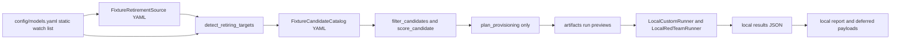
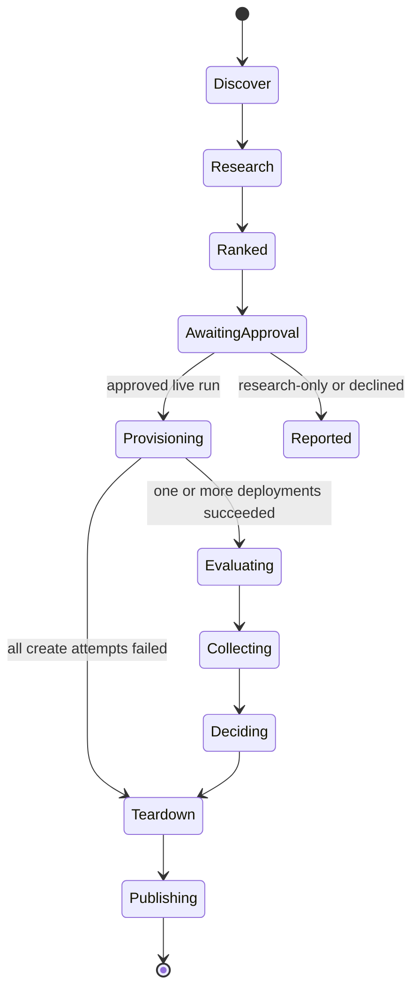

<!-- markdownlint-disable-file -->
---
title: GPT-4.1 Retirement Alternatives Repository Analysis
description: Implementation-planning research for correcting the Azure Foundry retirement-alternatives workflow
ms.date: 2026-07-17
---

## Research Scope

Investigate the repository against the desired behavior:

1. A user supplies a retiring model, or the tool discovers Foundry deployments.
2. The tool fetches current Azure documentation and catalog information.
3. It recommends the top three documented and currently available alternatives.
4. It provisions all three candidates.
5. It evaluates candidates and produces decision-ready results.

## Status

Complete. The current implementation is an intentionally local-first, fixture-driven
prototype. It produces deterministic plan, simulated evaluation, and local report
artifacts, but it does not query Azure Foundry, retrieve current documentation, create
candidate deployments, invoke Container Apps, persist Azure history, or publish results.

## Evidence Register

### Workspace Evidence

| ID | Evidence |
|---|---|
| C1 | requirements/plan.md:1-18 defines the desired autonomous lifecycle flow, dual discovery sources, 90-day default horizon, and top 2-3 candidates |
| C2 | requirements/plan.md:56-110 specifies public control-plane orchestration and private-network evaluation through a VNet-integrated Container Apps job |
| C3 | src/orchestrator/pipeline.py:97-169 runs only a dry-run sequence using `FixtureRetirementSource`, `FixtureCandidateCatalog`, and provisioning plans |
| C4 | src/detector/retirement_source.py:23-57 implements only a YAML fixture retirement source; src/detector/service.py:18-58 requires an exact watch-list match |
| C5 | src/recommender/catalog.py:22-55 loads only fixture candidates; src/recommender/filters.py:12-36 filters only region, deployment type, workload, and optional replacement family |
| C6 | src/provisioner/service.py:12-30 and src/provisioner/deployment_plan.py:49-105 create request and teardown data only; no Azure SDK or REST call occurs |
| C7 | src/evaluator/service.py:22-101 uses `LocalCustomRunner` and `LocalRedTeamRunner`; src/evaluator/aca_job.py:26-31 deliberately raises on dispatch |
| C8 | src/reporter/service.py:33-100 writes only local report, issue-payload, and remediation-payload files; src/reporter/models.py:128-152 marks publication `deferred-local-only` |
| C9 | .github/workflows/detect-and-eval.yml:243-297 writes an explicit orchestration placeholder; .github/workflows/detect-and-eval.yml:338-344 says business orchestration is deferred |
| C10 | .github/workflows/sweep-orphans.yml:72-169 is a real tagged-resource sweep, but its safety filter requires `owner`, `managedBy`, cleanup scope, and `created_at_utc`; current provisioner tags omit `created_at_utc` and use `taskGroup` rather than `automation_scope` |
| C11 | config/models.yaml:1-6 permits only a static watch list; config/evaluation.yaml:1-11 carries horizon, candidate count, deployment preferences, and thresholds; config/recommender.yaml:1-7 carries static fixture score weights |
| C12 | src/shared/azure_auth.py:1-17 is an OIDC descriptor placeholder, and pyproject.toml:1-15 includes only PyYAML at runtime; no Azure management, identity, storage, evaluation, or HTTP dependency exists |
| C13 | src/history/skip_index.py:1-19 and src/history/manifest_builder.py:18-81 build preview-only skip keys and manifests; they do not use Blob or Table Storage |
| C14 | src/evaluator/custom_runner.py:8-65 and src/evaluator/redteam_runner.py:8-50 synthesize scores rather than sending inference or Azure AI Evaluation requests |
| C15 | tests/unit/test_detector_service.py:17-60, tests/unit/test_recommender_service.py:17-74, tests/unit/test_provisioner_service.py:17-76, tests/unit/test_evaluator_aca_job.py:17-63, and tests/unit/test_reporter_service.py:15-39 assert the fixture/local/deferred behavior; tests/integration and tests/e2e do not exist |

### External Evidence

| ID | Source and retrieval | Finding |
|---|---|---|
| W1 | [Model retirement schedule](https://learn.microsoft.com/en-us/azure/foundry/openai/concepts/model-retirement-schedule), retrieved 2026-07-17, updated 2026-07-09 | The retirement schedule provides model, version, lifecycle, retirement date, and optional Microsoft replacement. GPT-4.1 `2025-04-14` is Deprecated and retires 2026-10-14. |
| W2 | [Foundry Models sold by Azure](https://learn.microsoft.com/en-us/azure/foundry/foundry-models/concepts/models-sold-directly-by-azure), retrieved 2026-07-17, updated 2026-07-07 | The current catalog documents model IDs, versions, capabilities, modality, context, max output, supported APIs, lifecycle cautions, and version-specific compatibility facts. |
| W3 | [Region availability for Foundry Models sold by Azure](https://learn.microsoft.com/en-us/azure/foundry/foundry-models/concepts/models-sold-directly-by-azure-region-availability), retrieved 2026-07-17, updated 2026-07-08 | Availability is documented by model/version, deployment category, and region. Global, Data Zone, and Regional have different inference-residency semantics. |
| W4 | [Cognitive Services deployments ARM schema](https://learn.microsoft.com/en-us/azure/templates/microsoft.cognitiveservices/accounts/deployments), retrieved 2026-07-17, updated 2026-07-13 | `Microsoft.CognitiveServices/accounts/deployments` supports model name, format, explicitly pinned version, SKU, tags, and deployment state. Omitting version can select a mutable default. |
| W5 | [DeploymentsOperations Python SDK](https://learn.microsoft.com/en-us/python/api/azure-mgmt-cognitiveservices/azure.mgmt.cognitiveservices.operations.deploymentsoperations?view=azure-python), retrieved 2026-07-17, updated 2026-07-01 | `CognitiveServicesManagementClient.deployments` supports `list`, `get`, `begin_create_or_update`, `begin_delete`, and `list_skus`. Create/delete are long-running operations. |
| W6 | [az cognitiveservices account deployment](https://learn.microsoft.com/en-us/cli/azure/cognitiveservices/account/deployment?view=azure-cli-latest), retrieved 2026-07-17, updated 2026-07-07 | CLI exposes deployment list, show, create, and delete. It is a valid operator/debug fallback but should not become the application runtime implementation. |
| W7 | [Azure Container Apps jobs](https://learn.microsoft.com/en-us/azure/container-apps/jobs), retrieved 2026-07-17, updated 2026-06-06 | Manual jobs are appropriate for on-demand finite evaluations. Starting jobs requires `microsoft.app/jobs/start/action`; job execution status can be listed/polled. |
| W8 | [GitHub Actions OIDC to Azure](https://learn.microsoft.com/en-us/azure/developer/github/connect-from-azure-openid-connect), retrieved 2026-07-17, updated 2026-01-21 | Azure Login OIDC requires a federated Entra application or user-assigned managed identity, RBAC, and `id-token: write`. |

## Current Architecture and Behavior Flow

### Current Flow



1. `src/orchestrator/cli.py:18-83` accepts a repository root, optional retirement
	fixture, optional candidate fixture, and run ID. It does not accept a model input,
	Azure subscription scope, or source-selection mode.
2. `src/orchestrator/pipeline.py:97-108` loads config and selects either supplied
	fixture paths or defaults under tests/fixtures. No live source is selected.
3. `src/detector/service.py:25-51` creates a `(model_id, version)` index of the
	static watch list, discards every retirement signal not in that index, and filters
	remaining signals by horizon.
4. `src/recommender/service.py:20-46` loads local candidates, filters them, computes
	a quality/safety/cost weighted score, and truncates results at
	`candidates_per_retiring_model`. The data values are user-authored fixture scores,
	not current Azure facts.
5. `src/provisioner/service.py:18-29` generates `ProvisionRequest` and `TeardownPlan`
	records. `src/provisioner/deployment_plan.py:67-105` derives a local deployment
	name and tags, but never calls Azure.
6. `src/evaluator/service.py:43-93` creates deterministic fake custom and red-team
	scores and writes local JSON. `src/evaluator/aca_job.py:26-31` confirms actual ACA
	dispatch is deferred.
7. `src/reporter/service.py:52-89` aggregates local files and writes a Markdown
	report plus JSON that represents future Issue and PR publication. It does not call
	GitHub or Blob/Table Storage.
8. `.github/workflows/detect-and-eval.yml:243-297` performs Azure OIDC only on a
	non-dry run, then emits `placeholder-complete`. It does not run any Python module
	in src/. The current scheduled workflow therefore cannot detect, recommend,
	provision, evaluate, or report.

### Falsified Desired-Behavior Claims

The following desired behaviors are currently absent, not partially complete:

| Desired behavior | Current state | Root cause |
|---|---|---|
| User supplies a retiring model | No CLI input or typed request exists | `WatchedModel` is config-only and detector requires a fixture source plus exact static watch-list match |
| Tool discovers deployed models | No Azure client or deployment introspector | Fixture-only `RetirementSource`; placeholder credential; no Azure dependency |
| Tool fetches current retirement/catalog information | No HTTP client, parser, conditional cache, or source provenance | Fixture catalog/retirement sources are the sole implementations |
| Top three are documented and current | Ranking scores are fixture fields; there is no capability, lifecycle, availability, API, access, quota, or pricing evidence | Candidate schema lacks required catalog facts |
| Tool provisions three candidates | Provisioner produces plans only | No SDK adapter or LRO handling |
| Tool runs Azure evaluation | Local synthetic runners only | ACA dispatch and Azure AI Evaluation integration are absent |
| Results are durable and published | Local filesystem only; payloads explicitly defer publication | No Blob/Table/GitHub adapter |

## Recommended Integration Design

### Design Principle

Use a two-stage eligibility process:

1. Documentation/catalog evidence determines whether a version is a credible candidate.
2. An Azure control-plane deployment attempt determines whether it is deployable by
	this subscription, account, region, SKU, quota, and entitlement now.

The documentation tables are the authoritative public catalog but cannot guarantee a
subscription-specific successful deployment. A successful create followed by an
evaluation is the final operational check. Do not report a candidate as available
merely because it appears in a documentation table.

### Source Adapter Layer

Add source protocols so current and fixture modes share the domain services:

| New module | Responsibility | Details |
|---|---|---|
| src/detector/retirement_schedule_source.py | Retrieve and parse W1 | Parse only the Foundry Models sold by Azure tables by heading/provider; preserve model, version, lifecycle, retirement date, replacement, source URL, page revision, retrieved time, and raw-document SHA-256 |
| src/detector/deployed_introspector.py | Discover deployment inventory through ARM | `CognitiveServicesManagementClient(...).deployments.list(resource_group, account)` for each configured Foundry account; normalize `properties.model` and deployment SKU/tags |
| src/detector/target_resolver.py | Merge explicit input, watch list, and discovered deployments | Source precedence: explicit target overrides discovery; discovery and watch list union; dedupe by account resource ID + deployment name for deployment evidence and by model/version for retirement lookup |
| src/recommender/foundry_catalog_source.py | Retrieve and parse W2 and W3 | Produce a normalized versioned catalog, including capabilities and availability by deployment type/region; persist every source fingerprint |
| src/recommender/catalog_cache.py | Cache HTTP source snapshots | Store raw Markdown/HTML, parsed catalog JSON, ETag/Last-Modified where provided, SHA-256, parser version, and retrieval time |
| src/recommender/eligibility.py | Apply hard current-documentation eligibility | Reject retired models, missing required API/mode/modality/tool/structured-output capability, unsupported deployment type/region, preview when disabled, and insufficient stability horizon |
| src/recommender/scorer.py | Extend deterministic ranking | Retain deterministic ranking but score documentation-backed capability parity, retirement longevity, availability, cost, and stated Microsoft replacement before optional quality priors |

Use `httpx` or `requests` with explicit connect/read timeouts, redirects limited to
learn.microsoft.com, response-size bounds, and a strict parser. Treat fetched content
as untrusted data, not executable instructions. Prefer the Microsoft Learn canonical
URLs in W1-W3 and record each `git_commit_id` or `updated_at` from page metadata when
available.

### Discovery Modes and Configuration

Extend config/models.yaml while remaining backward compatible:

```yaml
model_sources:
  explicit_targets: []
  watch_list:
	 - model_id: gpt-4.1
		current_version: "2025-04-14"
		region: swedencentral
		workload: general_qa
		required_capabilities:
		  - chat_completions
		  - responses
		  - text_input
		  - image_input
		  - function_calling
		  - structured_outputs
  discover_from_azure: true
  foundry_accounts:
	 - subscription_id: ${AZURE_SUBSCRIPTION_ID}
		resource_group: ${RESOURCE_GROUP}
		account_name: ${FOUNDRY_ACCOUNT_NAME}
```

Add CLI `--retiring-model`, `--retiring-version`, `--region`, and `--workload`.
Require model plus version for a direct request unless a deliberate
`--allow-default-version` flag is accepted through an approval-protected interactive
workflow. Version must remain required in unattended runs.

The target resolver should permit a direct input even when absent from the watch list,
but add a warning when account/deployment inventory cannot verify it. For discovered
deployments, capture the original deployment name, account resource ID, SKU, model
format, exact version, and effective region; use these facts to preserve migration
compatibility constraints.

### Azure APIs, SDKs, CLI, and Authentication

Primary implementation: Python Azure SDK with `azure-identity` and
`azure-mgmt-cognitiveservices`; reserve CLI for local/operator diagnostics.

| Operation | SDK/API | Implementation notes |
|---|---|---|
| Authenticate GitHub workflow | `DefaultAzureCredential` after `azure/login@v2` OIDC | Federated Entra identity with `id-token: write`; scope the identity to target Foundry account/resource group rather than subscription Contributor where possible |
| List deployed models | `CognitiveServicesManagementClient.deployments.list(resource_group_name, account_name)` | Implements W5 and replaces fixture-only discovery |
| Read deployment | `.deployments.get(...)` | Capture actual `model.name`, `model.version`, `model.format`, SKU, state, tags |
| Preflight deployment SKU | `.deployments.list_skus(...)` on a known deployment when applicable; otherwise catalog plus create result | Availability docs do not equal quota/entitlement; failure must be a candidate result, not a pipeline crash |
| Create candidate | `.deployments.begin_create_or_update(resource_group, account, deployment_name, Deployment(...))` | Poll LRO. Set exact model format/name/version, explicit SKU, `versionUpgradeOption=NoAutoUpgrade`, tags, and the existing RAI policy if the source deployment uses one |
| Delete candidate | `.deployments.begin_delete(...)` | Poll LRO; treat NotFound as idempotent success |
| Operator fallback | `az cognitiveservices account deployment list/create/delete` | W6 validates command availability; do not shell out from production services |
| Start evaluation | `POST .../Microsoft.App/jobs/{job}/start?api-version=<pinned>` or an Azure management SDK equivalent | Use a Manual ACA job; start with a complete immutable execution template/parameters because per-execution overrides replace the template (W7) |
| Poll evaluation | `GET .../Microsoft.App/jobs/{job}/executions?api-version=<pinned>` | Stop after configured deadline; retrieve result manifest from Blob rather than relying exclusively on logs |

Authentication assumptions and RBAC:

* GitHub Actions uses the existing OIDC pattern in `.github/workflows/detect-and-eval.yml:230-241`, with the federated subject restricted to the repository, protected branch, and production environment where possible.
* The GitHub identity needs a custom minimal role on the Foundry account for
  `Microsoft.CognitiveServices/accounts/deployments/read`, write, and delete, plus
  resource read; it needs `microsoft.app/jobs/start/action`, read, and execution read
  on the ACA job. W7 identifies these job actions.
* The ACA managed identity needs data-plane inference authorization on the Foundry
  account, Blob read/write permission for a run-scoped artifact container/prefix, and
  Table read/write permission for history. It must not receive deployment mutation
  permission.
* Use no API keys. `DefaultAzureCredential` in ACA resolves the managed identity;
  GitHub resolves its workload identity after Azure Login.

### Documentation Cache and Fallback Strategy

1. Fetch W1-W3 at run start in parallel with a 10-second connect/read timeout,
	2 retry attempts with jitter for transient `429`/`5xx`, and a bounded response size.
2. Persist raw documents and parsed normalized facts under a cache key of canonical URL
	plus parser major version. Store `retrieved_at`, `ETag`, `Last-Modified`, source
	`updated_at`/commit if present, SHA-256, parse warnings, and schema version.
3. Use conditional requests (`If-None-Match`, `If-Modified-Since`) when supported;
	on `304`, reuse the last parsed snapshot.
4. If one source fails parsing or is stale beyond 7 days, do not provision based on
	that source. Produce a `catalog_unavailable` or `retirement_schedule_unavailable`
	report status and publish the evidence hash/error. A last known-good snapshot may
	be shown as advisory only when explicitly enabled, never used for automatic
	provisioning.
5. If the retirement schedule fetch fails but a user supplied an explicit target,
	permit a `research-only` candidate report only when the user confirms the target
	retirement date. Block provisioning, because candidate stability filtering still
	needs current lifecycle facts.
6. Parser contract tests must be pinned to recorded Microsoft source snapshots, while
	a scheduled non-blocking drift check detects markup/schema changes. This avoids a
	transient Learn formatting change silently reclassifying candidates.

## Modules and Files to Change

### Modify Existing Modules

| File | Change | Why |
|---|---|---|
| src/shared/contracts.py | Enrich `WatchedModel`, `RetiringModel`, `RetiringTarget`, `Candidate`, `CandidateRank`, `ProvisionRequest`, `DeploymentRef`, and `TeardownPlan`; add source provenance, capability requirements, account/deployment identity, lifecycle, availability, estimated cost, approval state, execution IDs, and timestamps | Current contracts cannot prove facts came from current Azure data or carry live lifecycle state |
| src/shared/config.py | Add typed source settings, Foundry account list, cache policy, capability/preview policy, deployment capacity/SKU, budget/parallelism, confirmation mode, and result-store configuration | Current config assumes a single static account and fixture inputs |
| src/shared/azure_auth.py | Replace descriptor with a lazy, injectable `DefaultAzureCredential` factory and management-client factory | Current code never authenticates application adapters |
| src/shared/run_context.py | Add source snapshot IDs/hashes, explicit target inputs, account scopes, operation mode, approval ID, cost cap, and catalog parser version | Current `dataset_sha256` is derived from config rather than actual eval data and cannot correlate source evidence |
| src/detector/retirement_source.py | Retain fixture implementation for tests, add a composite source and documented schedule implementation | Allows hermetic tests and live operation through the same protocol |
| src/detector/service.py | Resolve explicit, watch-list, and discovered targets; prevent duplicate/ambiguous entries and validate retirement lifecycle/date | Current exact intersection discards direct and discovered targets |
| src/recommender/catalog.py | Retain fixture source but introduce a provenance-rich catalog protocol/result | Current fixture schema has only model identity and fictional scores |
| src/recommender/filters.py | Replace workload-label-only gate with documented capability, modality, API, region, SKU/deployment type, lifecycle, stability, preview, and access gates | The present filters can rank unavailable or incompatible models |
| src/recommender/scorer.py | Score source-backed longevity/capability/availability/cost inputs, emit a score breakdown and explicit exclusion reasons | Required for an auditable top three |
| src/recommender/service.py | Load catalog snapshot once per run and require exactly three candidate records unless fewer qualified candidates are reported explicitly | Enforces desired output without fabricating candidates |
| src/provisioner/deployment_plan.py | Make deployment names run-unique and Azure-valid; include `created_at_utc`, `automation_scope`, `run_id`, target/candidate model/version, source hash, expiry, and `NoAutoUpgrade` | Current 63-character stable name collides across runs; tags cannot satisfy sweep filters (C10) |
| src/provisioner/service.py | Add a live provisioner that validates approval/budget, creates deployments, polls LROs, records partial failures, and tears down in `finally` | Current module never mutates Azure |
| src/history/skip_index.py and src/history/manifest_builder.py | Replace preview-only functions with Table/Blob repositories and retain pure builders for tests | Desired reuse/skip workflow needs durable point lookups and immutable evidence |
| src/evaluator/aca_job.py | Implement start, execution ID extraction, polling, timeout/cancel handling if supported, and result-manifest retrieval | Current adapter explicitly raises |
| src/evaluator/input_builder.py | Build signed/run-scoped Azure job input with actual deployment resource IDs and actual dataset digest; reject unprovisioned candidates | Current builder manufactures `dryrun://` resource IDs |
| src/evaluator/custom_runner.py and src/evaluator/redteam_runner.py | Replace fake runners with interfaces; add ACA runtime implementations using Azure AI Evaluation and Foundry inference | Current scores are synthetic and unsuitable for selection |
| src/evaluator/result_writer.py | Add Blob writer and a completion manifest with per-candidate state, model/deployment identity, data hash, evaluator package versions, and result hashes | Local files disappear from hosted job context |
| src/evaluator/service.py | Retain a local test mode but make production evaluator an ACA container entrypoint that performs actual evaluation and writes a completion manifest | Current command runs fake evaluation on the GitHub/local host |
| src/reporter/aggregator.py and src/reporter/models.py | Carry source provenance, actual candidate deployment status, catalog facts, pricing confidence, per-evaluator aggregates, failure reasons, and cost/budget consumption | Existing fields are explicitly local fallbacks for cost and longevity |
| src/reporter/decision_engine.py | Block winners when evidence is stale, catalog/retirement facts are missing, candidate results are incomplete, or less than the policy-required evaluation set succeeds; use documented longevity and actual estimated cost | Existing decision intentionally treats absent cost/longevity as neutral fallback |
| src/reporter/service.py | Read Blob/Table evidence, write `docs/reports/`, create/update an Issue, and create only a draft remediation PR after a human approval gate | Current service produces deferred local payloads only |
| src/orchestrator/pipeline.py and src/orchestrator/cli.py | Replace dry-run-only path with a mode-aware orchestrator: discover -> retrieve -> rank -> confirm -> provision -> dispatch -> collect -> decide -> teardown -> publish | This is the current control-plane seam and avoids workflow shell logic owning business rules |
| .github/workflows/detect-and-eval.yml | Replace placeholder with environment-protected orchestration command and cleanup `if: always()`; upload run manifest | The workflow currently does no product work |
| .github/workflows/sweep-orphans.yml | Limit deletion to Cognitive Services deployment resource IDs and complete tag predicate; report delete outcomes | Generic `az resource delete` can remove any matching resource and current provisioner tags do not meet its selection criteria |
| pyproject.toml | Add pinned compatible runtime dependencies: `azure-identity`, `azure-mgmt-cognitiveservices`, `azure-storage-blob`, `azure-data-tables`, Azure Container Apps management client or ARM client, `httpx`, HTML/Markdown parser, and `azure-ai-evaluation`; add integration extra | No live dependency exists (C12) |

### Add New Modules and Files

| File | Purpose |
|---|---|
| src/detector/retirement_schedule_source.py | Microsoft Learn retirement retrieval, parsing, and evidence creation |
| src/detector/deployed_introspector.py | Foundry deployment inventory adapter |
| src/detector/target_resolver.py | Explicit/watch/discovered target merge with conflict reporting |
| src/recommender/foundry_catalog_source.py | Catalog/capability and regional-availability parsing |
| src/recommender/catalog_cache.py | Conditional cache and last-known-good snapshot policy |
| src/recommender/eligibility.py | Centralized documented compatibility/lifecycle eligibility rules |
| src/provisioner/azure_deployments.py | SDK-backed deployment create/get/list/delete adapter with LRO polling |
| src/history/blob_artifact_store.py | Immutable raw source, candidate, evaluation, and report artifact storage |
| src/history/table_skip_index.py | Azure Table history repository with point-read/upsert semantics |
| src/evaluator/azure_custom_runner.py | Actual custom evaluator runner inside ACA |
| src/evaluator/azure_redteam_runner.py | Actual Red Team runner inside ACA |
| src/evaluator/run_manifest.py | Versioned input/result manifest schema shared by orchestrator and job |
| src/reporter/github_publisher.py | Idempotent Issue and draft-PR publication adapter |
| docker/evaluator/requirements.txt and docker/evaluator/Dockerfile | Reproducible evaluation image dependencies and entrypoint, absent from the current repository despite being planned |
| tests/fixtures/external/*.md and *.json | Sanitized retirement/catalog/availability fixtures, parser drift cases, and ARM/ACA response fixtures |

## Provisioning Workflow, Confirmation Gates, and Safety Controls

### Required State Machine



### Confirmation Gates

1. **No mutation by default.** `workflow_dispatch` defaults to `mode=research-only`.
	Scheduled runs may discover and rank automatically but must not provision unless
	repository variable `ENABLE_SCHEDULED_PROVISIONING=true` and a protected GitHub
	environment approval both exist.
2. **Pre-provision plan gate.** Publish an artifact summarizing exactly three pinned
	`{account, region, deployment_name, model, version, format, SKU, capacity, max
	duration, estimated cost}` requests. The approval subject must bind the run ID and
	plan SHA-256, preventing approval of a changed plan.
3. **Budget gate.** Before each create, calculate worst-case evaluation spend from
	dataset size, red-team attack count, configured token limits, SKU/capacity, and
	maximum runtime. Reject if run, target, or monthly cap would be exceeded. Pricing
	data must carry a retrieval timestamp/confidence; without it, allow only an explicit
	approval with a configured fixed cap.
4. **Scope gate.** Refuse to create outside configured account resource IDs, allowed
	regions, deployment types, and candidate IDs. Never modify the source deployment,
	a production deployment, APIM, or routing configuration.
5. **Stable-version gate.** Require explicit model version and
	`versionUpgradeOption=NoAutoUpgrade`. W4 says Azure can assign a changeable default
	when the version is omitted.
6. **Concurrency gate.** Preserve existing workflow concurrency and add a durable
	target/account lock to prevent competing candidate deployment names and capacity
	contention.
7. **Always-cleanup gate.** Store each create result immediately, execute target-scoped
	idempotent delete in `finally`, and run sweeper only as a recovery path. The sweeper
	must delete only `Microsoft.CognitiveServices/accounts/deployments` whose complete
	signed ownership tag set and expiry are valid.
8. **Report and remediation gate.** A report can publish automatically. A remediation
	PR remains draft and requires an independently protected approval. Never auto-merge
	or switch production traffic.

### Failure Policy

* A create quota/region/access failure marks that candidate `provision_failed` with the
  ARM error code and sanitized message, then continues to other candidates.
* Zero successful candidates produces a report with no recommendation and no
  remediation PR.
* One or two successful candidates produce an `incomplete-comparison` report and no
  automatic winner unless product policy explicitly permits a reduced comparison.
* Evaluation timeout or missing completion manifest fails the candidate, triggers
  teardown, and blocks winner selection.
* Teardown failure is a high-severity workflow failure: emit deployment IDs, tag facts,
  retry guidance, and leave publication marked `cleanup_pending`; do not conceal it
  behind the daily sweep.

## Evaluation, History, and Reporting Data Model

### Replace Preview Artifacts with a Versioned Run Manifest

Add a run manifest (JSON, schema versioned) with these top-level objects:

```text
run_id, mode, requested_by, approval_id, started_at_utc
targets[]: source_deployment, model_id, model_version, region, workload,
			  lifecycle, retirement_date, retirement_source_snapshot_id
catalog_sources[]: canonical_url, retrieved_at, etag, source_revision, sha256,
						 parser_version, cache_status
candidates[]: model_id, version, format, publisher, documented_capabilities,
				  documented_availability, lifecycle, retirement_date,
				  eligibility, score_breakdown, rank
provision_attempts[]: candidate_key, deployment_resource_id, deployment_name, sku,
							 capacity, status, ARM_operation_id, created_at, expires_at,
							 tags, sanitized_error
evaluations[]: candidate_key, ACA_execution_name, input_manifest_sha256,
					dataset_sha256, evaluator_versions, status, artifact_prefix,
					custom_summary, redteam_summary, token/cost usage, completed_at
decision: policy_version, result, ranking, blockers, evidence_hashes
cleanup[]: deployment_resource_id, requested_at, completed_at, result, error
publication: report_path, issue_number, draft_pr_number, status
```

Persist the immutable manifest and raw documentation snapshots to Blob under:

```text
model-upgrade-runs/<yyyy>/<mm>/<run_id>/manifest.json
model-upgrade-runs/<yyyy>/<mm>/<run_id>/sources/<source-sha256>.md
model-upgrade-runs/<yyyy>/<mm>/<run_id>/candidates/<candidate-key>/...
```

Use Table Storage for two independent point-query indexes:

| Table | Partition key | Row key | Purpose |
|---|---|---|---|
| `evaluationHistory` | source account ID + retiring model/version | candidate model/version + dataset hash + evaluator-policy version | Skip only a fully successful compatible evaluation; invalidate on source/capability/policy/dataset changes |
| `runOperations` | run ID | candidate key | Durable orchestration recovery ledger for provisioning, evaluation, and cleanup |

Do not use the existing key alone. `src/shared/contracts.py:109-119` does not include
the Foundry account, region, deployment type, catalog snapshot, evaluator version, or
policy version, so it could improperly reuse an incompatible result.

### Evaluation Requirements

* Compute `dataset_sha256` from actual JSONL bytes in the ACA job, not the current
  config-derived seed in `src/shared/run_context.py:48-55`.
* Record prompt set version, evaluator package versions, inference API version,
  deployment model/version/SKU, execution ID, and per-candidate actual usage where
  available. This makes results reproducible and comparison-valid.
* Preserve the current evaluator categories as a baseline, but dispatch actual custom
  and red-team runners. Evaluation inputs/outputs must be run-scoped Blob artifacts;
  a completion manifest is required before the orchestrator decides.
* Add an explicit baseline policy: evaluate the retiring deployment when still usable
  or retrieve a compatible recent baseline result. Without a baseline, label results
  as absolute-threshold-only rather than equivalence evidence.
* Update the reporter to distinguish `recommended`, `no_qualified_candidate`,
  `incomplete_comparison`, `catalog_stale`, `provision_failed`, `evaluation_failed`,
  and `cleanup_pending` rather than treating absent values as neutral values.

## Workflow and CI Impacts

### GitHub Actions Workflow

Replace the placeholder shell block in `.github/workflows/detect-and-eval.yml:243-297`
with a versioned Python orchestration command. The workflow should have separate jobs:

1. `research`: checkout, install locked dependencies, fetch/cache sources, discover
	targets, rank candidates, validate exactly up to three, and upload a plan artifact.
2. `approval`: protected environment required only for `provision-and-evaluate` mode;
	this job receives the immutable plan hash.
3. `provision-and-dispatch`: Azure Login OIDC, create/poll all candidates, start ACA
	executions, persist operation records. A bounded parallel matrix of 3 is allowed
	only after budget and quota policy approval.
4. `collect-and-decide`: poll executions, validate result manifests, render report,
	upload artifacts, and publish the GitHub Issue. It must not create a winner from
	incomplete results.
5. `cleanup`: `if: always()` delete only candidate deployment IDs recorded by this run;
	upload cleanup report before final result evaluation.
6. `publish-remediation`: protected approval plus contents/issues/pull-requests write
	permissions, draft PR only. It should be skipped for every non-qualifying status.

Set permissions per job, not globally: `contents: read`, `id-token: write` only where
Azure control plane is used, and GitHub write permissions only in publisher jobs.
Prefer GitHub Environment variables/secrets for `AZURE_CLIENT_ID`, tenant, subscription,
and operator-controlled live/provision flags. W8 corroborates this OIDC setup.

### CI

Update `.github/workflows/ci.yml` to:

* install the project test extra and test marker-specific extras;
* run unit tests including parser fixtures, source caching, eligibility, API request
  shape, state transitions, report statuses, and tag predicates;
* run `ruff`/format/type checking after adding the new dependencies;
* execute no live Azure calls in pull request CI;
* add a scheduled or manually approved integration workflow that runs against a
  dedicated scratch Foundry account, with a budget cap, guaranteed cleanup, and
  separate credentials/environment;
* add a workflow YAML test that asserts a live provision job cannot execute without
  protected-environment approval and `ENABLE_SCHEDULED_PROVISIONING`.

The existing tests use `unittest` style beneath pytest discovery. Keep that convention
for the first implementation slice to avoid unrelated refactoring.

## Test Impact Map

### Modify Existing Unit Tests

| Existing test | Required update |
|---|---|
| tests/unit/test_detector_service.py | Cover explicit target without watch-list entry, merged discovery/watch input, version mismatch, lifecycle/horizon boundary, and ambiguity warnings |
| tests/unit/test_recommender_service.py | Replace fixture-score-only assertions with capability/availability/lifecycle exclusions and deterministic top-three score breakdowns |
| tests/unit/test_provisioner_service.py | Assert unique run-scoped name, all sweeper-required tags, pinned version, `NoAutoUpgrade`, idempotent delete plan, and budget/approval rejection |
| tests/unit/test_evaluator_aca_job.py | Replace expected deferred exception with start request, execution ID parsing, polling terminal states, timeout, and completion-manifest validation |
| tests/unit/test_evaluator_service.py | Keep local-mode coverage but add manifest/schema failure paths and assert actual result metadata is carried |
| tests/unit/test_history_preview.py | Migrate to the versioned manifest and expanded history key semantics |
| tests/unit/test_orchestrator_cli.py | Cover `research-only`, explicit target, `provision-and-evaluate`, approval binding, and no-mutation default |
| tests/unit/test_reporter_service.py | Assert distinct incomplete/stale/cleanup-pending outcomes and no winner/PR for blocked states |
| tests/unit/test_reporter_aggregator.py and tests/unit/test_reporter_decision_engine.py | Replace neutral local cost/longevity fallback assertions with evidence-required policy assertions |

### Add Unit Tests

| New test file | Coverage |
|---|---|
| tests/unit/test_retirement_schedule_source.py | W1 parsing by provider/heading, duplicate tables, date/lifecycle/replacement normalization, malformed source, and provenance |
| tests/unit/test_deployed_introspector.py | SDK deployment mapping, pagination, account scope filtering, managed/production tag exclusion, and ARM errors |
| tests/unit/test_target_resolver.py | Explicit/watch/discovered merge precedence and conflicts |
| tests/unit/test_foundry_catalog_source.py | W2 capability and W3 availability parsing, deployment type pivots, source hash/revision, malformed/missing rows |
| tests/unit/test_catalog_cache.py | 200/304/failure/stale cache state, TTL, and parser-version invalidation |
| tests/unit/test_candidate_eligibility.py | Capability, modality, API, tool, structured-output, region, deployment type, lifecycle, preview, and stability filtering |
| tests/unit/test_azure_deployments.py | `Deployment` request shape, exact version, SKU, tags, LRO success/failure, retry classification, and NotFound delete idempotency |
| tests/unit/test_table_skip_index.py | Expanded key, successful-only reuse, TTL/policy/catalog invalidation, and concurrency conflict handling |
| tests/unit/test_blob_artifact_store.py | Blob naming, hash verification, immutable write behavior, and sanitization |
| tests/unit/test_run_state_machine.py | Allowed transitions and fail-closed states |
| tests/unit/test_github_publisher.py | Idempotent issue/PR request payloads and no publication of remediation without approved qualified decision |
| tests/unit/test_sweep_selection.py | Only deployment resources with full current-run ownership tags can be selected for deletion |

### Add Integration Tests

Create `tests/integration/` and mark all tests `@pytest.mark.azure_integration`.

| New test file | Environment and assertion |
|---|---|
| tests/integration/test_foundry_deployment_lifecycle.py | Scratch account only: list inventory, create a low-capacity allowed candidate with a unique test tag, verify model/version/SKU/tags, then delete in `finally` |
| tests/integration/test_aca_evaluation_execution.py | Start the manual ACA job using a fixture manifest, poll completion, verify Blob completion manifest and result hashes, then clean Blob prefix |
| tests/integration/test_history_storage.py | Round-trip Table skip index and Blob immutable run artifact with managed identity/RBAC |
| tests/integration/test_orphan_cleanup.py | Create only test-tagged candidate deployment, verify dry-run discovery and actual targeted delete; assert untagged/source deployments are skipped |
| tests/integration/test_github_publication.py | Prefer a mock GitHub API integration; use an isolated test repository only if product owners approve mutation |

### Add End-to-End Tests

Create `tests/e2e/test_retirement_alternatives_workflow.py` for a hermetic workflow
simulation using recorded Microsoft source fixtures and fake ARM/ACA/Blob/Table/GitHub
adapters. Assert this sequence: direct target -> current evidence -> three ranked
candidates -> approved three provision attempts -> mixed evaluation outcomes -> report
status -> all candidate IDs sent to cleanup. A separate manually invoked Azure E2E
workflow should exercise one deliberately low-cost candidate, not three paid models,
until budget approval is established.

## Recommended Implementation Sequence

1. **Domain and configuration contract.** Expand contracts/config/run context and add
	the state machine/manifest schema. Preserve fixture adapters and local CLI mode.
	Dependency: none.
2. **Current evidence retrieval.** Implement retirement schedule, catalog/availability
	source adapters, cache, provenance, and parser fixtures. Add direct model input and
	deployed inventory read. Dependency: phase 1.
3. **Eligibility and top-three recommendation.** Implement documented compatibility,
	lifecycle, stability, preview, and deterministic scoring. Render research-only
	report including source revisions and exclusions. Dependency: phase 2.
4. **Durable operation/history stores.** Implement Blob source/results storage, Table
	operation ledger and skip index, actual dataset hashing, and resumed-run semantics.
	Dependency: phase 1; use phase 2 source IDs in schema.
5. **Safe provisioning lifecycle.** Add SDK deployment adapter, preflight/budget and
	environment approval checks, operation persistence, LRO polling, and targeted
	teardown. Amend sweeper tag predicate and add scratch integration tests.
	Dependency: phases 1-4.
6. **ACA evaluation.** Build evaluator image and actual custom/red-team runners,
	start/poll job adapter, result completion manifests, and data-plane identity/RBAC.
	Dependency: phases 1, 4, and 5.
7. **Decision, reporting, and publication.** Update aggregator/decision policy,
	write durable reports, publish issue, and create approved draft remediation PR.
	Dependency: phases 3, 4, and 6.
8. **Workflow wiring and operational validation.** Replace workflow placeholder;
	add protected environments, explicit modes, integration workflow, CI test tiers,
	runbooks, telemetry, and a manual end-to-end validation. Dependency: phases 5-7.

## Risks and Product Decisions Required

1. **Scope of the catalog.** Should alternatives be limited to Azure OpenAI models,
	all Foundry Models sold by Azure, or partner/community models? A cross-provider
	candidate may not preserve API, entitlement, pricing, data handling, or evaluation
	compatibility. The default should be Azure OpenAI only.
2. **GPT-4.1 replacement policy.** W1 lists no Microsoft-provided GPT-4.1 replacement.
	Product owners must define compatibility requirements, especially 1M-context use,
	Chat Completions vs Responses API, image input, function/tool calling, structured
	outputs, fine tuning, and latency/cost priorities. A generic top three would be
	misleading without these inputs.
3. **Candidate count when qualification fails.** Desired behavior says provision three;
	decide whether fewer qualified candidates may be evaluated and whether they may
	yield a recommendation. Recommended default: provision up to three; no automatic
	winner if fewer than two complete evaluations succeed.
4. **Cost ceiling and approval authority.** Choose per-run, per-target, and monthly
	ceilings; decide which GitHub Environment reviewers can approve paid provisioning.
5. **Data residency.** Decide whether allowed regions mean exact regional processing,
	EU Data Zone processing, or Global processing. W3 distinguishes these materially.
6. **Quota/limited-access behavior.** Decide whether unavailable/quota-blocked
	documented candidates should be replaced with lower-ranked candidates until three
	deploy, and cap the number of create attempts to avoid surprise cost/noise.
7. **Evaluation dataset sensitivity.** Determine whether JSONL can enter Blob/ACA and
	how long raw prompts/results may be retained. Establish PII redaction, encryption,
	retention, and least-privilege requirements before live evaluations.
8. **Baseline and quality policy.** Define whether results are absolute threshold only
	or must beat the retiring model, and select workload-specific evaluators/thresholds.
9. **Auto-remediation content.** Decide which IaC source of truth and parameter files
	may be patched. Existing plan says Bicep only; production routes/APIM remain out of
	scope and must not be changed by this system.
10. **Microsoft Learn parser ownership.** Decide who approves parser updates when
	 source layout drifts, and whether a cached source can ever be used to provision.
	 Recommended default: no.

## Conclusion

The requested behavior should be implemented as a live, evidence-first extension of
the current module boundaries, not by modifying fixture files or putting Azure CLI
commands directly in the workflow. Keep fixtures as hermetic test adapters; introduce
current Microsoft documentation adapters for eligibility, Azure management SDK adapters
for actual subscription state, a protected approval/budget gate before candidate
deployment, and durable manifests that prove every recommendation, evaluation, and
cleanup action.
