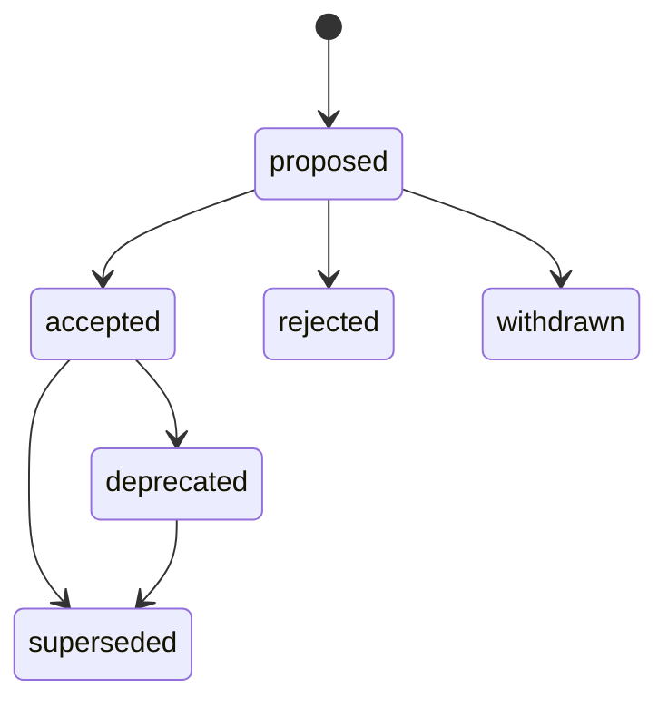

# ADR Standards Reference

This file is the standards anchor for the ADR Creator agent. It embeds the MADR v4.0.0 template (CC0-1.0), the Y-Statement six-slot formula (Zimmermann/Zdun), the canonical status taxonomy with legal transitions, the file-naming rule, and the ASR (Architecturally Significant Requirement) trigger schema.
Microsoft-authored guidance is paraphrased under CC-BY 4.0 with explicit change indication. Other sources (Nygard 2011, IEEE 42010:2022, arc42 §9, joelparkerhenderson) are cite-only to prevent CC-BY-SA contamination. Standards lookups outside this embedded set are delegated to the Researcher Subagent at runtime.

## MADR v4.0.0 Verbatim Template

The Markdown Any Decision Records (MADR) v4.0.0 template is embedded verbatim below.

> Source: github.com/adr/madr @ v4.0.0 (`template/adr-template.md`, tag `4.0.0`).
> License: CC0-1.0 Universal Public Domain Dedication.
> The MADR project releases the template under CC0-1.0; no rights are reserved by the original authors and the template may be reproduced byte-identical without modification.

The template content below is byte-identical to upstream and is pinned to MADR v4.0.0. Any deviation (including the typographical anomaly in the `status:` example) is intentional preservation of the upstream bytes.

```markdown
---
# These are optional metadata elements. Feel free to remove any of them.
status: "{proposed | rejected | accepted | deprecated | … | superseded by ADR-0123"
date: {YYYY-MM-DD when the decision was last updated}
decision-makers: {list everyone involved in the decision}
consulted: {list everyone whose opinions are sought (typically subject-matter experts); and with whom there is a two-way communication}
informed: {list everyone who is kept up-to-date on progress; and with whom there is a one-way communication}
---

# {short title, representative of solved problem and found solution}

## Context and Problem Statement

{Describe the context and problem statement, e.g., in free form using two to three sentences or in the form of an illustrative story. You may want to articulate the problem in form of a question and add links to collaboration boards or issue management systems.}

<!-- This is an optional element. Feel free to remove. -->
## Decision Drivers

* {decision driver 1, e.g., a force, facing concern, …}
* {decision driver 2, e.g., a force, facing concern, …}
* … <!-- numbers of drivers can vary -->

## Considered Options

* {title of option 1}
* {title of option 2}
* {title of option 3}
* … <!-- numbers of options can vary -->

## Decision Outcome

Chosen option: "{title of option 1}", because {justification. e.g., only option, which meets k.o. criterion decision driver | which resolves force {force} | … | comes out best (see below)}.

<!-- This is an optional element. Feel free to remove. -->
### Consequences

* Good, because {positive consequence, e.g., improvement of one or more desired qualities, …}
* Bad, because {negative consequence, e.g., compromising one or more desired qualities, …}
* … <!-- numbers of consequences can vary -->

<!-- This is an optional element. Feel free to remove. -->
### Confirmation

{Describe how the implementation of/compliance with the ADR can/will be confirmed. Are the design that was decided for and its implementation in line with the decision made? E.g., a design/code review or a test with a library such as ArchUnit can help validate this. Not that although we classify this element as optional, it is included in many ADRs.}

<!-- This is an optional element. Feel free to remove. -->
## Pros and Cons of the Options

### {title of option 1}

<!-- This is an optional element. Feel free to remove. -->
{example | description | pointer to more information | …}

* Good, because {argument a}
* Good, because {argument b}
<!-- use "neutral" if the given argument weights neither for good nor bad -->
* Neutral, because {argument c}
* Bad, because {argument d}
* … <!-- numbers of pros and cons can vary -->

### {title of other option}

{example | description | pointer to more information | …}

* Good, because {argument a}
* Good, because {argument b}
* Neutral, because {argument c}
* Bad, because {argument d}
* …

<!-- This is an optional element. Feel free to remove. -->
## More Information

{You might want to provide additional evidence/confidence for the decision outcome here and/or document the team agreement on the decision and/or define when/how this decision the decision should be realized and if/when it should be re-visited. Links to other decisions and resources might appear here as well.}
```

## Y-Statement Six-Slot Formula

The Y-Statement is a six-slot decision capture formula authored by Olaf Zimmermann and Uwe Zdun. The formula condenses an architectural decision into a single sentence covering use case, concern, chosen option, alternatives, target quality, and accepted downside.

> Attribution: The Y-Statement concept originates with Olaf Zimmermann and Uwe Zdun. The six-slot template below is an original HVE rendering of that structure, not a reproduction of the published sentence.

The six slots, in order, are:

> For (USE CASE), given (CONCERN), choose (OPTION) rather than (ALTERNATIVES) to gain (QUALITY) while accepting (DOWNSIDE).

Slot definitions:

* USE CASE: the functional context, scenario, or component in which the decision applies.
* CONCERN: the architectural concern, force, or quality attribute under tension.
* OPTION: the chosen option.
* ALTERNATIVES: the rejected alternatives evaluated against the same concern.
* QUALITY: the target quality attribute the chosen option is intended to achieve.
* DOWNSIDE: the consequence, tradeoff, or compromise accepted as a result.

Y-Statements are produced when `state.json.outputTemplate` is set to `y-statement` and are suitable for low-stakes or reversible decisions where a MADR v4 long-form is unnecessary. Either entry mode (`capture` or `from-planner-handoff`) can produce a Y-Statement when the user opts for the `y-statement` output form.

## Status Taxonomy

Six canonical statuses apply to all ADRs authored by the ADR Creator:

| Status       | Semantics                                                                                                       |
|--------------|-----------------------------------------------------------------------------------------------------------------|
| `proposed`   | Decision drafted and circulated for review; not yet authoritative.                                              |
| `accepted`   | Decision approved by deciders and in force.                                                                     |
| `rejected`   | Decision was proposed and explicitly declined; retained for historical context.                                 |
| `deprecated` | Previously accepted decision no longer recommended; retained for context but should not be applied to new work. |
| `superseded` | Replaced by a newer accepted decision; the replacement is identified via `superseded-by`.                       |
| `withdrawn`  | Proposal withdrawn before reaching a `rejected` or `accepted` outcome; no further action expected.              |

### Legal State Transitions

The following Mermaid state diagram defines all legal transitions between statuses. Transitions not shown are forbidden.



Transition rules:

* New ADRs enter the lifecycle as `proposed`.
* `proposed` ADRs may move to `accepted`, `rejected`, or `withdrawn`.
* `accepted` ADRs may move to `deprecated` or `superseded`.
* `deprecated` ADRs may subsequently be `superseded`.
* `rejected`, `withdrawn`, and `superseded` are terminal states.
* Reverting to an earlier state is forbidden; reopen by authoring a new `proposed` ADR that supersedes the prior decision.

## Supersession Idiom

Supersession is recorded with bidirectional links in ADR frontmatter:

* `supersedes`: array of ADR identifiers (formatted `NNNN-kebab-case-title`) that the current ADR replaces. Multiple entries are permitted when a single new decision consolidates several prior decisions.
* `superseded-by`: single scalar identifier (formatted `NNNN-kebab-case-title`) of the ADR that replaces the current one. Set when transitioning to Superseded.

When a new ADR supersedes one or more existing ADRs, both sides of the link must be updated in the same change set: the new ADR's `supersedes` array references the prior IDs, and each prior ADR's `superseded-by` field references the new ID and its status moves to Superseded.

Supersession links reference ADRs within the same project. The `supersedes` and `superseded-by` fields hold four-digit IDs that resolve against the current project's `.adr-config.yml`.

## File-Naming Rule (GP-16)

ADR filenames follow the pattern `NNNN-kebab-case-title.md`:

* `NNNN`: 4-digit zero-padded decimal identifier (for example, `0001`, `0042`, `0123`).
* `kebab-case-title`: lowercase ASCII title with words joined by single hyphens. Permitted characters are `a-z`, `0-9`, and `-`. No uppercase letters, underscores, spaces, or non-ASCII characters.
* `.md` extension required.

Allocation semantics:

* IDs are monotonic per project slug. The allocator reads `last_decision_id` from the project's `.adr-config.yml` file and assigns the next sequential ID.
* IDs are never reused; a Withdrawn or Rejected ADR retains its allocated ID.
* The 4-digit ID prefix is immutable on rename. Only the `kebab-case-title` suffix may change after the file is created. Renames that alter the numeric prefix are forbidden.
* Project slugs partition the ID space; two different projects may both have an ADR `0001-...` without conflict. Supersession links resolve within a single project.

## Personas, Not People

ADRs are durable, version-controlled artifacts that travel with the repository and are frequently read by people who never attended the meeting where the decision was made. Record stakeholder perspectives by persona or role rather than by named individual so that the record stays accurate as people change teams or leave the organization, and so that personal identifiers are not committed to a repository that may be public.

* Refer to participants by their role or persona — for example, "the platform on-call engineer", "the security reviewer", "the data platform team" — rather than by personal name, `@mention`, email address, or other personal identifier.
* Abstract paraphrased input, objections, and endorsements to the contributing role. "The on-call engineer raised reliability concerns" is preferred over "Jordan raised reliability concerns".
* The single exception is named decider attribution: when the user explicitly requires that a specific individual be credited as a decider for accountability, that name may appear in the deciders metadata. Even then, prefer pairing the name with the role.
* This rule is enforced at the Govern phase before any durable write. It is independent of the Sensitive-Content Scan Gate, which detects PII and public-repository internal URLs but does not detect persona-versus-name usage.

## ASR Trigger Schema (GP-07)

Architecturally Significant Requirements (ASRs) are recorded in the ADR frontmatter under `asrTriggers`. Each entry is a 3-field object:

```yaml
asrTriggers:
  - kind: cost | performance | security | compliance | availability | scalability | maintainability | evolvability
    evidence: <free-text reference; required>
    note: <≤280 char rationale; required>
```

Field rules:

* `kind`: one of the eight values listed above. The enum is closed; entries with any other value must be rejected by the agent.
* `evidence`: required free-text reference pointing to the source of the trigger (link, document title, ticket ID, requirement ID, or quoted constraint). Empty values are not permitted.
* `note`: required free-text rationale of 280 characters or fewer explaining why this trigger applies.

Output-template applicability:

* `madr-v4` output template: required. The Frame phase cannot exit without at least one `asrTriggers` entry recorded, or an explicit recorded determination that no ASR triggers apply.
* `y-statement` output template: optional. Prompted only when the user requests deeper analysis.
* `adopt-template` entry mode: omitted for the adoption ADR itself. Subsequent ADRs authored under the adopted template re-introduce ASR evaluation per their own output template.

## Azure Well-Architected Framework: Maintain an ADR

> Attribution: paraphrased from `MicrosoftDocs/well-architected`, "Maintain an Architecture Decision Record" guidance. Original work licensed under CC-BY 4.0. Modified from original — content has been condensed, restructured for the ADR Creator workflow, and aligned with the MADR v4.0.0 template embedded above.

Paraphrased guidance:

* Capture the architectural decision close to the time it is made, while context, drivers, and considered alternatives are still fresh; latency reduces fidelity.
* Record the decision as an immutable artifact in the same repository as the system it governs so that history travels with the code.
* Treat each ADR as version-controlled; do not edit accepted decisions to change their meaning. When circumstances change, supersede the prior decision with a new ADR that links back to the original.
* Identify the decision-makers, consulted parties, and informed stakeholders by role or name so that accountability is unambiguous.
* Capture both the chosen option and the alternatives considered, with the reasoning that led to selection. Future maintainers benefit as much from understanding the discarded options as from the chosen one.
* Surface tradeoffs, including the qualities sacrificed and the constraints accepted. Hidden tradeoffs become future surprises.
* Keep the language plain and the scope tight; one decision per record makes downstream linkage and supersession tractable.

## microsoft/code-with-engineering-playbook: ADRs

> Attribution: paraphrased from `microsoft/code-with-engineering-playbook`, ADR section. Original work licensed under CC-BY 4.0. Modified from original — content has been condensed and adapted for the ADR Creator workflow conventions.

Paraphrased guidance:

* Use ADRs to document architecturally significant decisions; trivial implementation choices belong in code comments or commit messages, not ADRs.
* Store ADRs alongside the code under a predictable path (for example, `docs/planning/adrs/`) so that engineers discover them through the normal repository workflow.
* Number ADRs sequentially and include a short descriptive title in the filename to support scanning the directory listing.
* Write each ADR for a future engineer who lacks the meeting context that produced the decision; include enough background that the decision can be evaluated on its merits later.
* Review ADRs as part of the standard pull request flow; treat them as code artifacts subject to the same quality bar as production source.
* Revisit ADRs periodically. Stale decisions that no longer reflect reality should be Deprecated or Superseded rather than silently abandoned.

## Cite-Only References

The following sources inform ADR practice but are referenced by URL only. Do not embed quoted text from these sources into ADRs or into this instructions file. The arc42 and joelparkerhenderson references in particular carry CC-BY-SA licensing that would contaminate downstream artifacts if quoted.

* Michael Nygard (2011). "Documenting Architecture Decisions." Source: <https://cognitect.com/blog/2011/11/15/documenting-architecture-decisions> (link only; do NOT quote).
* IEEE 42010:2022, "Software, systems and enterprise — Architecture description," Clause 5. Source: <https://www.iso.org/standard/74393.html> (catalog page; link only; do NOT quote).
* arc42, Section 9 "Architecture Decisions." Source: <https://docs.arc42.org/section-9/> (link only; do NOT quote — CC-BY-SA contamination risk).
* joelparkerhenderson ADR catalog. Source: <https://github.com/joelparkerhenderson/architecture-decision-record> (link only; do NOT quote — CC-BY-SA contamination risk).

## Researcher Subagent Delegation

Standards lookups outside the set embedded in this file must be delegated to the Researcher Subagent at runtime. The agent must `runSubagent` against the `Researcher Subagent` for any of the following:

* Domain-specific or industry-specific architecture decision frameworks not covered above.
* Updated revisions of MADR, Y-Statement, IEEE 42010, or arc42 published after this file was authored.
* Organizational ADR conventions or templates supplied by the user that require external research to validate.
* Any standard, framework, or pattern not listed in the embedded set or the Cite-Only References.

Do not embed additional standards content inline at runtime. The agent's standards surface is fixed to the embedded content above plus subagent-mediated lookups; expanding the embedded set requires an explicit edit to this file.
