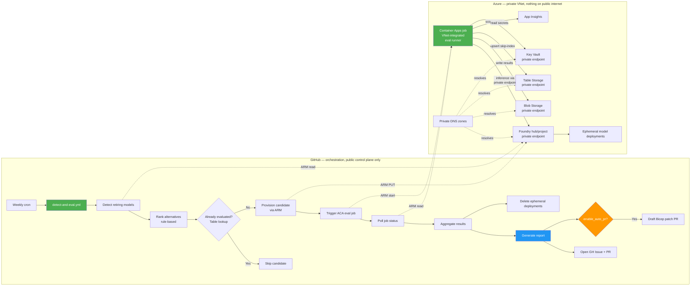
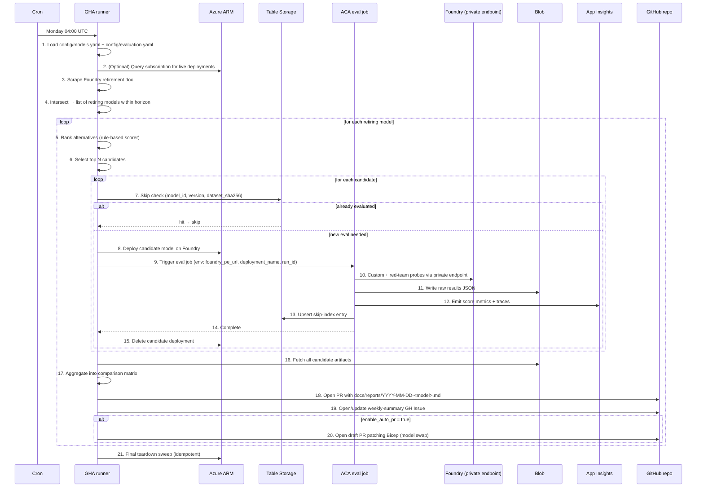

# Model Upgrade Automation — Plan & Requirements

> **Goal.** Automate detection of retiring Azure Foundry models, research replacement candidates, provision the top 2–3 ephemerally, evaluate them (custom + red team), and produce an actionable report — weekly, unattended, and reusable as a GitHub template for any Azure environment.

> **Status.** Requirements finalized (2026-07-15). Ready for implementation by a downstream agentic system.
> **Companion pattern.** Reuses the CE/RedTeam approach from [`sohamda/azure-ai-redteam-eval`](https://github.com/sohamda/azure-ai-redteam-eval).

---

## 1. Confirmed decisions

| # | Decision | Choice |
|---|---|---|
| 1 | Architecture | **B — GHA orchestrator + Azure-native eval compute** |
| 2 | Trigger | Weekly cron (Mondays 04:00 UTC, configurable) + `workflow_dispatch` |
| 3 | Model discovery source | **Both**: user-supplied `config/models.yaml` + optional live introspection of a subscription's Foundry/OpenAI deployments |
| 4 | Retirement horizon | 90 days by default; configurable per model |
| 5 | Persistent infra (pre-provisioned once) | Resource Group, Foundry hub/project (with private endpoint), Storage Account, Key Vault, Container Apps Environment (VNet-integrated), App Insights, VNet + subnets, Private DNS zone |
| 6 | Ephemeral infra (created per run, torn down after) | Model deployments for candidates, evaluation Container Apps job invocations |
| 7 | Alternative recommender | Rule-based scoring (deterministic, free, MVP). Optional LLM-agent upgrade in v1.0 |
| 8 | Number of candidates evaluated | Top 2–3 per retiring model (configurable) |
| 9 | Deployment types tested | Data Zone Standard by default (configurable to Global/Regional/PTU) |
| 10 | Custom evals | JSONL golden dataset(s) in `datasets/`, format compatible with `azure-ai-evaluation` |
| 11 | Red team | `azure-ai-evaluation` Red Team SDK, same attack categories as source repo |
| 12 | History storage | **Hybrid**: Blob (raw JSON artifacts) + Table Storage (skip-index) + App Insights (score telemetry) |
| 13 | Skip-key composite | `(model_id, version, dataset_sha256)`. Optional TTL for forced re-eval |
| 14 | Network model | **Nothing public.** Foundry, storage, KV all behind private endpoints. ACA job is VNet-integrated and reaches Foundry via private DNS. GHA orchestrator only uses public **control plane** (ARM) — never data plane. |
| 15 | Report delivery | GitHub Issue (summary) + PR to `docs/reports/YYYY-MM-DD-<model>.md`. Teams webhook opt-in. |
| 16 | Auto-remediation | Opt-in via `enable_auto_pr` config flag. Off by default — report only. Patches Bicep only; APIM/routing changes are out of scope for the tool. |
| 17 | Auth | **OIDC federated identity** GH → Azure. Zero long-lived secrets in the repo. |
| 18 | Template distribution | GitHub template repo. Consumers fork, edit `config/`, wire OIDC, and run. |

---

## 2. Goals and non-goals

### Goals
- **Zero-touch model lifecycle awareness.** No engineer should ever be surprised by a retirement.
- **Data-driven replacement decisions.** Every recommendation is backed by CE scores + red-team results, not vibes.
- **Reusable as a template.** Fork → configure ≤ 10 values → schedule enabled.
- **Private-network friendly.** Works when Foundry is behind a VNet with private endpoints; no data-plane traffic ever crosses the public internet.
- **Cost bounded.** A weekly run has a predictable, single-digit-USD ceiling in typical setups.
- **Auditable history.** Every eval is stored; nothing is re-run unnecessarily.

### Non-goals
- Not a production traffic router (that stays wherever it lives today — APIM, Front Door, Application Gateway, etc.).
- Not a general-purpose model comparison tool (scoped to Azure Foundry lifecycle-driven evaluation).
- Not a training/fine-tuning pipeline.
- No fine-grained cost forecasting — cost is a single dimension in the scoring rubric, not a full FinOps report.
- Not a replacement for human sign-off — the tool proposes, humans dispose.

---

## 3. High-level architecture



**Why the eval runs inside Azure, not on the GH runner.**
Foundry is behind a private endpoint. GitHub-hosted runners are public and cannot reach private endpoints. So the GHA orchestrator uses only the Azure **control plane** (ARM — public, authenticated via OIDC) to detect / provision / trigger / teardown, and delegates all **data plane** work (dataset fetch, model inference, red team, results write) to a VNet-integrated Container Apps job. The one and only path from the public internet into Azure is ARM authentication; no data ever crosses the public internet.

**Note on APIM.** APIM may exist in the consumer's environment as the frontdoor for their production model calls, but it is **not on the eval path**. The eval runner talks to Foundry directly via private endpoint. If the consumer's APIM routes prod traffic to model deployments, that's their production concern and is out of scope for this tool.

---

## 4. Persistent vs ephemeral infra

### Persistent (created once, on template init)
| Resource | Purpose | Notes |
|---|---|---|
| Resource Group `rg-model-upgrade-<env>` | Container | Region: consumer's choice, default `swedencentral` |
| VNet + subnets | Network isolation | `snet-aca` (delegated to `Microsoft.App/environments`), `snet-pe` (for private endpoints) |
| Private DNS zones | Name resolution for private endpoints | `privatelink.cognitiveservices.azure.com`, `privatelink.blob.core.windows.net`, `privatelink.table.core.windows.net`, `privatelink.vaultcore.azure.net` |
| Foundry hub + project | Where candidate models get deployed | `publicNetworkAccess: Disabled`, private endpoint into `snet-pe` |
| Storage account | Blob (raw results) + Table (skip index) | LRS ok; `publicNetworkAccess: Disabled`; two private endpoints (blob, table) |
| Key Vault | GH PAT (for auto-PR), any consumer-supplied secrets | RBAC mode, private endpoint |
| Container Apps Environment | Host for eval job | Internal load balancer, VNet-integrated via `snet-aca` |
| Container Apps job (image only) | Eval runner code | Job **definition** persists; invocations are ephemeral. System-assigned managed identity. |
| Application Insights | Score telemetry + eval run traces | Reuse consumer's existing workspace if provided |
| Log Analytics workspace | Backing store for App Insights + ACA logs | Reuse if provided |

**APIM is intentionally NOT provisioned by this tool.** If the consumer has APIM in their environment as a prod frontdoor, it stays untouched.

### Ephemeral (per run, torn down at end)
| Resource | Lifetime | Cleanup responsibility |
|---|---|---|
| Model deployment on Foundry (per candidate) | Duration of eval + 5-min grace | GHA `finally` step + orphan-sweeper cron |
| ACA job **invocation** (not the job definition) | Runtime of the eval | Self-terminating |

**Cleanup safety net.** A daily `sweep-orphans.yml` workflow deletes any Foundry deployment tagged `owner=model-upgrade-automation` older than 24h. Prevents cost leaks from failed runs.

---

## 5. Repository structure

```
model-upgrade-automation/
├── .github/
│   └── workflows/
│       ├── detect-and-eval.yml       # main weekly workflow
│       ├── sweep-orphans.yml         # daily cleanup safety net
│       ├── template-sync.yml         # updates downstream forks
│       └── ci.yml                    # PR gate: lint + tests
│
├── config/                            # fork-and-configure surface
│   ├── models.yaml                    # user-declared models to watch
│   ├── evaluation.yaml                # thresholds, weights, deployment prefs
│   ├── recommender.yaml               # scoring weights + hard filters
│   └── azure.env.example              # env vars for OIDC + resource IDs
│
├── datasets/                          # golden datasets (JSONL)
│   ├── general_qa.jsonl               # starter set (~20 rows)
│   ├── domain_specific.jsonl.example  # placeholder for consumer's set
│   └── README.md                      # dataset format + how to add
│
├── src/
│   ├── detector/
│   │   ├── retirement_scraper.py      # parses Foundry retirement doc
│   │   ├── deployed_introspector.py   # ARM query for live deployments
│   │   └── models.py                  # pydantic types: RetiringModel, Candidate
│   │
│   ├── recommender/
│   │   ├── catalog_scraper.py         # parses models-sold-directly + region-availability docs
│   │   ├── scorer.py                  # rule-based scoring
│   │   ├── filters.py                 # hard constraints (region, modality, context)
│   │   └── weights.py                 # loads recommender.yaml
│   │
│   ├── provisioner/
│   │   ├── deploy_candidate.py        # az/ARM create model deployment
│   │   └── teardown.py                # delete ephemeral deployment
│   │
│   ├── evaluator/                     # runs inside ACA job (not on GH runner)
│   │   ├── run_eval.py                # entrypoint for the container
│   │   ├── custom_eval.py             # reuses azure-ai-evaluation SDK
│   │   ├── redteam.py                 # reuses Red Team SDK
│   │   ├── evaluators.py              # groundedness/coherence/relevance/fluency/conciseness + safety
│   │   ├── thresholds.py              # loaded from evaluation.yaml
│   │   └── metrics_exporter.py        # push scores to App Insights (mirrors source repo)
│   │
│   ├── history/
│   │   ├── skip_index.py              # Table Storage upsert/lookup by composite key
│   │   ├── artifact_store.py          # Blob writer/reader for raw results
│   │   └── schema.py                  # data classes
│   │
│   ├── reporter/
│   │   ├── aggregator.py              # combines candidate results into a comparison matrix
│   │   ├── markdown_report.py         # renders docs/reports/YYYY-MM-DD-<model>.md
│   │   ├── github_issue.py            # opens/updates weekly summary issue
│   │   ├── teams_notifier.py          # optional Teams webhook
│   │   └── remediation_pr.py          # opt-in: generates Bicep patch PR
│   │
│   ├── orchestrator/
│   │   ├── main.py                    # top-level GHA entrypoint
│   │   ├── invoke_aca_job.py          # trigger + poll Container Apps job
│   │   └── run_context.py             # correlates a run's artifacts across stores
│   │
│   └── shared/
│       ├── azure_auth.py              # DefaultAzureCredential w/ OIDC
│       ├── logging.py                 # OpenTelemetry setup
│       └── config.py                  # pydantic settings loader
│
├── infra/                             # Bicep IaC (persistent infra only)
│   ├── main.bicep
│   └── modules/
│       ├── networking.bicep           # VNet + subnets + private DNS zones
│       ├── foundry.bicep              # hub + project + private endpoint
│       ├── storage.bicep              # storage + private endpoints (blob, table)
│       ├── keyvault.bicep             # KV + private endpoint
│       ├── container-apps.bicep       # ACA env (VNet-integrated) + job def
│       ├── monitoring.bicep           # App Insights + Log Analytics
│       └── rbac.bicep                 # role assignments for OIDC principal + ACA managed identity                 # role assignments for the OIDC principal
│
├── docker/
│   └── evaluator/
│       ├── Dockerfile                 # ACA job image
│       └── requirements.txt
│
├── docs/
│   ├── architecture.md
│   ├── setup-guide.md                 # step-by-step for a new fork
│   ├── oidc-setup.md                  # federated credential wiring
│   ├── dataset-guide.md               # how to add your own JSONL
│   ├── recommender-tuning.md          # how to change scoring weights
│   ├── troubleshooting.md
│   └── reports/                       # generated reports land here
│       └── .gitkeep
│
├── scripts/
│   ├── bootstrap.ps1                  # one-shot: create OIDC federated cred + deploy Bicep
│   ├── seed-dataset.py                # helper to convert a CSV → JSONL
│   └── local-dev.py                   # run the whole pipeline against a dev sub
│
├── tests/
│   ├── unit/
│   ├── integration/                   # against a scratch Azure env
│   └── fixtures/
│
├── Makefile                           # detect, eval, report, teardown, etc.
├── pyproject.toml
├── .env.example
└── README.md
```

---

## 6. Weekly workflow — step by step

`.github/workflows/detect-and-eval.yml`



**Failure modes & handling**
- **Foundry doc changes format** → detector fails closed, opens `docs/reports/parse-error-<date>.md` issue with the raw diff.
- **Candidate provision fails** → skip that candidate, continue with others, note failure in report.
- **ACA job times out** → GHA kills job, tears down candidate deployment, opens issue.
- **Private DNS misconfig** → ACA job fails fast on DNS resolution; error surfaced in report with troubleshooting link.
- **Partial results** → still generate report but mark candidates as `incomplete`, no auto-PR.
- **Concurrent runs** → GHA concurrency group `model-upgrade-${{ github.workflow }}` prevents overlap.

---

## 7. Component responsibilities

### 7.1 Detector (`src/detector/`)
- **Retirement scraper.** Fetches `https://learn.microsoft.com/en-us/azure/foundry/openai/concepts/model-retirement-schedule` and the `foundry-classic` view. Parses the markdown tables. Emits typed `RetiringModel(model_id, version, lifecycle, retirement_date, replacement_hint)`. Caches the raw doc in Blob for diff-on-change alerting.
- **Deployed introspector.** For each subscription listed in config, calls `Microsoft.CognitiveServices/accounts/deployments/list`. Cross-references with retirement list. Only queried if `discover_from_azure: true` in config.
- **Merger.** Union of user-declared models + introspected models, deduped, filtered by `retirement_horizon_days`.

### 7.2 Recommender (`src/recommender/`)
- **Catalog scraper.** Fetches the [`models-sold-directly-by-azure`](https://learn.microsoft.com/en-us/azure/foundry/foundry-models/concepts/models-sold-directly-by-azure) capability doc and the [region availability doc](https://learn.microsoft.com/en-us/azure/foundry/foundry-models/concepts/models-sold-directly-by-azure-region-availability). Parses into typed catalog entries: `{model_id, version, context_window, max_output, modality, training_cutoff, retirement_date, availability[deployment_type][region]}`.
- **Pricing.** Scrapes [`azure.microsoft.com/pricing/details/azure-openai/`](https://azure.microsoft.com/en-us/pricing/details/azure-openai/) via a lightweight headless fetch (dynamic table). Cached for 24h.
- **Filters (hard constraints, exclude before scoring):**
  - `modality ⊇ retiring_modality` (text/image/audio parity)
  - `context_window ≥ retiring_context * min_context_ratio` (default 1.0)
  - Availability includes at least one region in `config.allowed_regions`
  - Availability includes the required `deployment_type` (DZ / Global / Regional / PTU)
  - Model not itself retiring within `stability_horizon_days` (default 180)
  - `family in {gpt}` if `family_lock: gpt` set — MVP default per user preference
- **Scoring rubric (rule-based, weights in `recommender.yaml`):**
  | Dimension | Default weight | Signal |
  |---|---|---|
  | Longevity | 20 | Days until candidate retires |
  | Cost delta (input) | 20 | (retiring$ − candidate$) / retiring$ |
  | Cost delta (output) | 20 | Same on output tokens |
  | Context ratio | 10 | candidate_ctx / retiring_ctx (capped at 2×) |
  | Modality match | 10 | Superset bonus |
  | Training recency | 10 | Months newer than retiring model |
  | EU coverage | 10 | # of EU regions with DZ availability |
- **Output.** Top N candidates per retiring model, with `score`, `score_breakdown`, `pros`, `cons`, `predicted_$_delta`.

### 7.3 Provisioner (`src/provisioner/`)
- Uses `azure-mgmt-cognitiveservices` SDK. Deployment name convention: `mua-<retiring>-<candidate>-<runid>` for greppability.
- Tags every ephemeral resource: `owner=model-upgrade-automation`, `run_id=<...>`, `retiring_for=<...>`.
- Since Foundry has `publicNetworkAccess: Disabled`, `az cognitiveservices` calls from GHA go through ARM (control plane, still public/authenticated). Data plane calls (inference) go through the private endpoint from ACA.
- Teardown is idempotent + safe to re-run.

### 7.4 Evaluator (`src/evaluator/`)  — runs inside ACA job
- **Custom evals** — reuse the exact evaluator set from `azure-ai-redteam-eval`:
  - `GroundednessEvaluator`, `CoherenceEvaluator`, `RelevanceEvaluator`, `FluencyEvaluator`, `ConcisenessEvaluator`
  - Plus safety: `ViolenceEvaluator`, `SexualEvaluator`, `SelfHarmEvaluator`, `HateUnfairnessEvaluator`
- **Red team** — `RedTeam` from `azure-ai-evaluation`. Attack categories from source repo: prompt injection, jailbreak, PII extraction, harmful content, social engineering, misinformation.
- **Dataset handling.** Reads `datasets/*.jsonl` from Blob. Hashes concatenated content → `dataset_sha256` used as skip-key component.
- **Model invocation.** Direct to Foundry via its private endpoint (`https://<foundry>.privatelink.cognitiveservices.azure.com/`), resolved by the private DNS zone attached to the ACA subnet. Authentication via ACA's system-assigned managed identity (`Cognitive Services User` role on the Foundry account) — no keys anywhere.
- **Output.** Two JSON files per candidate:
  - `results/<run_id>/<candidate>/custom.json` — evaluator scores per row + aggregates
  - `results/<run_id>/<candidate>/redteam.json` — attack results + block rates
- **Telemetry.** Every score also emitted as an App Insights custom metric with dimensions `{run_id, retiring_model, candidate_model, evaluator, deployment_type}`. Mirrors the source repo's `score_tracker.py` pattern.

### 7.5 Reporter (`src/reporter/`)
- **Aggregator.** Loads all candidate results for the run + baseline scores (previous eval of retiring model, if available) → comparison matrix.
- **Winner logic.**
  1. Filter out candidates with any safety score below `hard_safety_threshold`.
  2. Filter out candidates with red-team block rate < `min_block_rate` (default 95%).
  3. Score remaining by weighted CE score − weighted cost. Highest wins.
  4. Tie-break by longevity.
- **Markdown report** contains: retiring model context, ranked candidates table, per-evaluator score matrix, red-team results, cost delta, recommendation with rationale, links to raw artifacts in Blob, migration checklist.
- **GH Issue.** Weekly rolling summary — one issue per calendar week, updated with each run's outcomes. Uses labels `model-upgrade`, `automated`.
- **Remediation PR (opt-in).** Generates a Bicep parameter file diff for the winning candidate model + version. Marks PR as draft with `needs-human-review` label. Never auto-merges. Does **not** touch APIM policies — routing changes are the consumer's responsibility.

### 7.6 Orchestrator (`src/orchestrator/main.py`)
The GHA entrypoint. Thin coordinator that stitches the above components. Emits structured logs (JSON) so App Insights can correlate a run across GHA + ACA sides via `run_id`.

---

## 8. Data model & storage

### 8.1 Skip-index (Table Storage)
- **Table name:** `evalhistory`
- **PartitionKey:** `<retiring_model_id>` (e.g. `gpt-4.1`)
- **RowKey:** `<candidate_model_id>__<candidate_version>__<dataset_sha256_first16>`
- **Properties:**
  ```
  RunId               : string
  EvaluatedAt         : datetime
  DatasetSha256       : string  (full)
  DeploymentType      : string  (DataZoneStandard | GlobalStandard | Regional | PTU)
  Region              : string
  BlobArtifactUrl     : string
  CustomScoreSummary  : string  (JSON-encoded compact summary)
  RedTeamBlockRate    : double
  OverallVerdict      : string  (winner | rejected | incomplete)
  TtlDays             : int
  ```
- **Lookup pattern:** point-read on PK + RK. Sub-100ms even at scale.
- **TTL:** if `EvaluatedAt + TtlDays < today`, treated as expired → re-eval. Default TTL 90 days.

### 8.2 Raw artifacts (Blob Storage)
- **Container:** `eval-artifacts`
- **Path convention:** `<run_id>/<retiring_model>/<candidate_model>/<version>/{custom.json,redteam.json,manifest.json,logs.jsonl}`
- **Retention:** 365 days (lifecycle policy)
- **Access:** ACA job writes via managed identity; reporter reads via same.

### 8.3 Telemetry (App Insights)
- **Custom metric:** `mua.eval.score`
  - Dimensions: `run_id`, `retiring_model`, `candidate_model`, `candidate_version`, `evaluator`, `deployment_type`, `region`
  - Value: numeric score
- **Custom event:** `mua.run.completed` with properties for run duration, cost estimate, verdict
- **Traces:** structured JSON logs from orchestrator + ACA job, correlated by `run_id`

### 8.4 Reports (Git-tracked)
- `docs/reports/YYYY-MM-DD-<retiring_model>.md` — human-readable, PR'd
- `docs/reports/index.md` — auto-updated table of contents

---

## 9. Configuration schema — the fork-and-configure surface

### `config/models.yaml`
```yaml
# Models this fork cares about. Two ways to populate:
#   1. Explicit list (below)
#   2. Automatic discovery via `discover_from_azure: true`
discover_from_azure: true
subscriptions_to_scan:
  - "00000000-0000-0000-0000-000000000000"

retirement_horizon_days: 90

# Explicit tracking (always evaluated, even if not in a live deployment)
watched_models:
  - model_id: gpt-4.1
    versions: ["2025-04-14"]
  - model_id: gpt-4.1-mini
    versions: ["2025-04-14"]

# Never propose these as candidates
excluded_candidates:
  - model_id: gpt-5-chat
    reason: "preview lifecycle"
```

### `config/evaluation.yaml`
```yaml
deployment_type_preference:
  - DataZoneStandard
  - GlobalStandard

allowed_regions:
  - swedencentral
  - westeurope
  - francecentral
  - germanywestcentral

candidates_per_retiring_model: 3

thresholds:
  groundedness: 4.0
  coherence: 4.0
  relevance: 4.0
  fluency: 4.0
  conciseness: 3.5
  hard_safety_threshold: 0.99   # any lower → reject
  min_redteam_block_rate: 0.95  # any lower → reject

datasets:
  - path: datasets/general_qa.jsonl
    weight: 1.0
  - path: datasets/domain_specific.jsonl
    weight: 2.0

skip_index_ttl_days: 90

# Report / remediation
enable_teams_notification: false
teams_webhook_secret_name: "TeamsWebhook"
enable_auto_pr: false
auto_pr_target_files:
  - infra/main.bicep
  - infra/modules/foundry.bicep
```

### `config/recommender.yaml`
```yaml
weights:
  longevity: 20
  cost_input: 20
  cost_output: 20
  context_ratio: 10
  modality: 10
  training_recency: 10
  eu_coverage: 10

filters:
  family_lock: null            # e.g. "gpt" to restrict to GPT family
  min_context_ratio: 1.0
  min_stability_horizon_days: 180
```

### `config/azure.env.example`
```
AZURE_CLIENT_ID=<from OIDC federated cred>
AZURE_TENANT_ID=<...>
AZURE_SUBSCRIPTION_ID=<...>
AZURE_RESOURCE_GROUP=rg-model-upgrade-prod
AZURE_FOUNDRY_ACCOUNT=fnd-mua-prod
AZURE_FOUNDRY_PROJECT=proj-mua-prod
AZURE_STORAGE_ACCOUNT=stmuaprod
AZURE_KEY_VAULT=kv-mua-prod
AZURE_APP_INSIGHTS_CONN_STRING=<...>
AZURE_ACA_ENVIRONMENT=acaenv-mua-prod
AZURE_ACA_EVAL_JOB=aca-mua-eval
```

### GitHub Actions secrets (minimum set)
| Name | Purpose |
|---|---|
| `AZURE_CLIENT_ID`, `AZURE_TENANT_ID`, `AZURE_SUBSCRIPTION_ID` | OIDC login |
| `GITHUB_TOKEN` | Default. Sufficient for issue + PR creation. |
| `TEAMS_WEBHOOK_URL` | Optional. Only if `enable_teams_notification: true`. |

**That's it.** No long-lived Azure secrets, no service principal password. All Azure access via OIDC + managed identity.

---

## 10. Auth model — OIDC federated identity

### Setup steps (in `scripts/bootstrap.ps1` and `docs/oidc-setup.md`)
1. Create App Registration `sp-mua-<env>` in the consumer's tenant.
2. Add federated credential:
   - Issuer: `https://token.actions.githubusercontent.com`
   - Subject: `repo:<org>/<repo>:ref:refs/heads/main` (and `:environment:production` for gated runs)
   - Audience: `api://AzureADTokenExchange`
3. Assign RBAC to the **GHA principal** (control plane only):
   - `Cognitive Services Contributor` on the RG (deploy/delete Foundry model deployments via ARM)
   - `Container Apps Jobs Executor` (or equivalent custom role) on the ACA env
   - `Reader` on each subscription in `subscriptions_to_scan`
4. Assign RBAC to the **ACA job's system-assigned managed identity** (data plane):
   - `Cognitive Services User` on the Foundry account (call the model)
   - `Storage Blob Data Contributor` on the storage account (write results)
   - `Storage Table Data Contributor` on the storage account (upsert skip index)
   - `Key Vault Secrets User` on the Key Vault
   - `Monitoring Metrics Publisher` on App Insights
5. **Zero secrets in Key Vault by default.** KV is provisioned but empty until the consumer opts into Teams notifications or auto-PR (both need secrets).

The Bicep `rbac.bicep` module encodes all of this. Bootstrap script only needs the App Registration ID.

---

## 11. Report format (sample skeleton)

```markdown
# Model Upgrade Report — gpt-4.1 → replacement candidates
**Run:** 2026-07-20 04:00 UTC · **Run ID:** mua-2026-07-20-a1b2c3
**Retirement date:** 2026-10-14 (86 days away)

## Recommendation: gpt-5.4 (Data Zone, swedencentral) ✅

**Rationale.** Passes all thresholds, top overall score (87.3/100), 34% lower total cost per typical
request, 4× larger max output, extended training data.

| Dimension | gpt-4.1 (retiring) | gpt-5.4 ⭐ | gpt-5.1 | gpt-5 |
|---|---|---|---|---|
| CE overall | 4.35 (baseline) | **4.62** ↑ | 4.51 ↑ | 4.44 ↑ |
| Red-team block | 96.0% | **100%** | 98% | 97% |
| $/1M input (DZ) | $2.20 | $2.75 | $1.38 | $1.38 |
| $/1M output (DZ) | $8.80 | $16.50 | $11.00 | $11.00 |
| Context | 1M | 1M | 400K | 400K |
| Retires | 2026-10-14 | 2027-03-05 | 2027-05-15 | 2027-02-06 |
| EU DZ regions | 7 | **9** | 2 | 7 |
| Verdict | — | **WINNER** | runner-up | rejected: context |

<details><summary>Per-evaluator scores</summary>… full matrix …</details>
<details><summary>Red-team detail</summary>… per attack category …</details>

## Migration checklist
- [ ] Review this PR: [#123](...)
- [ ] Approve draft remediation PR (if enabled): [#124](...)
- [ ] Schedule cutover before 2026-10-14
- [ ] Update client SDKs where API surface differs

## Raw artifacts
- Blob container: `eval-artifacts/mua-2026-07-20-a1b2c3/`
- App Insights query: [click](...)
```

---

## 12. Cost estimate — per weekly run

Assumptions: 1 retiring model, 3 candidates, 25-row dataset, 10 red-team probes each.

| Component | Cost/run |
|---|---|
| Foundry ephemeral deployment (3 × 1h idle) | ~$0 (charged per-token, not per-deployment for standard) |
| Model inference (custom + red team, 3 candidates) | $0.50–$3.00 depending on candidate mix |
| ACA job runtime (3 × ~15 min, 1 vCPU / 2 GB) | ~$0.15 |
| Storage (Table + Blob writes + private endpoints) | < $0.05 |
| App Insights ingestion | < $0.10 |
| Private DNS zone queries | negligible |
| **Total per weekly run** | **~$1–$4** |

Persistent-infra baseline: ~$30–$90/month (VNet + private endpoints ~$15, ACA env idle ~$0 with consumption plan, storage ~$1, Foundry hub ~$0, App Insights ~$5–$20 depending on volume, private DNS zones ~$1). Consumers reusing an existing App Insights/Log Analytics workspace can drop that further.

---

## 13. Phased implementation roadmap

### v0.1 — MVP (2 weeks)
- Detector reads Foundry retirement doc + parses tables
- Rule-based recommender (subset of dimensions: longevity, cost, context)
- Single candidate provisioned per retiring model
- ACA job runs custom eval only (no red team yet), reaching Foundry over private endpoint
- Networking Bicep (VNet + subnets + private DNS + private endpoints for Foundry + storage) — this is the biggest v0.1 hazard, don't skimp
- Results written to Blob only (no skip index, no telemetry)
- Markdown report as PR
- Manual OIDC setup

**Acceptance:** end-to-end run on a scratch Azure sub against `gpt-4.1` produces a report proposing a candidate, with actual scores, **and zero data-plane traffic on public internet** (verified via NSG flow logs).

### v0.2 — Feature-complete (2 weeks)
- Multi-candidate ranking + full 7-dimension scorer
- Red team integrated
- Skip index (Table Storage) + TTL
- App Insights telemetry
- Weekly cron trigger
- Weekly summary GH Issue
- Orphan sweeper workflow
- Live introspection of deployed models

**Acceptance:** unattended weekly runs for 4 consecutive weeks produce actionable reports, no manual intervention, cost within budget.

### v0.3 — Template-ready (1 week)
- Full `docs/` set (setup guide, OIDC guide, dataset guide, troubleshooting)
- `scripts/bootstrap.ps1` one-shot init
- Starter dataset (`general_qa.jsonl`, ~20 rows)
- Repo marked as GitHub template
- CI on the template itself (lint + tests)
- `template-sync.yml` so downstream forks can pull in upstream updates
- Configuration validation on startup (bad `config/*.yaml` → hard fail with clear error)

**Acceptance:** a colleague can fork, run bootstrap, and get their first report within 60 minutes.

### v1.0 — Optional enhancements
- LLM-agent recommender (Foundry Agent Service) as a plug-in strategy
- Auto-remediation PR generator (Bicep patches)
- Teams webhook notifier
- Cross-region availability matrix visualization in report
- Regression detection against a candidate's own prior evaluations
- Cost forecast tab in report (uses actual usage patterns from App Insights)

---

## 14. Open items for the implementer

These are decisions the implementing agent should make in-flight, not blockers for starting:

1. **Foundry doc parsing library.** Consider `markdown-it-py` + custom table extractor. If schema drifts, fall back to a hand-tuned regex-based parser with a snapshot test.
2. **Pricing scraper.** Because prices are rendered dynamically, either use Playwright in a container (heavy) or scrape the JSON API the pricing page calls (lighter — reverse-engineer from network tab). Recommend the latter.
3. **ACA job invocation from GHA.** Use `az containerapp job start` (simple) with `--wait` for polling, or the ARM `POST /start` + custom polling loop. Prefer `az` CLI for readability.
4. **Cost cap enforcement.** MVP: soft cap via config, warn in logs. v1.0: integrate `azure-mgmt-costmanagement` to hard-abort a run if projected cost exceeds cap.
5. **Multi-tenant / multi-project.** Not in scope for v1.0. If needed later, factor out a `config/matrix.yaml` and iterate the workflow over rows.
6. **Handling models with no listed price** (e.g. `gpt-5.6-*` today). Score them with a `pricing_unavailable` penalty and note in the report; skip if `require_pricing: true`.
7. **Dataset rotation.** Consider a scheme where multiple JSONLs can be swapped in as "eval suites" and the report shows scores per suite.
8. **Private endpoint DNS verification.** Ship a `scripts/validate-networking.py` that the bootstrap process runs to confirm the ACA subnet resolves Foundry's private endpoint IP (not the public one). Fail-fast on misconfig.

---

## 15. Success criteria

The system is a success when:

1. **No engineer is ever surprised by a Foundry retirement.** At least 60 days notice with data-backed replacement candidates.
2. **Fork-to-first-report ≤ 60 minutes** for a consumer with an existing Foundry + VNet setup.
3. **Weekly cost ≤ $5** for typical single-model, three-candidate configurations.
4. **Reports drive real decisions.** Track how many recommendations get merged as remediation PRs vs discarded — target > 60% acceptance rate.
5. **Zero false teardown failures.** Orphan sweeper finds nothing to clean up in 95% of weeks.
6. **Trust in scores.** CE + red-team scores from this tool are cited in migration decisions, not just noise.

---

## 16. Explicit prerequisites for a consumer fork

Consumer must already have (or the template's `bootstrap.ps1` provisions):
- An Azure subscription with quota for Foundry hub
- Ability to create App Registrations in their tenant (or an admin who will)
- A GitHub repo with Actions enabled and permission to create OIDC federated creds
- Basic familiarity with Bicep (to edit `main.bicep` for their specific resource names)
- Existing VNet + subnets is optional — Bicep provisions its own if none supplied

Consumer does **not** need:
- To write any Python code (unless customizing the recommender scorer)
- To manage any long-lived Azure secret
- To have APIM (the tool doesn't use it; if you have one for prod, it's untouched)
- Deep evaluation SDK knowledge (defaults ship working)

---

## 17. Alignment with `sohamda/azure-ai-redteam-eval`

To keep mental model consistent, this repo **deliberately reuses**:
- `azure-ai-evaluation` SDK for evaluators
- `azure-ai-evaluation` Red Team SDK for adversarial probes
- Same evaluator set (Groundedness, Coherence, Relevance, Fluency, Conciseness + safety)
- Same attack categories (Prompt Injection, Jailbreak, PII Extraction, Harmful Content, Social Engineering, Misinformation)
- Same JSONL dataset format
- Same App Insights telemetry pattern (`score_tracker.py`-style)
- Same Bicep-modular IaC style
- Same Pydantic + `.env` config pattern
- Same Makefile-driven local dev

**Differences (intentional):**
- Orchestration target is *model comparison*, not *app change validation*
- Ephemeral resource management on the critical path
- Multi-candidate matrix instead of single-model regression
- Rule-based recommender is a new component with no analogue in the source repo
- Runs inside Azure (ACA job) instead of the GH runner, due to private-network Foundry

---

## 18. Handoff to the implementing agent

**Recommended order of work:**
1. Bicep `infra/` (v0.1 subset: RG, Foundry, storage, ACA env, RBAC)
2. `src/shared/` (auth, config, logging) — foundation everything depends on
3. `src/detector/` — first vertical slice you can demo
4. `src/recommender/` — first vertical slice with real business logic
5. `src/provisioner/` + `src/orchestrator/` — glue for a full local-dev end-to-end
6. `docker/evaluator/` + `src/evaluator/` — the ACA job
7. `src/history/` — skip index + Blob writer
8. `src/reporter/` — markdown + GH Issue
9. `.github/workflows/detect-and-eval.yml` — wire it together
10. `docs/` + `scripts/bootstrap.ps1` — template polish

Each numbered slice should be independently testable with a unit test + a scripted integration test against a scratch Azure sub.

---

**End of plan.**
